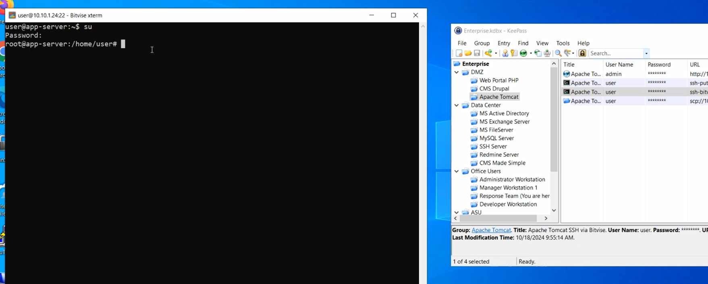
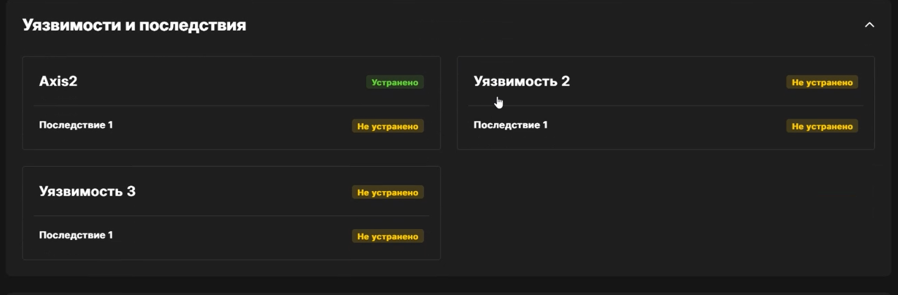
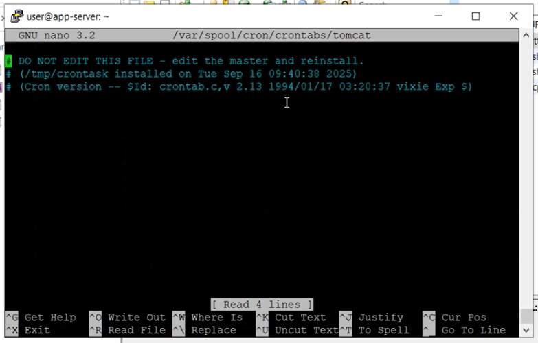

---
## Front matter
lang: ru-RU
title: "Лабораторная работа №1. ЗАЩИТА ДАННЫХ СЕГМЕНТА АСУ ТП"
subtitle: "Дисциплина: Кибербезопасность предприятия"
author:
  - Астраханцева Анастасия
  - Ганина Таисия
  - Ибатулина Дарья
  - Шошина Евгения
  - Кадирова Мехрубон
  - Хассан Факи Абакар

institute:
  - Группа НФИбд-01-22
  - Российский университет дружбы народов, Москва, Россия
date: 30 сентября 2025

## i18n babel
babel-lang: russian
babel-otherlangs: english

## Formatting pdf
toc: false
toc-title: Содержание
slide_level: 2
aspectratio: 169
section-titles: true
theme: metropolis
header-includes:
 - \metroset{progressbar=frametitle,sectionpage=progressbar,numbering=fraction}
 - '\makeatletter'
 - '\beamer@ignorenonframefalse'
 - '\makeatother'
---

# Вводная часть

## Цели и задачи

Целью лабораторной работы является изучение методов обнаружения, анализа и устранения последствий компьютерных атак в сегменте автоматизированных систем управления технологическим процессом (АСУ ТП) на базе программного комплекса "Ampire". Работа направлена на формирование навыков защиты данных от внешних нарушителей, использующих уязвимости в программном обеспечении, и освоение инструментов мониторинга сетевой безопасности, таких как ViPNet IDS NS, ViPNet TIAS и Security Onion.

## Задание

1. Изучить типовые уязвимости, используемые при атаке на сегмент АСУ ТП.
2. Проанализировать последовательность действий нарушителя на каждом этапе атаки.
3. Освоить методы детектирования атак с использованием средств мониторинга и анализа безопасности.
4. Выполнить мероприятия по устранению последствий атаки.
5. Отработать навыки анализа сетевых соединений и процессов с помощью стандартных утилит.

# Заполнение карточек инцидентов

##

Для обнаружения и анализа атак использовались средства ViPNet IDS NS. Были зафиксированы следующие ключевые инциденты, соответствующие этапам атаки

{#fig:001 width=70%}

##

{#fig:002 width=70%}

## 

{#fig:003 width=70%}

##

{#fig:004 width=70%}

##

{#fig:005 width=70%}

# Устранение первой уязвимости и последствия (Axis2, App backdoor)

## Процесс аутентификации на целевом хосте

{#fig:006 width=70%}

## 

:::::::::::::: {.columns align=center}
::: {.column width="50%"}

Для блокировки доступа к конфигурационному файлу axis2.xml и предотвращения эксплуатации уязвимости CVE-2010-0219 в межсетевой экран iptables было добавлено специальное правило

:::
::: {.column width="50%"}

{#fig:007 width=70%}

:::
::::::::::::::

## Устранена уязвимость Axis2

{#fig:009 width=70%}

##

:::::::::::::: {.columns align=center}
::: {.column width="50%"}

Для полной проверки с помощью утилиты `ss` было выявлено установленное соединение с IP-адресом злоумышленника `195.239.174.11` на порт `7777`, связанное с процессом `evil.conf` (`PID 8367`). Данное соединение является обратным shell-соединением (backdoor), установленным нарушителем, и подлежало немедленному завершению.

:::
::: {.column width="50%"}

{#fig:010 width=70%}

:::
::::::::::::::

##

{#fig:011 width=70%}

##

{#fig:012 width=70%}

##

{#fig:013 width=70%}

##

{#fig:014 width=70%}

##

{#fig:015 width=70%}

##

:::::::::::::: {.columns align=center}
::: {.column width="40%"}

Была реализована блокировка сетевого трафика (в Manager Workstation) для уязвимой программы CoolReaderPDF, что является ключевой мерой по предотвращению дальнейшего распространения вредоносного кода и установления обратных соединений с машиной злоумышленника

:::
::: {.column width="60%"}

{#fig:018 width=70%}

:::
::::::::::::::

##

{#fig:019 width=70%}

##

{#fig:020 width=70%}

##

:::::::::::::: {.columns align=center}
::: {.column width="40%"}

После открытия командной строки была выполнена команда `netstat -bno`, которая выводит список всех TCP-соединений вместе с именами процессов и их PID. Для устранения угрозы была выполнена команда: `taskkill /f /pid 5348`. Эта команда принудительно (`/f`) завершает процесс с идентификатором 5348.

:::
::: {.column width="60%"}

{#fig:023 width=70%}

:::
::::::::::::::

##

{#fig:024 width=70%}

##

:::::::::::::: {.columns align=center}
::: {.column width="40%"}

Для проведения работ по защите SCADA-сервера необходимо было получить удалённый доступ к нему. Для этого был использован менеджер паролей KeePass.

:::
::: {.column width="60%"}

{#fig:025 width=70%}

:::
::::::::::::::

##

:::::::::::::: {.columns align=center}
::: {.column width="40%"}

Далее был запущен "Windows security center": в меню "Пуск" - "Accessories" - "System Tools" - "Security center".

:::
::: {.column width="60%"}

{#fig:026 width=70%}

:::
::::::::::::::

##

{#fig:027 width=70%}

##

:::::::::::::: {.columns align=center}
::: {.column width="40%"}

На вкладке "Исключения" брандмауэра виден список правил, для которых мы убрали из исключений IGSS Dataserver. Эти правила были использованы злоумышленником для эксплуатации уязвимости.

:::
::: {.column width="60%"}

{#fig:028 width=70%}

:::
::::::::::::::

##

:::::::::::::: {.columns align=center}
::: {.column width="40%"}

Команда netstat -bno (рис. @fig:030) выявила установленное TCP-соединение между SCADA-сервером (10.10.3.10:1163) и IP-адресом злоумышленника (195.239.174.11:28002). Процесс, ответственный за соединение, — IGSSdataServer.exe (PID 2484).

:::
::: {.column width="60%"}

{#fig:030 width=70%}

:::
::::::::::::::

## Полностью устранена третья уязвимость и её последствия

{#fig:031 width=70%}

# Результаты

В ходе выполнения лабораторной работы был успешно отработан сценарий комплексной кибератаки на сегмент АСУ ТП и проведены мероприятия по её обнаружению и нейтрализации.
