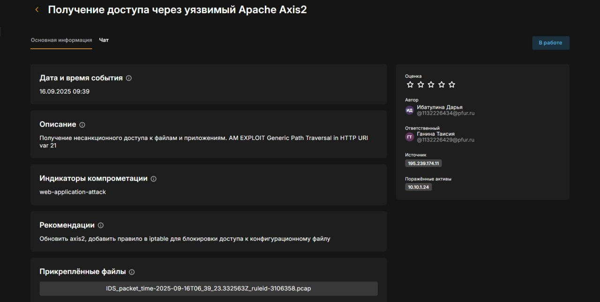
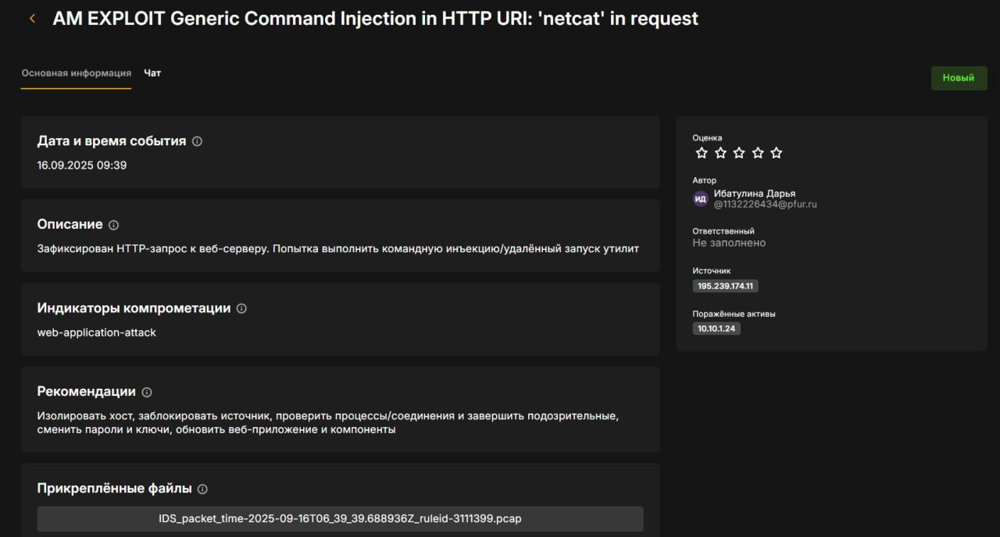
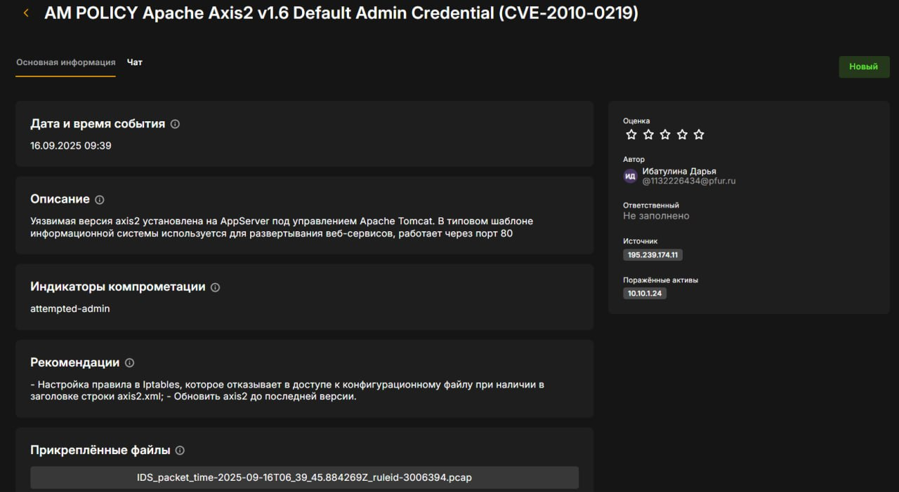
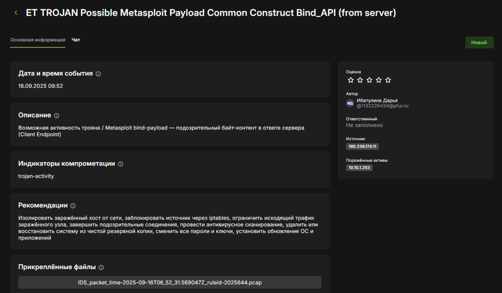
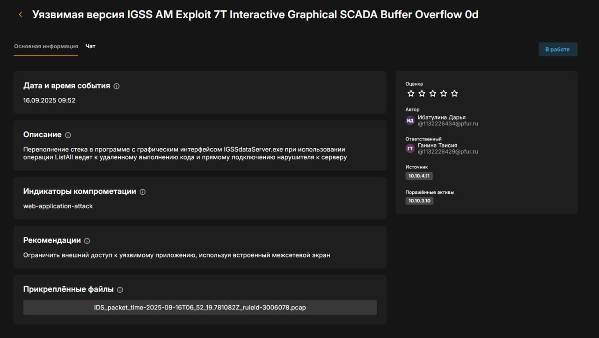

---
## Front matter
title: "Отчёт по лабораторной работе №1"
subtitle: "Дисциплина: Кибербезопасность предприятия"
author: |
  Астраханцева Анастасия  
  Ибатулина Дарья  
  Ганина Таисия  
  Шошина Евгения  
  Кадирова Мехрубон  
  Хассан Факи Абакар  
  (группа НФИбд-01-22)

## Generic otions
lang: ru-RU
toc-title: "Содержание"

## Bibliography
bibliography: bib/cite.bib
csl: pandoc/csl/gost-r-7-0-5-2008-numeric.csl

## Pdf output format
toc: true # Table of contents
toc-depth: 2
lof: true # List of figures
lot: false # List of tables
fontsize: 12pt
linestretch: 1.5
papersize: a4
documentclass: scrreprt
## I18n polyglossia
polyglossia-lang:
  name: russian
  options:
	- spelling=modern
	- babelshorthands=true
polyglossia-otherlangs:
  name: english
## I18n babel
babel-lang: russian
babel-otherlangs: english
## Fonts
mainfont: PT Serif
romanfont: PT Serif
sansfont: PT Sans
monofont: PT Mono
mainfontoptions: Ligatures=TeX
romanfontoptions: Ligatures=TeX
sansfontoptions: Ligatures=TeX,Scale=MatchLowercase
monofontoptions: Scale=MatchLowercase,Scale=0.9
## Biblatex
biblatex: true
biblio-style: "gost-numeric"
biblatexoptions:
  - parentracker=true
  - backend=biber
  - hyperref=auto
  - language=auto
  - autolang=other*
  - citestyle=gost-numeric
## Pandoc-crossref LaTeX customization
figureTitle: "Рис."
tableTitle: "Таблица"
listingTitle: "Листинг"
lofTitle: "Список иллюстраций"
lotTitle: "Список таблиц"
lolTitle: "Листинги"
## Misc options
indent: true
header-includes:
  - \usepackage{indentfirst}
  - \usepackage{float} # keep figures where there are in the text
  - \floatplacement{figure}{H} # keep figures where there are in the text
---

# Цель работы

Целью лабораторной работы является изучение методов обнаружения, анализа и устранения последствий компьютерных атак в сегменте автоматизированных систем управления технологическим процессом (АСУ ТП) на базе программного комплекса "Ampire". Работа направлена на формирование навыков защиты данных от внешних нарушителей, использующих уязвимости в программном обеспечении, и освоение инструментов мониторинга сетевой безопасности, таких как ViPNet IDS NS, ViPNet TIAS и Security Onion.

# Задание

1. Изучить типовые уязвимости, используемые при атаке на сегмент АСУ ТП.
2. Проанализировать последовательность действий нарушителя на каждом этапе атаки.
3. Освоить методы детектирования атак с использованием средств мониторинга и анализа безопасности.
4. Выполнить мероприятия по устранению последствий атаки.
5. Отработать навыки анализа сетевых соединений и процессов с помощью стандартных утилит.

# Теоретическое введение

Автоматизированные системы управления технологическим процессом (АСУ ТП) представляют собой комплекс программно-аппаратных средств, предназначенных для автоматизации управления производственными процессами в промышленности. В условиях растущей цифровизации такие системы становятся уязвимыми для компьютерных атак, которые могут привести к нарушению производственных процессов, утечке данных или физическому ущербу. Программный комплекс "Ampire" (Киберполигон Ampire) предназначен для обучения методам обнаружения, анализа и устранения последствий таких атак в симулированной среде.

Сценарий №4 "Защита данных сегмента АСУ ТП" моделирует действия внешнего нарушителя, обладающего знаниями в области инструментов для проведения компьютерных атак и техник постэксплуатации. Уровень сложности сценария оценивается как 7 из 10, что учитывает количество уязвимостей, типы узлов в шаблоне информационной системы и сложность детектирования. Нарушитель начинает с сканирования сети (195.239.174.0/24), выявления уязвимого сервера с открытым портом 8080 (Axis2 на AppServer), получения учетных данных из конфигурационного файла axis2.xml и загрузки backdoor. Далее генерируется вредоносный PDF-файл для эксплуатации переполнения буфера в CoolReaderPDF на хосте Manager Workstation 1, что приводит к meterpreter-сессии. Завершающий этап — сканирование внутренней сети (10.10.3.0/24) и эксплуатация уязвимости в IGSS на SCADA Server, с установкой удаленной сессии.

Последствия включают установку reverse_shell соединений и meterpreter-сессий, которые позволяют нарушителю закрепиться в системе и расширить доступ. Для детектирования используются:

- ViPNet IDS NS: Обнаружение вторжений через анализ сетевых пакетов, выявление этапов атаки (например, чтение axis2.xml или подключение на порт 4445).

- ViPNet TIAS: Интеллектуальный анализ событий на основе CEF-сообщений от сенсоров, классификация подозрительных инцидентов.

- Security Onion: Инструмент на базе Ubuntu с компонентами Snort, Suricata, Zeek, OSSEC, Sguil, Squert и Elastic Stack для полного захвата пакетов, обнаружения вторжений и анализа (включая визуализацию в Kibana и Squert).

Устранение уязвимостей включает настройку правил в iptables или Windows Firewall, обновление ПО до актуальных версий и удаление вредоносных файлов/процессов с помощью команд (например, kill, taskkill, rm).

# Выполнение лабораторной работы

1.  Заполнение карточек инцидентов.

Для обнаружения и анализа атак использовались средства ViPNet IDS NS. Были зафиксированы следующие ключевые инциденты, соответствующие этапам атаки (рис. @fig:001, @fig:002, @fig:003, @fig:004, @fig:005)

{#fig:001 width=70%}

{#fig:002 width=70%}

{#fig:003 width=70%}

{#fig:004 width=70%}

{#fig:005 width=70%}

- Инцидент 1: Сработало правило AM EXPLOIT Generic Path Traversal in HTTP URI, что свидетельствует о попытке злоумышленника получить несанкционированный доступ к файлам через уязвимость в Apache Axis2.

- Инцидент 2: Зафиксирован HTTP-запрос к веб-серверу. Попытка выполнить командную инъекцию/удалённый запуск утилит.

Инцидент 3: Уязвимая версия axis2 установлена на AppServer под управлением Apache Tomcat. В типовом шаблоне информационной системы используется для развертывания веб-сервисов, работает через порт 80.

- Инцидент 4: Этот инцидент сигнализирует о возможной активности трояна или полезной нагрузки Metasploit (bind-payload), обнаруженной в ответе сервера. Это подтверждает, что злоумышленник успешно установил бэкдор на SCADA-сервере.

- Инцидент 5: Переполнение стека в программе с графическим интерфейсом IGSSdataServer.exe при использовании операции ListAll ведет к удаленному выполнению кода и прямому подключению нарушителя к серверу.

2. Устранение первой уязвимости и последствия (Axis2, App backdoor).

На скриншоте (рис. @fig:006) показан процесс аутентификации на целевом хосте:

{#fig:006 width=70%}

Для блокировки доступа к конфигурационному файлу axis2.xml и предотвращения эксплуатации уязвимости CVE-2010-0219 в межсетевой экран iptables было добавлено специальное правило (рис. @fig:007, @fig:008)

Команда `sudo iptables -I INPUT 1 -j REJECT -p tcp --dport 8080 -m string --string "axis2.xml" --algo kmp` — добавляет правило в начало цепочки INPUT, которое отклоняет (REJECT) все входящие TCP-пакеты на порт 8080, если в них содержится строка axis2.xml.

Команда `sudo iptables -L INPUT -n --line-numbers` — выводит текущие правила цепочки INPUT с номерами строк для проверки.

{#fig:007 width=70%}

{#fig:008 width=70%}

На скриншоте (рис. @fig:009) видно, что у нас устранена первая уязвимость (Axis2), и можно приниматься за последствия.

{#fig:009 width=70%}

Для полной проверки с помощью утилиты `ss` было выявлено установленное соединение с IP-адресом злоумышленника `195.239.174.11` на порт `7777`, связанное с процессом `evil.conf` (`PID 8367`). Данное соединение является обратным shell-соединением (backdoor), установленным нарушителем, и подлежало немедленному завершению (рис. @fig:010)

{#fig:010 width=70%}

Переход к редактированию файла планировщика заданий crontab для пользователя tomcat (рис. @fig:011)

{#fig:011 width=70%}

В файле tomcat (рис. @fig:012, @fig:013) было обнаружено вредоносное задание `1 * * * * /opt/tomcat/webapps/evil.conf`

{#fig:012 width=70%}

{#fig:013 width=70%}

После отключения автозапуска следующим шагом стало непосредственное удаление самого файла evil.conf и завершение активного процесса, который он запустил (рис. @fig:014, @fig:015). Эти действия полностью нейтрализуют последствие атаки — "App Backdoor". После этого на сервере не остаётся ни вредоносного кода, ни механизмов его автоматического запуска. После проведения всех мероприятий была проверена общая картина устранения уязвимостей и последствий атаки.

{#fig:014 width=70%}

{#fig:015 width=70%}

2. Устранение второй уязвимости и её последствий.

Для продолжения лабораторной работы по устранению других уязвимостей (CoolReaderPDF) были получены учетные данные для доступа к рабочей станции менеджера (рис. @fig:016).

{#fig:016 width=70%}

Была реализована блокировка сетевого трафика для уязвимой программы CoolReaderPDF, что является ключевой мерой по предотвращению дальнейшего распространения вредоносного кода и установления обратных соединений с машиной злоумышленника (рис. @fig:017, @fig:018, @fig:019,  @fig:020, @fig:021).

{#fig:017 width=70%}

На скриншоте ниже показан начальный этап создания нового правила брандмауэра. Выбран тип правила «Для программы», что позволяет заблокировать сетеую активность конкретного приложения.

{#fig:018 width=70%}

Далее отображено окно настройки создаваемого правила:

- Указано имя правила: CoolPDFReader.

- Выбрано действие «Блокировать подключение», которое запрещает любое входящее и исходящее сетевое взаимодействие для уязвимой программы.

{#fig:019 width=70%}

На скриншоте ниже выполняется проверка в «Мониторе брандмауэра Защитника Windows». В списке правил для входящих подключений присутствует созданное правило CoolPDFReader. Это подтверждает, что уязвимое приложение теперь изолировано от сети, что предотвращает его использование злоумышленником для получения удаленного доступа.

{#fig:020 width=70%}

{#fig:021 width=70%}

Далее работали с последствием этой уязвимости.

После открытия командной строки была выполнена команда `netstat -bno`, которая выводит список всех TCP-соединений вместе с именами процессов и их PID (рис. @fig:022).

{#fig:022 width=70%}

Для устранения угрозы была выполнена команда: `taskkill /f /pid 5348`. Эта команда принудительно (`/f`) завершает процесс с идентификатором 5348 (рис. @fig:023).

{#fig:023 width=70%}

Обновление статуса в разделе «Уязвимости и последствия»: на данном скриншоте (рис. @fig:024) отображается интерфейс управления уязвимостями в системе «Ampire».

- Уязвимость CoolReaderPDF также помечена как «Устранено».

- Последствие Manager meterpreter теперь также имеет статус «Устранено».

{#fig:024 width=70%}

3. Устранение третьей уязвимости и её последствий.

Для проведения работ по защите SCADA-сервера необходимо было получить удалённый доступ к нему. Для этого был использован менеджер паролей KeePass (рис. @fig:025)

{#fig:025 width=70%}

Далее был запущен "Windows security center" (рис. @fig:026): в меню "Пуск" - "Accessories" - "System Tools" - "Security center".

{#fig:026 width=70%}

После этого мы включили брандмауэр (рис. @fig:027).

{#fig:027 width=70%}

На скриншоте (рис. @fig:028) на вкладке "Исключения" брандмауэра виден список правил, для которых мы убрали из исключений IGSS Dataserver. Эти правила были использованы злоумышленником для эксплуатации уязвимости.

{#fig:028 width=70%}

На скриншоте (рис. @fig:029) видно, что после настройки брандмауэра уязвимость IGSS32 была устранена, можно приниматься за последствия 

{#fig:029 width=70%}

Команда netstat -bno (рис. @fig:030) выявила установленное TCP-соединение между SCADA-сервером (10.10.3.10:1163) и IP-адресом злоумышленника (195.239.174.11:28002). Процесс, ответственный за соединение, — IGSSdataServer.exe (PID 2484).

Для нейтрализации угрозы процесс был принудительно завершен командой `taskkill /f /pid 2484`.

{#fig:030 width=70%}

Панель управления (рис. @fig:031) подтвердила успешное устранение уязвимости IGSS32 и последствия IGSS meterpreter. Все ключевые этапы атаки были нейтрализованы.

{#fig:031 width=70%}

# Выводы

В ходе выполнения лабораторной работы был успешно отработан сценарий комплексной кибератаки на сегмент АСУ ТП и проведены мероприятия по её обнаружению и нейтрализации.

# Список литературы

1. [CVE-2010-0219 — Apache Axis2 Default Credentials](https://cve.mitre.org/cgi-bin/cvename.cgi?name=CVE-2010-0219)
2. [CVE-2012-4914 — CoolPDF Reader Stack Buffer Overflow](https://cve.mitre.org/cgi-bin/cvename.cgi?name=CVE-2012-4914)
3. [CVE-2011-1567 — IGSS Stack Buffer Overflow](https://cve.mitre.org/cgi-bin/cvename.cgi?name=CVE-2011-1567)
4. [IGSS — Interactive Graphical SCADA System](https://ru.wikipedia.org/wiki/IGSS)
5. [iptables man page](https://linux.die.net/man/8/iptables)
6. [Security Onion Documentation](https://docs.securityonion.net/)
7. [ViPNet IDS NS — Руководство администратора](https://www.infotecs.ru/support/training/products/vipnet-ids-ns/)
8. [Metasploit Unleashed — Free Ethical Hacking Course](https://www.offsec.com/metasploit-unleashed/)
