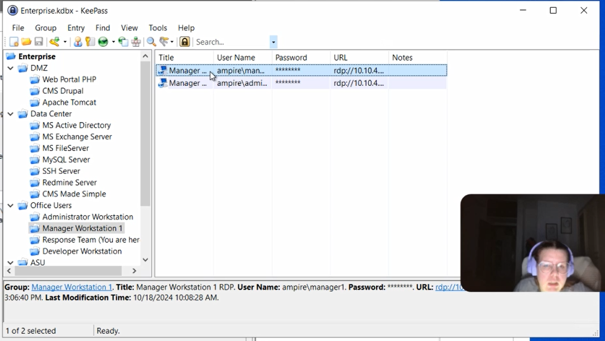
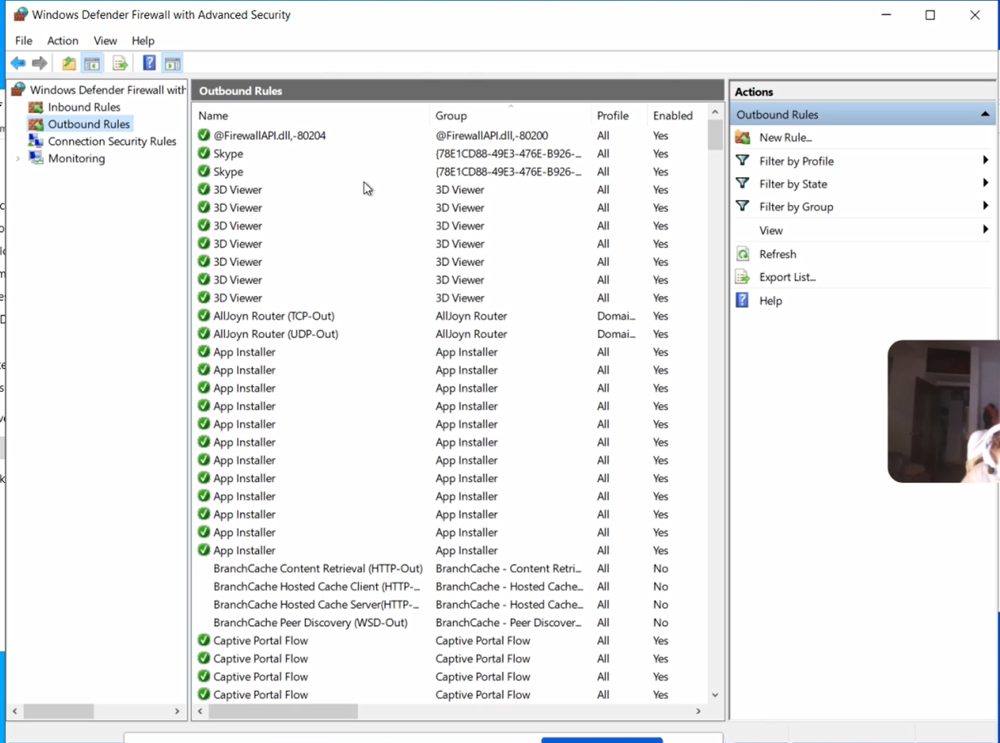
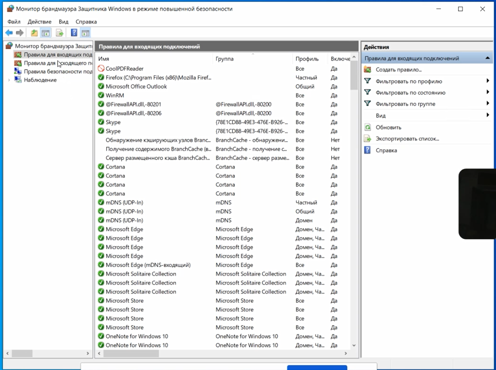

---
## Front matter
title: "Отчёт по лабораторной работе №1"
subtitle: "Дисциплина: Математическое моделирование"
author: "Ганина Таисия Сергеевна, НФИбд-01-22"

## Generic otions
lang: ru-RU
toc-title: "Содержание"

## Bibliography
bibliography: bib/cite.bib
csl: pandoc/csl/gost-r-7-0-5-2008-numeric.csl

## Pdf output format
toc: true # Table of contents
toc-depth: 2
lof: true # List of figures
lot: true # List of tables
fontsize: 12pt
linestretch: 1.5
papersize: a4
documentclass: scrreprt
## I18n polyglossia
polyglossia-lang:
  name: russian
  options:
	- spelling=modern
	- babelshorthands=true
polyglossia-otherlangs:
  name: english
## I18n babel
babel-lang: russian
babel-otherlangs: english
## Fonts
mainfont: PT Serif
romanfont: PT Serif
sansfont: PT Sans
monofont: PT Mono
mainfontoptions: Ligatures=TeX
romanfontoptions: Ligatures=TeX
sansfontoptions: Ligatures=TeX,Scale=MatchLowercase
monofontoptions: Scale=MatchLowercase,Scale=0.9
## Biblatex
biblatex: true
biblio-style: "gost-numeric"
biblatexoptions:
  - parentracker=true
  - backend=biber
  - hyperref=auto
  - language=auto
  - autolang=other*
  - citestyle=gost-numeric
## Pandoc-crossref LaTeX customization
figureTitle: "Рис."
tableTitle: "Таблица"
listingTitle: "Листинг"
lofTitle: "Список иллюстраций"
lotTitle: "Список таблиц"
lolTitle: "Листинги"
## Misc options
indent: true
header-includes:
  - \usepackage{indentfirst}
  - \usepackage{float} # keep figures where there are in the text
  - \floatplacement{figure}{H} # keep figures where there are in the text
---

# Цель работы

Целью данной работы является приобретение навыков работы с системой контроля версий git. Работа с репозиториями, внесение изменений, индексация, коммиты.

# Задание

1.  Подготовить пространство для работы.
2.  Создать проект.
3.  Внести изменения в проект.
4.  Провести индексацию изменений
5.  Работа с тегами версий.
6.  Отменить локальные изменения (до индексации).
7.  Отменить проиндексированные изменения (перед коммитом).
8.  Отменить коммит.
9.  Удалить коммиты из ветки.
10. Удаление тега.
11. Внести изменения в коммиты.
12. Переместить файлы.
13. Рассмотреть Git внутри: Каталог .git.
14. Работа непосредственно с объектами git.
15. Навигация по веткам. Изменения в ветке master.
16. Слияние веток. Создание конфликта.
17. Разрешение конфликтов.
18. Сброс ветки style. Сброс ветки master.
19. Перебазирование.
20. Слияние в ветку master.
21. Клонирование репозиториев. Просмотр клонированного репозитория.
22. Что такое origin? Удаленные ветки. Изменение оригинального репозитория.
23. Слияние извлеченных изменений.
24. Извлечение общих изменений.
25. Написание отчета по лабораторной работе в формате Markdown.

# Теоретическое введение

Система контроля версий (Version Control System) -- это инструмент, который используется для отслеживания, внесения и управления изменениями в программном коде. Это также можно назвать просто контролем версий.

Системы контроля версий помогает разработчикам сохранять изменения, внесенные в файл, на разных этапах, чтобы и они сами, и их коллеги могли их увидеть позже.

Существует три типа систем контроля версий: 

- Локальные системы контроля версий 
- Централизованные системы контроля версий 
- Распределенные системы контроля версий

**Что такое локальная система контроля версий (LVCS)?**

Этот тип системы контроля версий очень распространен и прост в использовании. Однако этот метод может выдавать ошибки и подвержен атакам, потому что файлы хранятся в вашей локальной системе.

Это означает, что вы можете потерять системный файл или случайно забыть каталог, с которым вы работаете (и затем записать в другой каталог). Что такое централизованная система контроля версий (CVCS)?

В этом типе контроля версий сервер работает как общее хранилище, в котором находятся все версии кода. CVCS помогает разработчикам работать совместно.

Однако, несмотря на то, что такой метод позволяет разработчикам сотрудничать, если сервер отключится на несколько секунд или будет поврежден, то есть шанс, что вы потеряете все файлы. Это является серьезной проблемой при работе с CVCS.

В CVCS только несколько разработчиков могут работать совместно над проектом. Что такое распределенная система контроля версий (DVCS)?

В настоящее время это новый и наиболее часто используемый тип системы контроля версий.

В DVCS у каждого разработчика есть полная резервная копия всех данных на сервере. Это означает, что всякий раз, когда сервер не будет работать или будет неисправен, то вы все равно сможете работать над своим проектом, а также копировать или создавать резервные копии своих хранилищ на сервере, чтобы восстановить их.

При работе с DVCS над одним проектом может работать много разработчиков. Одной из популярнейших DVCS является Git, о которой мы сейчас будем
говорить подробнее.

**Что такое Git?**

Git -- это бесплатная распределенная система контроля версий с открытым
исходным кодом, которую можно использовать для отслеживания изменений в
ваших файлах. В Git можно работать над всеми типами и размерами
проектов.

С помощью Git вы можете добавлять изменения в свой код, а затем
фиксировать их (или сохранять), когда это необходимо. Это означает, что
у вас есть возможность вернуться к ранее внесенным изменениям. Git
работает рука об руку с GitHub. А что же такое GitHub? Что такое GitHub?

GitHub -- это веб-интерфейс, в котором можно хранить свои репозитории
Git, а также эффективно отслеживать и управлять своими изменениями. С
его помощью разные разработчики имеют доступ к коду одного проекта. У
вас есть возможность вносить свои собственные изменения в проект
одновременно с другими разработчиками.

Например, если вы вдруг допустили какую-то ошибку во время внесения
изменений, вы можете легко вернуться к предыдущему этапу, где ошибки еще
нет.

**Для чего нужно использовать GitHub?**

Есть множество причин для использования GitHub. Давайте рассмотрим
некоторые из них.

**Эффективное управление проектами**

GitHub -- это своего рода хранилище ваших репозиториев. GitHub позволяет
разработчикам работать над одним проектом, находясь в разных местах.

С помощью GitHub вы можете легко отслеживать внесенные вами изменения и
управлять ими, а также проверять ход вашей работы над проектом. Простое
сотрудничество

С GitHub разработчики со всего мира могут работать вместе на одним
проектом без каких-либо проблем.

Команды разработчиков могут оставаться на одной странице во время
совместной работы над проектом и могут легко организовывать и эффективно
управлять проектом.

**Открытый исходный код**

GitHub -- это бесплатная система с открытым исходным кодом. Это
означает, что разработчики могут легко получить доступ к различным типам
кода/проектов, которые они могут использовать для обучения и развития
своих навыков.

**Универсальность.**

Это свойство GitHub очень важно. GitHub -- это веб-интерфейс не только
для разработчиков. Его также могут использовать дизайнеры, писатели и
все, кто хочет отслеживать историю своих проектов.

# Выполнение лабораторной работы

1.  Подготовить пространство для работы.

Я уже ранее использовала гит, поэтому сейчас выполнила несколько команд
для того, чтобы вывести на экран имя и электронную почту, а после
поработала с параметрами установки окончаний строк и с установкой
отображения unicode. (рис. @fig:001).

{#fig:001 width=70%}

2.  Создание проекта.

Я начала работу в пустом рабочем каталоге с создания пустого каталога с
именем hello, затем вошла в него и создала там файл с именем hello.html.

Потом я создала git репозиторий из этого каталога. Добавила файл в
репозиторий, проверила его состояние. (рис. @fig:002,
@fig:003, @fig:004, @fig:005).

{#fig:002 width=70%}

{#fig:003 width=70%}

{#fig:004 width=70%}

{#fig:005 width=70%}

3.  Внесение изменений в проект.

Я добавила HTML-теги к нашему приветствию. Проверила состояние рабочего
каталога, видно, что git знает, что файл hello.html был изменен, но при
этом эти изменения еще не зафиксированы в репозитории. (рис. @fig:006).

{#fig:006 width=70%}

4.  Провести индексацию изменений. Выполнила следующие команды, чтобы
    проиндексировать изменения и опять проверить состояние:

```
git add hello.html
git status
```
(рис. @fig:007).

{#fig:007 width=70%}

После этого я сделала коммит, но не писала метку `-m` в строке, поэтому
в редакторе смогла интерактивно отредактировать комментарии для коммита. (рис. @fig:008, @fig:009).

{#fig:008 width=70%}

{#fig:009 width=70%}

Потом я опять изменила файл html и добавила туда стандартные теги
страницы. При этом часть изменений я проиндексировала, а часть
(заголовок) -- нет. Произвела коммит проиндексированного изменения
(значение по умолчанию), а затем еще раз проверила состояние. Потом
последовательно проиндексировала второе изменение и закоммитила.
(рис. @fig:010, @fig:011, @fig:012, @fig:013, @fig:014).

{#fig:010 width=70%}

{#fig:011 width=70%}

{#fig:012 width=70%}

{#fig:013 width=70%}

{#fig:014 width=70%}

Далее была работа с историей и просмотр версий. (рис. @fig:015, @fig:016).

{#fig:015 width=70%}

{#fig:016 width=70%}

5.  Работа с тегами версий. Вместо поиска до хэш, использовала \^,
    обозначающее «родитель v1». Вместо обозначения v1\^ можно
    использовать v1\~1. Это обозначение можно определить как «первую
    версию предшествующую v1». Создала тег первой версии и также тег для
    предыдущей версии при помощи команд:

```
git tag v1
git checkout v1^
cat hello.html
git tag v1-beta
```

Потом переключалась между двумя отмеченными версиями и смотрела теги в
логе. (рис. @fig:017, @fig:018, @fig:019).

{#fig:017 width=70%}

{#fig:018 width=70%}

{#fig:019 width=70%}

6.  Отменить локальные изменения (до индексации). Убедилась, что
    нахожусь на последнем коммите ветки master, прежде чем продолжить
    работу. Потом внесла нежелательный комментарий, но не индексировала
    изменения и отменила их при помощи `git checkout` (рис. @fig:020)

{#fig:020 width=70%}

7.  Отменить проиндексированные изменения (перед коммитом). Я опять
    внесла нежелательные изменения в файл, но теперь уже
    проиндексировала их, а после -- отменила. (рис. @fig:021).

{#fig:021 width=70%}

8.  Отменить коммит. (рис. @fig:022, @fig:023, @fig:024).

{#fig:022 width=70%}

{#fig:023 width=70%}

{#fig:024 width=70%}

9.  Удалить коммиты из ветки. Часто мы делаем коммит, и сразу понимаем,
    что это была ошибка. Было бы неплохо иметь команду «возврата»,
    которая позволила бы нам сделать вид, что неправильного коммита
    никогда и не было. Команда «возврата» даже предотвратила бы
    появление нежелательного коммита в истории git log. (рис. @fig:025, @fig:026)

{#fig:025 width=70%}

{#fig:026 width=70%}

10. Удаление тега. Сброс в локальных ветках, как правило, безопасен.
    Последствия любой «аварии» как правило, можно восстановить простым
    сбросом с помощью нужного коммита. Однако, если ветка «расшарена» на
    удаленных репозиториях, сброс может сбить с толку других
    пользователей ветки. (рис. @fig:027).

{#fig:027 width=70%}

11. Внести изменения в коммиты. Добавим в страницу комментарий автора.
    После совершения коммита мы понимаем, что любой хороший комментарий
    должен включать электронную почту автора. Обновим страницу hello,
    включив в нее email. Давайте изменим предыдущий коммит, включив в
    него адрес электронной почты. (рис. @fig:028, @fig:029)

{#fig:028 width=70%}

{#fig:029 width=70%}

12. Переместить файлы. Сейчас мы собираемся создать структуру нашего
    репозитория. Давайте перенесем страницу в каталог lib, сделаем
    коммит этого перемещения. Добавим файл index.html в наш репозиторий.
    Теперь при открытии index.html, мы должны увидеть кусок страницы
    hello в маленьком окошке. (рис. @fig:030, @fig:031, @fig:032)

{#fig:030 width=70%}

{#fig:031 width=70%}

{#fig:032 width=70%}

13. Рассмотреть Git внутри: Каталог .git. Посмотрим каталог, в котором
    хранится вся информация git.

Выполним:

```
ls -C .git/objects
```

Мы должны увидеть набор каталогов, имена которых состоят из 2 символов.
Имена каталогов являются первыми двумя буквами хэша sha1 объекта,
хранящегося в git. После углубимся в базу данных объектов, посмотрим
файл конфигурации, создающийся для каждого конкретного проекта.

Выполним:

```
ls .git/refs
ls .git/refs/heads
ls .git/refs/tags
cat .git/refs/tags/v1
```

Мы узнаём файлы в подкаталоге тегов. Каждый файл соответствует тегу,
ранее созданному с помощью команды git tag. Его содержание --- это всего
лишь хэш коммита, привязанный к тегу. Посмотрим файл HEAD содержит
ссылку на текущую ветку, в данный момент это должна быть ветка master.
(рис. @fig:033, @fig:034, @fig:035).

{#fig:033 width=70%}

{#fig:034 width=70%}

{#fig:035 width=70%}

14. Работа непосредственно с объектами git. Посмотрим последний коммит в
    репозиторий. SHA1 хэш в нашей системе. Мы можем вывести дерево
    каталогов, ссылка на который идет в коммите. Это должно быть
    описание файлов (верхнего уровня) в нашем проекте (для конкретного
    коммита). Вывод каталога lib, вывод файла hello.html.(рис.@fig:036)

{#fig:036 width=70%}

**Самостоятельное исследование.** Исследуем git репозиторий вручную
самостоятельно. Смотрим, удастся ли нам найти оригинальный файл
hello.html с самого первого коммита вручную по ссылкам SHA1 хэша в
последнем коммите. (рис. @fig:037, @fig:038)

{#fig:037 width=70%}

{#fig:038 width=70%}

15. Навигация по веткам. Изменения в ветке master.

Пора сделать наш hello world более выразительным. Так как это может
занять некоторое время, лучше переместить эти изменения в отдельную
ветку, чтобы изолировать их от изменений в ветке master. Давайте назовем
нашу новую ветку «style». Добавим файл стилей style.css. Обновим файл
hello.html, чтобы использовать стили style.css. Обновим файл index.html,
чтобы он тоже использовал style.css. (рис. @fig:039, @fig:040).

{#fig:039 width=70%}

{#fig:040 width=70%}

Потом используем команду git checkout для переключения между ветками. (рис. @fig:041).

{#fig:041 width=70%}

Создадим файл README в ветке master. Сделаем коммит изменений README.md
в ветку master. Просмотр отличающихся веток. (рис. @fig:042).

{#fig:042 width=70%}

16. Слияние веток. Создание конфликта.

Слияние переносит изменения из двух веток в одну. Давайте вернемся к
ветке style и сольем master с style. Путем периодического слияния ветки
master с веткой style мы можем переносить из master любые изменения и
поддерживать совместимость изменений style с изменениями в основной
ветке. Но что если изменения в ветке master конфликтуют с изменениями в
style? (рис. @fig:043, @fig:044, @fig:045).

{#fig:043 width=70%}

{#fig:044 width=70%}

{#fig:045 width=70%}

17. Разрешение конфликтов. (рис. @fig:046).

{#fig:046 width=70%}

18. Сброс ветки style. Сброс ветки master.

Вернемся на ветке style к точке перед тем, как мы слили ее с веткой
master. Мы можем сбросить ветку к любому коммиту. По сути, это изменение
указателя ветки на любую точку дерева коммитов. В этом случае мы хотим
вернуться в ветке style в точку перед слиянием с master. Нам необходимо
найти последний коммит перед слиянием.(рис. @fig:047, @fig:048)

{#fig:047 width=70%}

{#fig:048 width=70%}

19. Перебазирование.

Используем команду rebase вместо команды merge. Мы вернулись в точку до
первого слияния и хотим перенести изменения из ветки master в нашу ветку
style. На этот раз для переноса изменений из ветки master мы будем
использовать команду git rebase вместо слияния. (рис. @fig:049).

{#fig:049 width=70%}

Конечный результат перебазирования очень похож на результат слияния.
Ветка style в настоящее время содержит все свои изменения, а также все
изменения ветки master. Однако, дерево коммитов значительно отличается.
Дерево коммитов ветки style было переписано таким образом, что ветка
master является частью истории коммитов. Это делает цепь коммитов
линейной и гораздо более читабельной.

20. Слияние в ветку master.

Мы поддерживали соответствие ветки style с веткой master (с помощью
rebase), теперь давайте сольем изменения style в ветку master. (рис. @fig:050).

{#fig:050 width=70%}

21. Клонирование репозиториев. Просмотр клонированного репозитория. (рис. @fig:051, @fig:052).

{#fig:051 width=70%}

{#fig:052 width=70%}


22. Что такое origin? Удаленные ветки. Изменение оригинального
    репозитория.

Мы видим, что клонированный репозиторий знает об имени по умолчанию
удаленного репозитория. Давайте посмотрим, можем ли мы получить более
подробную информацию об имени по умолчанию. (рис. @fig:053).

{#fig:053 width=70%}


23. Слияние извлеченных изменений. Научимся извлекать изменения из
    удаленного репозитория. (рис. @fig:054, @fig:055, @fig:056, @fig:057).

{#fig:054 width=70%}

{#fig:055 width=70%}

{#fig:056 width=70%}

{#fig:057 width=70%}

24. Извлечение общих изменений. (рис. @fig:058)

{#fig:058 width=70%}

25. Написание отчета по лабораторной работе в формате Markdown.

{#fig:059 width=70%}

{#fig:060 width=70%}

{#fig:061 width=70%}

{#fig:062 width=70%}

{#fig:063 width=70%}

{#fig:064 width=70%}


# Выводы

В ходе данной работы я приобрела практические навыки работы с системой
контроля версий git. Работа с репозиториями, внесение изменений,
индексация, коммиты.

# Список литературы

1.  [Руководство к лабораторной работе по git](https://esystem.rudn.ru/pluginfile.php/2584275/mod_folder/content/0/git.pdf)
2.  [Руководство к лабораторной работе по Markdown](https://esystem.rudn.ru/pluginfile.php/2584275/mod_folder/content/0/markdown.pdf)
