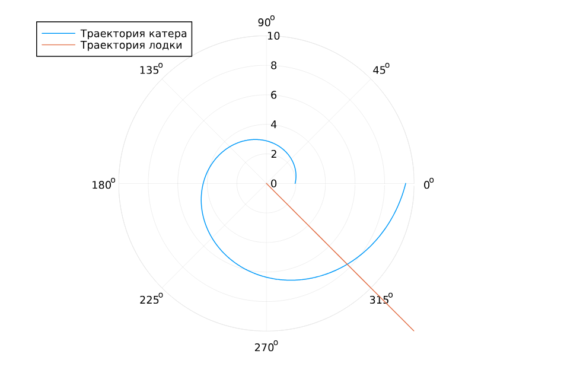
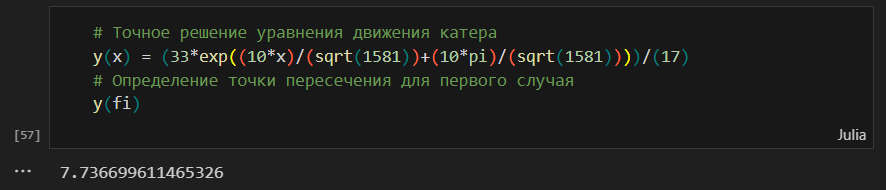

---
## Front matter
lang: ru-RU
title: "Лабораторная работа №2. Задачи поиска"
subtitle: "Дисциплина: Математическое моделирование"
author:
  - Ганина Т. С.
institute:
  - Группа НФИбд-01-22
  - Российский университет дружбы народов, Москва, Россия
date: 06 марта 2025

## i18n babel
babel-lang: russian
babel-otherlangs: english

## Formatting pdf
toc: false
toc-title: Содержание
slide_level: 2
aspectratio: 169
section-titles: true
theme: metropolis
header-includes:
 - \metroset{progressbar=frametitle,sectionpage=progressbar,numbering=fraction}
 - '\makeatletter'
 - '\beamer@ignorenonframefalse'
 - '\makeatother'
---

# Информация

## Докладчик

:::::::::::::: {.columns align=center}
::: {.column width="70%"}

  * Ганина Таисия Сергеевна
  * Студентка 3го курса, группа НФИбд-01-22
  * Фундаментальная информатика и информационные технологии
  * Российский университет дружбы народов
  * [Ссылка на репозиторий гитхаба tsganina](https://github.com/tsganina/study_2024-2025_mathmod)

:::
::: {.column width="30%"}

:::
::::::::::::::

# Вводная часть

## Цели и задачи

Целью данной работы является приобретение навыков построения математических моделей для
выбора правильной стратегии при решении задач поиска.

## Задание

На море в тумане катер береговой охраны преследует лодку браконьеров. Через определенный промежуток времени туман рассеивается, и лодка обнаруживается на расстоянии 9,9 км от катера. Затем лодка снова скрывается в тумане и уходит прямолинейно в неизвестном направлении. Известно, что скорость катера в 4,1 раза больше скорости браконьерской лодки.

1. Записать уравнение, описывающее движение катера, с начальными условиями для двух случаев (в зависимости от расположения катера относительно лодки в начальный момент времени).
2. Построить траекторию движения катера и лодки для двух случаев.
3. Найти точку пересечения траектории катера и лодки

# Записать уравнение, описывающее движение катера, с начальными условиями для двух случаев.

## Записать уравнение, описывающее движение катера, с начальными условиями для двух случаев.

**Начальные условия**

- $t_0 = 0$: Время, когда происходит обнаружение лодки.
- $x_{l0} = 0$: Местоположение лодки браконьеров в момент обнаружения — на полюсе, т.е. в начале координат.
- $x_{k0} = 9,9$ км: Местоположение катера береговой охраны в момент обнаружения лодки.

**Установка полярной системы координат**

- Полюс выбран как точка обнаружения лодки, и ось $r$ (радиальная ось) проходит через точку нахождения катера береговой охраны.
- Угол $\theta = 0$ в момент обнаружения лодки, и катер будет двигаться вдоль этой оси до тех пор, пока не окажется на том же расстоянии от полюса, что и лодка.

## Записать уравнение, описывающее движение катера, с начальными условиями для двух случаев.

**Первоначальная прямая траектория катера**

Катер должен двигаться вдоль прямой, пока не окажется на одинаковом расстоянии от полюса, как и лодка. Лодка за время $t$ пройдет расстояние $x$, а катер — расстояние $k - x$ (или $k + x$, в зависимости от того, с какой стороны катер относительно полюса).

Время, за которое оба пройдут это расстояние, будет одинаковым. Для лодки это время равно $\frac{x}{v}$, где $v$ — скорость лодки. Для катера время будет $\frac{k - x}{4.1v}$ (или 
$\frac{k + x}{4.1v}$, в зависимости от положения катера).

## Записать уравнение, описывающее движение катера, с начальными условиями для двух случаев.

Поскольку время одинаковое, мы составляем уравнение:

$\frac{x}{v} = \frac{k - x}{4.1v}$ или $\frac{x}{v} = \frac{k + x}{4.1v}$

Таким образом, для первого случая, где $k = 9.9$:

$x_1 = \frac{9.9}{5.1}$, 
а для второго случая: $x_2 = \frac{9.9}{3.1}$

## Записать уравнение, описывающее движение катера, с начальными условиями для двух случаев.

Разбиваем скорость катера на две составляющие:

- Радиальная скорость ($v_r$) — это скорость, с которой катер удаляется от полюса. Мы полагаем, что радиальная скорость равна скорости лодки: 

$$v_r = \frac{dr}{dt} = v$$

- Тангенциальная скорость ($v_{\tau}$) — это скорость, с которой катер движется по окружности вокруг полюса.

$$v_{\tau} = r \frac{d\theta}{dt}$$

## Записать уравнение, описывающее движение катера, с начальными условиями для двух случаев.

Так как катер движется с более высокой скоростью (в 4,1 раза больше скорости лодки), мы находим тангенциальную скорость:

$$v_{\tau} = \sqrt{16.81 \cdot v^2 - v^2} = \sqrt{15.81} \cdot v$$

## Записать уравнение, описывающее движение катера, с начальными условиями для двух случаев.

Теперь мы можем описать движение катера в виде системы дифференциальных уравнений:

$$
\begin{cases}
\frac{dr}{dt} = v \\
r \frac{d\theta}{dt} = \sqrt{15.81} \cdot v
\end{cases}
$$

## Записать уравнение, описывающее движение катера, с начальными условиями для двух случаев.

С начальными условиями для первого случая:

$$
\begin{cases}
\theta_0 = 0 \\
r_0 = \frac{9.9}{5.1}
\end{cases}
$$

## Записать уравнение, описывающее движение катера, с начальными условиями для двух случаев.

Для второго случая:

$$
\begin{cases}
\theta_0 = -\pi \\
r_0 = \frac{9.9}{3.1}
\end{cases}
$$

## Записать уравнение, описывающее движение катера, с начальными условиями для двух случаев.

Исключая из системы производную по времени $t$, можно получить уравнение, которое связывает радиус $r$ и угол $\theta$:

$$\frac{dr}{d\theta} = \frac{r}{\sqrt{15.81}}$$

Это уравнение можно решить, чтобы получить траекторию катера в полярных координатах.

# Построить траекторию движения катера и лодки для двух случаев.

## Построить траекторию движения катера и лодки для двух случаев.

```Julia
using DifferentialEquations, Plots
# Расстояние между лодкой и катером
k = 9.9 
# Начальные условия для двух случаев
r0 = k / 5.1 
r0_2 = k / 3.1 
theta0 = (0.0, 2*pi) 
theta0_2 = (-pi, pi)
```

## Построить траекторию движения катера и лодки для двух случаев.

```Julia
# Угол движения лодки браконьеров и интервал времени
fi = 3*pi/4
t = (0, 50)
# Функция, описывающая движение лодки браконьеров
x(t) = tan(fi) * t
# Дифференциальное уравнение для движения катера
f(r, p, t) = r / sqrt(15.81)
# Решение ДУ для первого случая
prob = ODEProblem(f, r0, theta0)
sol = solve(prob, saveat = 0.01)
# Построение траектории катера
plot(sol.t, sol.u, proj=:polar, lims=(0, 10), label="Траектория катера")
```

## Построить траекторию движения катера и лодки для двух случаев.

После этого я выполнила построение траектории лодки:

```Julia
# Угол и координаты для построения траектории лодки
ugol = [fi for i in range(0, 15)]
x_lims = [x(i) for i in range(0, 15)]

# Добавление траектории лодки на график
plot!(ugol, x_lims, proj=:polar, lims=(0, 10), label="Траектория лодки")
```

## Построить траекторию движения катера и лодки для двух случаев.

{#fig:003 width=40%}

## Построить траекторию движения катера и лодки для двух случаев.

Далее повторила действия для второго случая):

```Julia
# Решение ДУ для второго случая
prob_2 = ODEProblem(f, r0_2, theta0_2)
sol_2 = solve(prob_2, saveat = 0.01)
# Построение траектории катера во втором случае
plot(sol_2.t, sol_2.u, proj=:polar, lims=(0, 15), label="Траектория катера")

# Добавление траектории лодки на график
plot!(ugol, x_lims, proj=:polar, lims=(0, 15), label="Траектория лодки")
```

## Построить траекторию движения катера и лодки для двух случаев.

{#fig:004 width=70%}

# Найти точку пересечения траектории катера и лодки

## Найти точку пересечения траектории катера и лодки, код для первого случая

{#fig:005 width=70%}

## Найти точку пересечения траектории катера и лодки, код для второго случая

{#fig:006 width=70%}


# Результаты

В ходе данной работы я приобрела практические навыки построения математических моделей для
выбора правильной стратегии при решении задач поиска.
