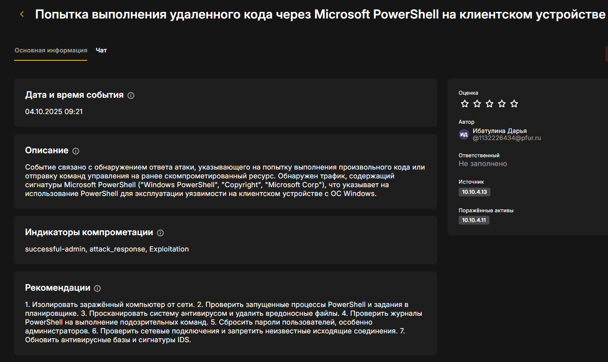
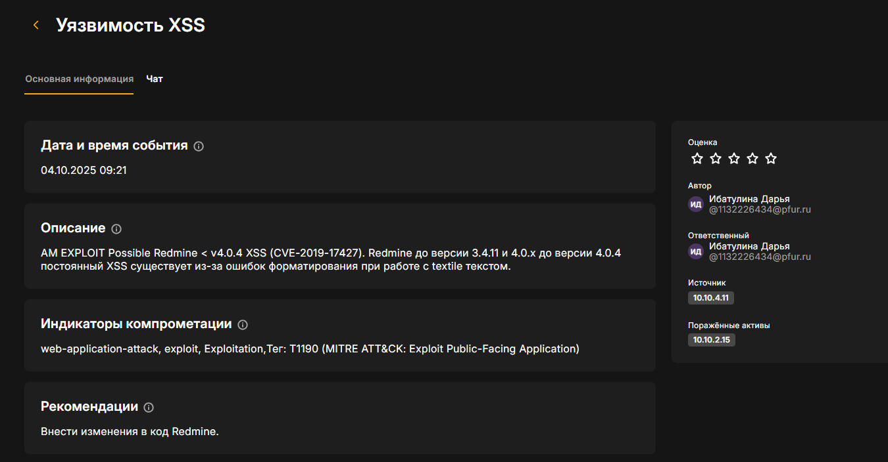

---
## Front matter
lang: ru-RU
title: "Лабораторная работа №2. Защита научно-технической информации предприятия"
subtitle: "Дисциплина: Кибербезопасность предприятия"
author:
  - Астраханцева Анастасия
  - Ганина Таисия
  - Ибатулина Дарья
  - Шошина Евгения
  - Кадирова Мехрубон
  - Хассан Факи Абакар

institute:
  - Группа НФИбд-01-22
  - Российский университет дружбы народов, Москва, Россия
date: 15 октября 2025

## i18n babel
babel-lang: russian
babel-otherlangs: english

## Formatting pdf
toc: false
toc-title: Содержание
slide_level: 2
aspectratio: 169
section-titles: true
theme: metropolis
header-includes:
 - \metroset{progressbar=frametitle,sectionpage=progressbar,numbering=fraction}
 - '\makeatletter'
 - '\beamer@ignorenonframefalse'
 - '\makeatother'
---

# Вводная часть

## Цели и задачи

Целью лабораторной работы является освоение практических навыков выявления, анализа и устранения уязвимостей информационных систем в рамках сценария «Защита научно-технической информации предприятия».

## Задание

1. Изучить уязыимости: слабый пароль пользователя, Blind SQL, XSS
2. Проанализировать последовательность действий нарушителя на каждом этапе атаки.
3. Освоить методы детектирования атак с использованием средств мониторинга и анализа безопасности.
4. Выполнить мероприятия по устранению последствий атаки.

# Заполнение карточек инцидентов

##

Для обнаружения и анализа атак использовались средства ViPNet IDS NS. Были зафиксированы следующие ключевые инциденты, соответствующие этапам атаки

{#fig:001 width=30%}

## Активность трояна LaZagne

{#fig:002 width=70%}

## Попытка выполнения удаленного кода через Microsoft PowerShell на клиентском устройстве

{#fig:003 width=70%}

## Уязвимость XSS

{#fig:004 width=70%}

## Попытка SQL-инъекции с использованием SELECT и SLEEP на веб-сервере redmine.ampire.corp

{#fig:005 width=70%}

## Чужой пользователь Redmine
 
 {#fig:006 width=70%}

# Устранение первой уязвимости и последствия

## Устанение первой уязвимости

:::::::::::::: {.columns align=center}
::: {.column width="50%"}

Для устранения уязвимости 1 необходимо сменить пароль пользователя

:::
::: {.column width="50%"}

{#fig:007 width=70%}

:::
::::::::::::::

## Устранена уязвимость 1

{#fig:008 width=70%}

## Описание последствия 1

Что произошло из-за установки слабого пароля пользователя dev1:

Начало атаки: Внутренний нарушитель подобрал слабый пароль на файловом сервере и заменил легитимный файл на вредоносный (backdoor).

Заражение: Пользователь dev1 скачал и запустил этот вредоносный файл.

Закрепление: После получения контроля над компьютером dev1, нарушитель создал задачу в планировщике, которая будет автоматически запускать вредоносный файл `svchosting.exe` каждый раз при входе пользователя *dev1* в систему. Это позволяет злоумышленнику сохранять доступ к компьютеру даже после перезагрузки.

## Вкладка General в планировщике задач

:::::::::::::: {.columns align=center}
::: {.column width="50%"}

Открываем планировщик задач и обнаруживаем подозрительную задачу:

:::
::: {.column width="50%"}

{#fig:009 width=70%}

:::
::::::::::::::

## Вкладка Actions в планировщике задач - путь к вредоносному файлу

:::::::::::::: {.columns align=center}
::: {.column width="50%"}

Задача настроена на выполнение программы (Start a program). Путь к исполняемому файлу: `C:\Users\dev1\Downloads\svchosting.exe`.
Это указывает на то, что злоумышленник разместил вредоносный файл svchosting.exe в папке загрузок пользователя dev1 и настроил его автоматический запуск через планировщик задач.

:::
::: {.column width="50%"}

{#fig:010 width=70%}

:::
::::::::::::::

## Устранено последствие уязвимости "Слабый пароль пользователя"

:::::::::::::: {.columns align=center}
::: {.column width="50%"}

Для устранения последствия мы удалили задачу и вредоносный exe-файл в директории `C:\Users\dev1\Downloads`.

Переходим на сервер и видим, что устанено последствие уязвимости "Слабый пароль пользователя"

:::
::: {.column width="50%"}

{#fig:011 width=70%}

:::
::::::::::::::

## Просмотр учетных данных администратора

:::::::::::::: {.columns align=center}
::: {.column width="40%"}

На скриншоте видим, что для доступа к серверу Redmine (10.10.2.15) были использованы учетные данные администратора (admin). Это необходимо для получения прав на редактирование кода сервера.

:::
::: {.column width="60%"}

{#fig:012 width=70%}

:::
::::::::::::::

## Mодификация файла redcloth3.rb

:::::::::::::: {.columns align=center}
::: {.column width="60%"}

Видим, что злоумышленником была добавлена константа *ALLOWED_TAGS*, которая определяет список тегов, которые не будут экранироваться. Тег `<pre>`, который использовался злоумышленником для внедрения вредоносного JavaScript-кода, мы исключили из этого списка. Теперь, при обнаружении любого тега, не входящего в ALLOWED_TAGS, он теперь будет автоматически экранирован (заменен на &lt; и &gt;), что делает его безопасным для отображения.

:::
::: {.column width="40%"}

{#fig:013 width=70%}

:::
::::::::::::::

## Перезапуск сервера

:::::::::::::: {.columns align=center}
::: {.column width="40%"}

После внесения изменений в код в терминале мы выполняем команду `sudo systemctl restart nginx.service`. Это необходимо для того, чтобы веб-сервер загрузил обновленный код и изменения вступили в силу.

:::
::: {.column width="60%"}

{#fig:014 width=70%}

:::
::::::::::::::

## Содержимое Wiki-страницы после внесения изменений в код и перезапуска сервера

:::::::::::::: {.columns align=center}
::: {.column width="40%"}

На скриншоте показано содержимое Wiki-страницы проекта Dev1 до и после перезапуска сервера. До перезапуска вредоносный код отображался "как есть", запускался при переходе на веб-страницу, а после — был экранирован и стал просто текстом.

:::
::: {.column width="60%"}

{#fig:015 width=70%}

:::
::::::::::::::

## Видим, что уязвимость XSS успешно устранена

{#fig:016 width=70%}

## Удаление нового пользователя Redmine

:::::::::::::: {.columns align=center}
::: {.column width="50%"}

В ходе сценария внутренний нарушитель успешно эксплуатировал уязвимость XSS (CVE-2019-17427) для внедрения вредоносного JavaScript-кода на Wiki-страницу проекта Dev1. Этот код был направлен на создание нового пользователя с правами администратора, что позволило злоумышленнику получить неограниченный доступ к системе Redmine и ее конфиденциальной информации.

:::
::: {.column width="50%"}

{#fig:018 width=70%}

:::
::::::::::::::

## Полностью устранена вторая уязвимость и её последствие

{#fig:019 width=70%}

## Эксплуатация уязвимости Blind SQL-инъекции

:::::::::::::: {.columns align=center}
::: {.column width="50%"}

На приведенном скриншоте показан процесс эксплуатации уязвимости до ее устранения. Он демонстрирует, как злоумышленник проводит атаку Blind SQL-инъекции.

:::
::: {.column width="50%"}

{#fig:020 width=70%}

:::
::::::::::::::

## Внесение изменений в файл query.rb

:::::::::::::: {.columns align=center}
::: {.column width="50%"}

Внесем изменения в файл *query.rb*. Этот файл является частью модели данных Redmine и отвечает за формирование SQL-запросов к базе данных. В нем  находится код, который обрабатывает параметр *subproject_id*.

:::
::: {.column width="50%"}

{#fig:021 width=70%}

:::
::::::::::::::

## Перезапуск сервера

:::::::::::::: {.columns align=center}
::: {.column width="50%"}

После внесения изменений в файл *query.rb* в терминале мы выполняем команду `sudo systemctl restart nginx.service`. Это необходимо для того, чтобы изменения вступили в силу.

:::
::: {.column width="50%"}

{#fig:022 width=70%}

:::
::::::::::::::

## Полностью устранена третья уязвимость (последствия нет)

{#fig:023 width=70%}

# Результаты

В ходе лабораторной работы был успешно реализован сценарий защиты научно-технической информации предприятия: обнаружены и устранены уязвимости (слабый пароль, XSS, Blind SQL-инъекция), нейтрализованы последствия атаки (удалён backdoor и несанкционированный пользователь Redmine).
