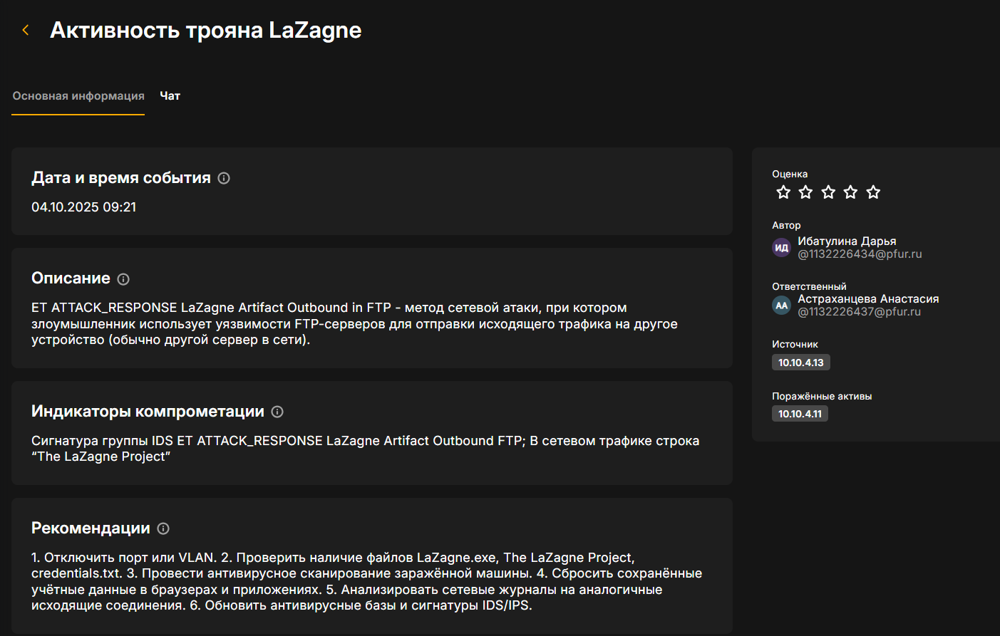

---
## Front matter
title: "Отчёт по лабораторной работе №2"
subtitle: "Дисциплина: Математическое моделирование"
author: "Ганина Таисия Сергеевна, НФИбд-01-22"

## Generic otions
lang: ru-RU
toc-title: "Содержание"

## Bibliography
bibliography: bib/cite.bib
csl: pandoc/csl/gost-r-7-0-5-2008-numeric.csl

## Pdf output format
toc: true # Table of contents
toc-depth: 2
lof: true # List of figures
lot: true # List of tables
fontsize: 12pt
linestretch: 1.5
papersize: a4
documentclass: scrreprt
## I18n polyglossia
polyglossia-lang:
  name: russian
  options:
	- spelling=modern
	- babelshorthands=true
polyglossia-otherlangs:
  name: english
## I18n babel
babel-lang: russian
babel-otherlangs: english
## Fonts
mainfont: PT Serif
romanfont: PT Serif
sansfont: PT Sans
monofont: PT Mono
mainfontoptions: Ligatures=TeX
romanfontoptions: Ligatures=TeX
sansfontoptions: Ligatures=TeX,Scale=MatchLowercase
monofontoptions: Scale=MatchLowercase,Scale=0.9
## Biblatex
biblatex: true
biblio-style: "gost-numeric"
biblatexoptions:
  - parentracker=true
  - backend=biber
  - hyperref=auto
  - language=auto
  - autolang=other*
  - citestyle=gost-numeric
## Pandoc-crossref LaTeX customization
figureTitle: "Рис."
tableTitle: "Таблица"
listingTitle: "Листинг"
lofTitle: "Список иллюстраций"
lotTitle: "Список таблиц"
lolTitle: "Листинги"
## Misc options
indent: true
header-includes:
  - \usepackage{indentfirst}
  - \usepackage{float} # keep figures where there are in the text
  - \floatplacement{figure}{H} # keep figures where there are in the text
---

# Цель работы

Целью данной работы является приобретение навыков построения математических моделей для
выбора правильной стратегии при решении задач поиска.

# Задание

На море в тумане катер береговой охраны преследует лодку браконьеров. Через определенный промежуток времени туман рассеивается, и лодка обнаруживается на расстоянии 9,9 км от катера. Затем лодка снова скрывается в тумане и уходит прямолинейно в неизвестном направлении. Известно, что скорость катера в 4,1 раза больше скорости браконьерской лодки.

1. Записать уравнение, описывающее движение катера, с начальными условиями для двух случаев (в зависимости от расположения катера относительно лодки в начальный момент времени).
2. Построить траекторию движения катера и лодки для двух случаев.
3. Найти точку пересечения траектории катера и лодки

# Теоретическое введение


Кривая погони — кривая, представляющая собой решение задачи о «погоне», которая ставится следующим образом. Пусть точка A равномерно движется по некоторой заданной кривой. Требуется найти траекторию равномерного движения точки P такую, что касательная, проведённая к траектории в любой момент движения, проходила бы через соответствующее этому моменту положение точки A.[@wiki_online]

# Выполнение лабораторной работы

В начале я установила среду Julia с официального сайта и установила все необходимые пакеты (рис. @fig:001):

{#fig:001 width=70%}

Далее, перед непосредственным началом выполнения лабораторной работы я вычислила свой номер варианта (рис. @fig:002):

{#fig:002 width=70%}

Далее можно было перейти к заданию 1.

1. Записать уравнение, описывающее движение катера, с начальными условиями для двух случаев (в зависимости от расположения катера относительно лодки в начальный момент времени).

В данном задаче мы моделируем движение катера береговой охраны, который должен догнать и затем следовать за лодкой браконьеров, используя полярные координаты.

**Начальные условия**

- $t_0 = 0$: Время, когда происходит обнаружение лодки.
- $x_{l0} = 0$: Местоположение лодки браконьеров в момент обнаружения — на полюсе, т.е. в начале координат.
- $x_{k0} = 9,9$ км: Местоположение катера береговой охраны в момент обнаружения лодки.

**Установка полярной системы координат**

- Полюс выбран как точка обнаружения лодки, и ось $r$ (радиальная ось) проходит через точку нахождения катера береговой охраны.
- Угол $\theta = 0$ в момент обнаружения лодки, и катер будет двигаться вдоль этой оси до тех пор, пока не окажется на том же расстоянии от полюса, что и лодка.

**Первоначальная прямая траектория катера**

Катер должен двигаться вдоль прямой, пока не окажется на одинаковом расстоянии от полюса, как и лодка. Лодка за время $t$ пройдет расстояние $x$, а катер — расстояние $k - x$ (или $k + x$, в зависимости от того, с какой стороны катер относительно полюса).

Время, за которое оба пройдут это расстояние, будет одинаковым. Для лодки это время равно $\frac{x}{v}$, где $v$ — скорость лодки. Для катера время будет $\frac{k - x}{4.1v}$ (или 
$\frac{k + x}{4.1v}$, в зависимости от положения катера).

Поскольку время одинаковое, мы составляем уравнение:

$$\frac{x}{v} = \frac{k - x}{4.1v}$$

или

$$\frac{x}{v} = \frac{k + x}{4.1v}$$

Таким образом, для первого случая, где $k = 9.9$:

$$x_1 = \frac{9.9}{5.1}$$

Для второго случая:

$$x_2 = \frac{9.9}{3.1}$$

**Переход к круговой траектории**

После того как катер окажется на том же расстоянии от полюса, что и лодка, он должен начать движение по круговой траектории вокруг полюса. При этом катер должен удаляться от полюса с той же скоростью $v$, что и лодка. 

Для этого мы разбиваем скорость катера на две составляющие:
- Радиальная скорость ($v_r$) — это скорость, с которой катер удаляется от полюса. Мы полагаем, что радиальная скорость равна скорости лодки: 

$$v_r = \frac{dr}{dt} = v$$

- Тангенциальная скорость ($v_{\tau}$) — это скорость, с которой катер движется по окружности вокруг полюса. Эта скорость определяется через угловую скорость $\frac{d\theta}{dt}$:

$$v_{\tau} = r \frac{d\theta}{dt}$$

Так как катер движется с более высокой скоростью (в 4,1 раза больше скорости лодки), мы находим тангенциальную скорость:

$$v_{\tau} = \sqrt{16.81 \cdot v^2 - v^2} = \sqrt{15.81} \cdot v$$

**Система дифференциальных уравнений**

Теперь мы можем описать движение катера в виде системы дифференциальных уравнений:

$$
\begin{cases}
\frac{dr}{dt} = v \\
r \frac{d\theta}{dt} = \sqrt{15.81} \cdot v
\end{cases}
$$

С начальными условиями для первого случая:

$$
\begin{cases}
\theta_0 = 0 \\
r_0 = \frac{9.9}{5.1}
\end{cases}
$$

Для второго случая:

$$
\begin{cases}
\theta_0 = -\pi \\
r_0 = \frac{9.9}{3.1}
\end{cases}
$$

**Уравнение для радиальной зависимости**

Исключая из системы производную по времени $t$, можно получить уравнение, которое связывает радиус $r$ и угол $\theta$:

$$\frac{dr}{d\theta} = \frac{r}{\sqrt{15.81}}$$

Это уравнение можно решить, чтобы получить траекторию катера в полярных координатах.

2. Построить траекторию движения катера и лодки для двух случаев.

Здесь уже был необходим следующий код:

```Julia
using DifferentialEquations, Plots

# Расстояние между лодкой и катером
k = 9.9 

# Начальные условия для двух случаев
r0 = k / 5.1 
r0_2 = k / 3.1 
theta0 = (0.0, 2*pi) 
theta0_2 = (-pi, pi)

# Угол движения лодки браконьеров и интервал времени
fi = 3*pi/4
t = (0, 50)

# Функция, описывающая движение лодки браконьеров
x(t) = tan(fi) * t

# Дифференциальное уравнение для движения катера
f(r, p, t) = r / sqrt(15.81)

# Решение ДУ для первого случая
prob = ODEProblem(f, r0, theta0)
sol = solve(prob, saveat = 0.01)

# Построение траектории катера
plot(sol.t, sol.u, proj=:polar, lims=(0, 10), label="Траектория катера")
```

После этого я выполнила построение траектории лодки:

```Julia
# Угол и координаты для построения траектории лодки
ugol = [fi for i in range(0, 15)]
x_lims = [x(i) for i in range(0, 15)]

# Добавление траектории лодки на график
plot!(ugol, x_lims, proj=:polar, lims=(0, 10), label="Траектория лодки")
```

И получила следующий результат (рис. @fig:003)

{#fig:003 width=70%}


Далее повторила действия для второго случая (рис. @fig:004):

```Julia
# Решение ДУ для второго случая
prob_2 = ODEProblem(f, r0_2, theta0_2)
sol_2 = solve(prob_2, saveat = 0.01)

# Построение траектории катера во втором случае
plot(sol_2.t, sol_2.u, proj=:polar, lims=(0, 15), label="Траектория катера")

# Добавление траектории лодки на график
plot!(ugol, x_lims, proj=:polar, lims=(0, 15), label="Траектория лодки")

```

{#fig:004 width=70%}

3. Найти точку пересечения траектории катера и лодки, код для первого случая (рис. @fig:005):

```Julia
# Точное решение уравнения движения катера
y(x) = (33*exp((10*x)/(sqrt(1581))+(10*pi)/(sqrt(1581))))/(17)
# Определение точки пересечения для первого случая
y(fi)
```

{#fig:005 width=70%}

Код для второго случая (рис. @fig:006):

{#fig:006 width=70%}

# Выводы

В ходе данной работы я приобрела практические навыки построения математических моделей для
выбора правильной стратегии при решении задач поиска.


# Список литературы{.unnumbered}

::: {#refs}
:::
