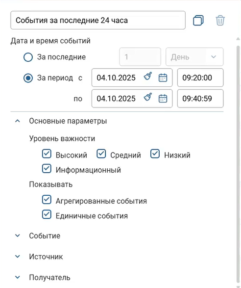

---
## Front matter
title: "Отчёт по лабораторной работе №2"
subtitle: "Защита научно-технической информации предприятия"
author: |
  Астраханцева Анастасия  
  Ибатулина Дарья  
  Ганина Таисия  
  Шошина Евгения  
  Кадирова Мехрубон  
  Хассан Факи Абакар  
  (группа НФИбд-01-22)

## Generic otions
lang: ru-RU
toc-title: "Содержание"

## Bibliography
bibliography: bib/cite.bib
csl: pandoc/csl/gost-r-7-0-5-2008-numeric.csl

## Pdf output format
toc: true # Table of contents
toc-depth: 2
lof: true # List of figures
lot: false # List of tables
fontsize: 12pt
linestretch: 1.5
papersize: a4
documentclass: scrreprt
## I18n polyglossia
polyglossia-lang:
  name: russian
  options:
    - spelling=modern
    - babelshorthands=true
polyglossia-otherlangs:
  name: english
## I18n babel
babel-lang: russian
babel-otherlangs: english
## Fonts
mainfont: PT Serif
romanfont: PT Serif
sansfont: PT Sans
monofont: PT Mono
mainfontoptions: Ligatures=TeX
romanfontoptions: Ligatures=TeX
sansfontoptions: Ligatures=TeX,Scale=MatchLowercase
monofontoptions: Scale=MatchLowercase,Scale=0.9
## Biblatex
biblatex: true
biblio-style: "gost-numeric"
biblatexoptions:
  - parentracker=true
  - backend=biber
  - hyperref=auto
  - language=auto
  - autolang=other*
  - citestyle=gost-numeric
## Pandoc-crossref LaTeX customization
figureTitle: "Рис."
tableTitle: "Таблица"
listingTitle: "Листинг"
lofTitle: "Список иллюстраций"
lotTitle: "Список таблиц"
lolTitle: "Листинги"
## Misc options
indent: true
header-includes:
  - \usepackage{indentfirst}
  - \usepackage{float} # keep figures where there are in the text
  - \floatplacement{figure}{H} # keep figures where there are in the text
---

# Цель работы

Целью лабораторной работы является освоение практических навыков выявления, анализа и устранения уязвимостей информационных систем в рамках сценария «Защита научно-технической информации предприятия».

# Задание

1. Изучить уязвимости: слабый пароль пользователя, Blind SQL, XSS
2. Проанализировать последовательность действий нарушителя на каждом этапе атаки.
3. Освоить методы детектирования атак с использованием средств мониторинга и анализа безопасности.
4. Выполнить мероприятия по устранению последствий атаки [@lab].

# Теоретическое введение

**VipNet IDS** (Intrusion Detection System) — программно-аппаратный комплекс, предназначенный для обнаружения вторжений в информационные системы. Он осуществляет непрерывный мониторинг сетевого трафика, выявляет признаки известных атак по сигнатурам, а также аномалии в поведении пользователей и систем. При обнаружении угрозы VipNet IDS генерирует оповещения и предлагает рекомендации по реагированию. Система тесно интегрирована с другими компонентами линейки VipNet, что обеспечивает комплексную, многоуровневую защиту корпоративной ИТ-инфраструктуры [@ids-ns].

**Слабый пароль пользователя** — распространённая конфигурационная ошибка, при которой для учётной записи задаётся предсказуемый или общеизвестный пароль (например, «123456», «password», «admin» и т.п.). Такая практика создаёт условия для успешного подбора или перебора учётных данных, что даёт злоумышленнику несанкционированный доступ к системе.

**XSS (межсайтовый скриптинг), CVE-2019-17427** — уязвимость в веб-приложении Redmine, вызванная недостаточной фильтрацией пользовательского ввода в текстовых полях (в частности, при использовании формата textile). Она позволяет внедрить вредоносный JavaScript-код, который будет выполнен в браузере других пользователей при просмотре заражённой страницы. Это может привести к краже сессионных токенов, подмене интерфейса или выполнению действий от имени жертвы.

**Blind SQL Injection, CVE-2019-18890** — уязвимость в Redmine, возникающая из-за отсутствия корректной валидации параметров запроса (например, `subproject_id`). Злоумышленник может использовать «слепые» SQL-инъекции — метод, при котором данные извлекаются по косвенным признакам (например, по времени ответа сервера). Это позволяет посимвольно читать содержимое базы данных, включая конфиденциальную информацию, а в некоторых случаях — выполнять произвольные команды на сервере.

**Developer backdoor** — скрытый механизм доступа, намеренно или случайно оставленный разработчиком в программном обеспечении. Такой «чёрный ход» позволяет обойти стандартные процедуры аутентификации и получить несанкционированный контроль над системой без видимых следов взлома.

**Redmine User** — компрометация учётной записи в системе Redmine (например, через XSS или утечку данных с рабочей станции) предоставляет злоумышленнику доступ к проектной документации, задачам, исходным кодам и другим элементам научно-технической информации. В контексте сценария №5 лабораторной работы это является ключевым этапом утечки конфиденциальных данных предприятия.

# Выполнение лабораторной работы

Для сценария № 5 «Защита научно-технической информации предприятия» определены три уязвимости и два последствия:

1) *Уязвимость 1.* Слабый пароль пользователя.

2) *Последствие.* Developer backdoor.

3) *Уязвимость 2.* XSS (CVE-2019-17427).

4) *Последствие.* Redmine User.

5) *Уязвимость 3.* Blind SQL (CVE-2019-18890).

**1.  Заполнение карточек инцидентов.**

Для обнаружения и анализа атак использовались средства ViPNet IDS NS.

Для обнаружения актуальной подозрительной активности пользуемся фильтрами по дате, времени и важности (рис. @fig:001).

{#fig:001 width=70%}

Были зафиксированы следующие ключевые инциденты, соответствующие этапам атаки (рис. @fig:002, @fig:003, @fig:004, @fig:005, @fig:006).

{#fig:002 width=70%}

{#fig:003 width=70%}

{#fig:004 width=70%}

{#fig:005 width=70%}

{#fig:006 width=70%}

- Инцидент 1: **Активность трояна LaZagne**

Что произошло: Обнаружена активность сетевой атаки, связанной с трояном LaZagne. Сигнатура IDS указывает на "ET ATTACK_RESPONSE LaZagne Artifact Outbound in FTP", а в трафике зафиксирована строка "The LaZagne Project" [@lazagne].

Что это означает: Внутренний нарушитель, получив доступ к компьютеру пользователя Dev-1 (после подбора слабого пароля на файловом сервере и запуска backdoor), использует троян LaZagne для кражи учетных данных (логинов и паролей), хранящихся в браузерах и других приложениях. Эти данные необходимы для последующего входа в систему Redmine.

Рекомендации: Необходимо изолировать зараженный хост (10.10.4.13), провести полное антивирусное сканирование, сбросить все пароли, которые могли быть скомпрометированы, и обновить антивирусные базы и сигнатуры IDS/IPS [@amtip].

- Инцидент 2: **Попытка выполнения удаленного кода через Microsoft PowerShell**

Что произошло: Обнаружен трафик, указывающий на попытку выполнения произвольного кода или отправки команд управления на ранее скомпрометированный ресурс. Трафик содержит сигнатуры Microsoft PowerShell ("Windows PowerShell", "Copyright", "Microsoft Corp").

Что это означает: Злоумышленник использует PowerShell для автоматизации дальнейших действий: загрузки дополнительных вредоносных модулей, сбора информации или установки постоянного доступа (backdoor). Это позволяет ему эффективно управлять зараженной машиной.

Рекомендация: Изолировать зараженный клиентский компьютер, проверить и завершить все подозрительные процессы PowerShell, провести антивирусное сканирование, сбросить пароли администраторов и обновить системы защиты [@amtip].

Инцидент 3: **Уязвимость XSS (Cross-Site Scripting)**

Что произошло: На сервере Redmine обнаружена уязвимость межсайтового скриптинга (XSS), идентифицированная как CVE-2019-17427. Эта уязвимость существует в версиях Redmine до 3.4.11 и 4.0.x до 4.0.4.

Что это означает: Это ключевой этап атаки. Внутренний нарушитель использует эту уязвимость для внедрения вредоносного JavaScript-кода на Wiki-страницу проекта Dev1. Цель — получить контроль над сессией администратора Redmine, чтобы создать нового пользователя с правами администратора. Это позволяет злоумышленнику закрепиться в системе и получить неограниченный доступ к пользовательской базе данных.

Рекомендация: Необходимо внести изменения в код Redmine, а именно в файл redcloth3.rb, чтобы исправить ошибку форматирования при работе с textile текстом. После внесения изменений требуется перезапустить веб-сервер (`sudo systemctl restart nginx.service`) [@amtip].

- Инцидент 4: **Попытка SQL-инъекции**

Что произошло: Зафиксирована попытка SQL-инъекции на веб-сервере `redmine.ampire.corp`. Злоумышленник отправил HTTP-запрос, содержащий элементы `SELECT` и `SLEEP`, что является классическим признаком атаки типа "слепая инъекция".

Что это означает: Это финальный этап атаки. После того, как нарушитель получил права администратора в Redmine, он использует уязвимость Blind SQL-инъекции (CVE-2019-18890) для посимвольного перебора и извлечения конфиденциальной информации из базы данных. Использование SLEEP позволяет ему определить, какие символы в запросе являются правильными, основываясь на времени ответа сервера.

Рекомендация: Необходимо внести изменения в код Redmine, в частности, в файл query.rb, добавив фильтрацию входных параметров и закомментировав уязвимый код. После этого также требуется перезапустить веб-сервер [@sql] [@amtip].

- Инцидент 5: **Чужой пользователь Redmine**

Что произошло: На сервере Redmine был создан новый пользователь с правами администратора [@redmine].

Что это означает: Это прямое следствие успешной эксплуатации уязвимости XSS. Нарушитель, получив контроль над сессией администратора, создал нового пользователя (`hacker`) с максимальными привилегиями. Это позволяет ему беспрепятственно просматривать, изменять или удалять любую информацию в Redmine, включая конфиденциальные данные проектов.

Рекомендация: Необходимо немедленно удалить этого нового пользователя через веб-интерфейс Redmine (в разделе Administration -> Users). Важно: Это действие будет эффективным только после того, как будет устранена сама уязвимость XSS, иначе нарушитель сможет снова создать нового пользователя [@amtip].

1. Устранение первой уязвимости (Слабый пароль пользователя) и ее последсвия:

В начале сценария внутренний нарушитель подбирает слабый пароль для входа на файловый сервер, получает доступ к учетным данным пользователя dev1 и загружает на его компьютер `backdoor`. Чтобы нейтрализовать эту угрозу и предотвратить дальнейший доступ злоумышленника, необходимо сменить пароль пользователя dev1 (рис. @fig:007). Мы установили сложный пароль, состоящий из латинских букв нижнего и верхнего регистра, цифр и специальных символов, а также не являющийся словом, датой рождения и не содержащий другие персональные данные:

{#fig:007 width=70%}

На скриншоте (рис. @fig:008) видно, что у нас устранена первая уязвимость (Слабый пароль пользователя), и можно приниматься за последствие.

{#fig:008 width=70%}

Что произошло из-за установки слабого пароля пользователя dev1:

Начало атаки: Внутренний нарушитель подобрал слабый пароль на файловом сервере и заменил легитимный файл на вредоносный (backdoor).

Заражение: Пользователь dev1 скачал и запустил этот вредоносный файл.

Закрепление: После получения контроля над компьютером dev1, нарушитель создал задачу в планировщике, которая будет автоматически запускать вредоносный файл `svchosting.exe` каждый раз при входе пользователя *dev1* в систему. Это позволяет злоумышленнику сохранять доступ к компьютеру даже после перезагрузки.

Открываем планировщик задач и обнаруживаем подозрительную задачу:

Имя задачи: *Evil task*

Автор: `AMPIRE\dev1`. Это означает, что задача была создана от имени легитимного пользователя dev1, что помогает ей выглядеть менее подозрительно.
Настройки безопасности: Задача будет запускаться только тогда, когда пользователь dev1 залогинен в системе (Run only when user is logged on). Это типично для атак, где злоумышленник хочет, чтобы вредоносное ПО работало в контексте активной сессии пользователя, чтобы иметь доступ к его данным и ресурсам (рис. @fig:009).

{#fig:009 width=70%}

Задача настроена на выполнение программы (Start a program). Путь к исполняемому файлу: `C:\Users\dev1\Downloads\svchosting.exe`.
Это указывает на то, что злоумышленник разместил вредоносный файл svchosting.exe в папке загрузок пользователя dev1 и настроил его автоматический запуск через планировщик задач (рис. @fig:010).

{#fig:010 width=70%}

Для устранения последствия мы удалили задачу и вредоносный exe-файл в директории `C:\Users\dev1\Downloads`.

Переходим на сервер и видим, что устанено последствие уязвимости "Слабый пароль пользователя" (рис. @fig:011).

{#fig:011 width=70%}

2. Устранение второй уязвимости и её последствия:

Последовательность действий, показанная на скриншотах (рис. @fig:012-@fig:016), представляет собой процесс устранения уязвимости XSS (CVE-2019-17427) в системе Redmine, которая была эксплуатирована злоумышленником для создания нового пользователя с правами администратора.

На скриншоте (рис. @fig:012) видим, что для доступа к серверу Redmine (10.10.2.15) были использованы учетные данные администратора (admin). Это необходимо для получения прав на редактирование кода сервера.

{#fig:012 width=70%}

Далее, открываем файл */var/www/redmine/lib/redcloth3.rb*. Это библиотека, отвечающая за преобразование текста в формате textile в HTML. В этом файле было найдено место, где обрабатываются HTML-теги, и внесены изменения для исправления уязвимости.

Видим, что злоумышленником была добавлена константа *ALLOWED_TAGS*, которая определяет список тегов, которые не будут экранироваться. Тег <pre>, который использовался злоумышленником для внедрения вредоносного JavaScript-кода, мы исключили из этого списка. Теперь, при обнаружении любого тега, не входящего в ALLOWED_TAGS, он теперь будет автоматически экранирован (заменен на &lt; и &gt;), что делает его безопасным для отображения (рис. @fig:013).

{#fig:013 width=70%}

После внесения изменений в код в терминале мы выполняем команду `sudo systemctl restart nginx.service`. Это необходимо для того, чтобы веб-сервер загрузил обновленный код и изменения вступили в силу (рис. @fig:014).

{#fig:014 width=70%}

На скриншоте (рис. @fig:015) показано содержимое Wiki-страницы проекта Dev1 до и после перезапуска сервера. До перезапуска вредоносный код отображался "как есть", запускался при переходе на веб-страницу, а после — был экранирован и стал просто текстом.

{#fig:015 width=70%}

Видим. что уязвимость XSS успешно устранена (рис. @fig:016).

{#fig:016 width=70%}

Далее работаем с последствием этой уязвимости.

В ходе сценария внутренний нарушитель успешно эксплуатировал уязвимость XSS (CVE-2019-17427) для внедрения вредоносного JavaScript-кода на Wiki-страницу проекта Dev1. Этот код был направлен на создание нового пользователя с правами администратора, что позволило злоумышленнику получить неограниченный доступ к системе Redmine и ее конфиденциальной информации.

На данных скриншотах (рис. @fig:017-@fig:018) показан процесс удаления созданного злоумышленником пользователя через веб-интерфейс администратора Redmine.

{#fig:017 width=70%}

{#fig:018 width=70%}

Последствие Redmine User теперь также имеет статус «Устранено».

{#fig:019 width=70%}

3. Устранение третьей уязвимости (последствия у нее нет):

Следующие скриншоты (рис. @fig:020-@fig:021) демонстрируют процесс устранения уязвимости Blind SQL-инъекции (CVE-2019-18890) в системе Redmine, которая была эксплуатирована злоумышленником для похищения конфиденциальной информации [@sql].

На рис. @fig:020 показан процесс эксплуатации уязвимости до ее устранения. Он демонстрирует, как злоумышленник проводит атаку Blind SQL-инъекции.

Что видно:

В адресной строке браузера введен URL: `redmine.ampire.corp/issues.xml?project_id=1&subproject_id=2,3-SLEEP(2)`.

Вкладка "Network" (Сеть) в инструментах разработчика показывает список HTTP-запросов.

Запрос issues.xml?project_id=1&subproject_id=2,3-SLEEP(2) имеет время выполнения 8.13 секунд (Time).

В левой части окна отображается XML-ответ сервера, который содержит данные о задачах проекта.

Это классический пример Blind SQL-инъекции. Злоумышленник использует функцию `SLEEP(2)` для создания искусственной задержки ответа сервера.

Если параметр `subproject_id` не был бы обработан корректно, сервер выполнил бы SQL-запрос, содержащий SLEEP(2), и ответил бы с задержкой в 2 секунды (плюс время выполнения самого запроса). Длинное время ответа (8.13 секунд) — это сигнал для атакующего, что его запрос был успешно выполнен.

Используя эту технику, злоумышленник может посимвольно перебирать данные из базы данных (например, пароли, названия проектов, содержимое задач), просто измеряя время ответа сервера. Если время ответа увеличивается, значит, символ подобран верно.

Этот скриншот служит доказательством того, что уязвимость существовала и была активно эксплуатирована. После внесения исправления в *query.rb* и перезапуска сервера, такой запрос больше не вызовет задержки, так как параметр subproject_id будет автоматически приведен к целому числу, и SLEEP(2) будет проигнорирован.

{#fig:020 width=70%}

Внесем изменения в файл *query.rb* (рис. @fig:021). Этот файл является частью модели данных Redmine и отвечает за формирование SQL-запросов к базе данных. В нем  находится код, который обрабатывает параметр *subproject_id*.

Что было сделано: Была внесена критическая правка. Оригинальная строка кода:

`ids = [project.id] + values_for("subproject_id").each(&:to_i)`

была закомментирована. Вместо нее была добавлена новая строка:

`ids = [project.id] + values_for("subproject_id").map(&:to_i)`

Исходный код использовал метод `.each`, который не выполнял должной фильтрации или преобразования входных данных. Это позволяло злоумышленнику передавать в параметр *subproject_id* произвольные SQL-команды, которые затем вставлялись в запрос без проверки.

Решение: Метод `.map` применяет функцию `&:to_i` ко всем элементам массива. Функция *to_i* (convert to integer) преобразует любое значение в целое число. Если входное значение не является числом, оно будет приведено к 0. Таким образом, любой попытке передать SQL-код (например, `or 1=1 --`) будет противопоставлено число 0, что делает атаку невозможной. Это простая, но эффективная форма фильтрации входных данных.

{#fig:021 width=70%}

После внесения изменений в файл *query.rb* в терминале мы выполняем команду `sudo systemctl restart nginx.service`. Это необходимо для того, чтобы изменения вступили в силу (рис. @fig:022).

{#fig:022 width=70%}

На скриншоте (рис. @fig:023) видно, что после настройки брандмауэра уязвимость IGSS32 была устранена, можно приниматься за последствия 

{#fig:023 width=70%}

# Выводы

В ходе лабораторной работы был успешно реализован сценарий защиты научно-технической информации предприятия: обнаружены и устранены уязвимости (слабый пароль, XSS, Blind SQL-инъекция), нейтрализованы последствия атаки (удалён backdoor и несанкционированный пользователь Redmine).

# Список литературы
