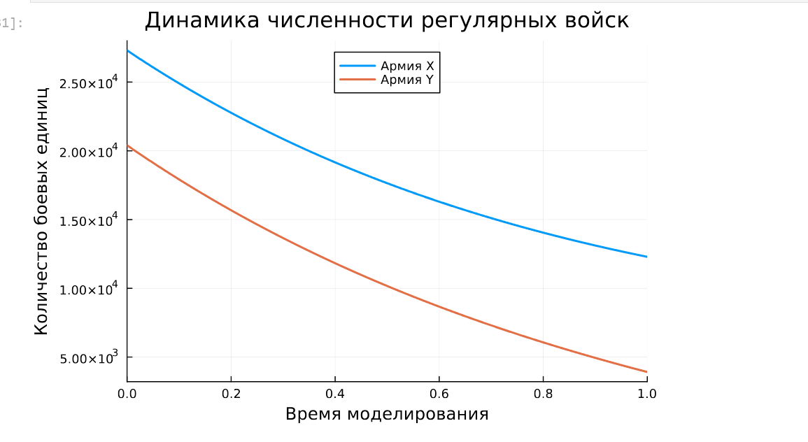
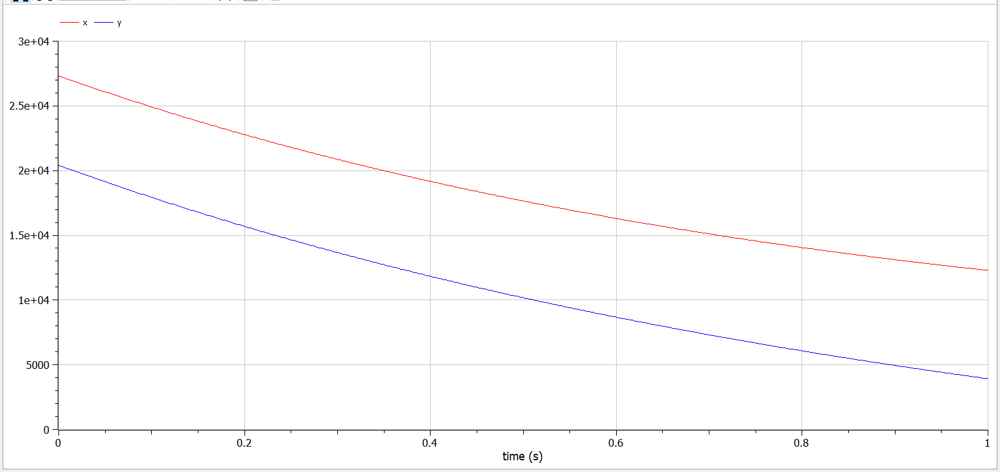
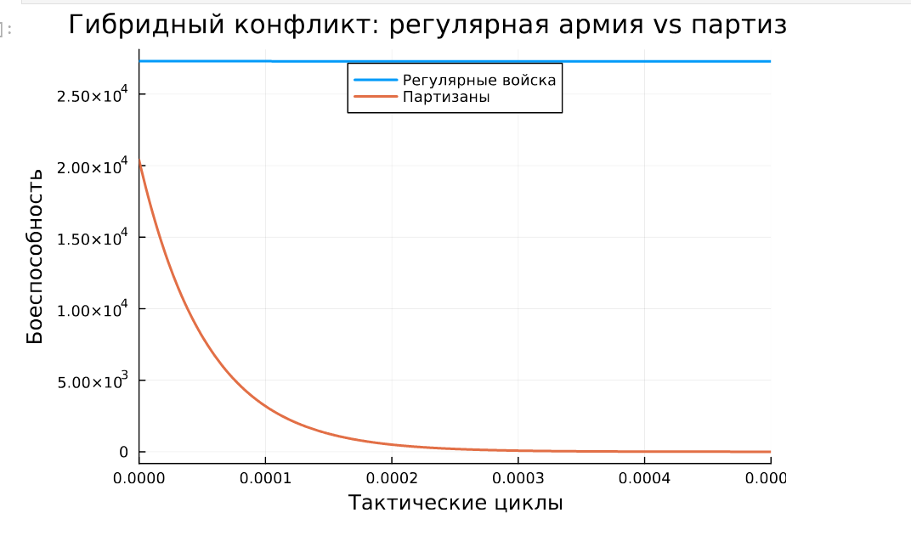
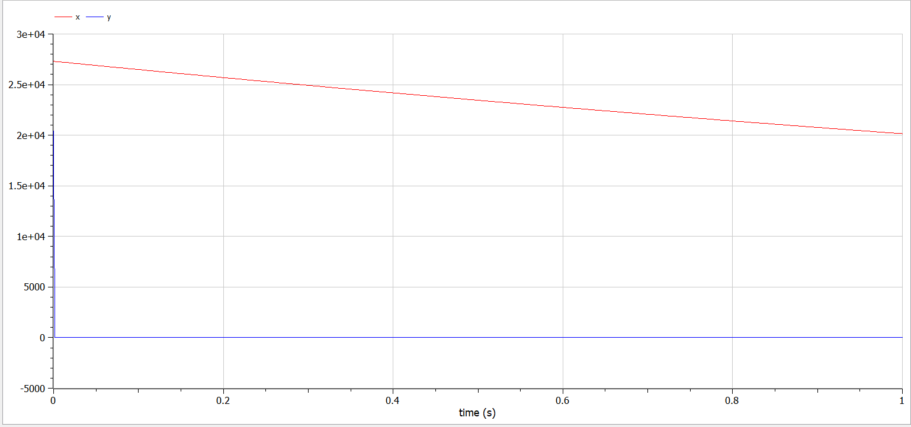
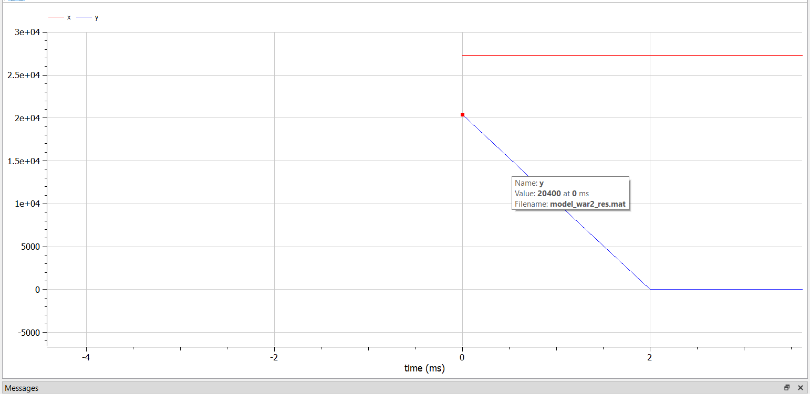
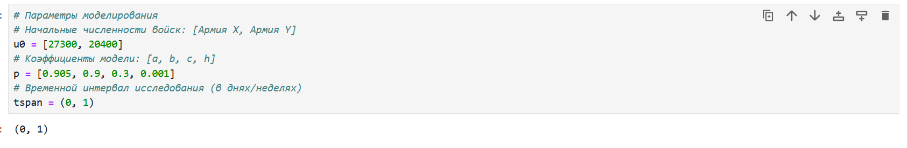
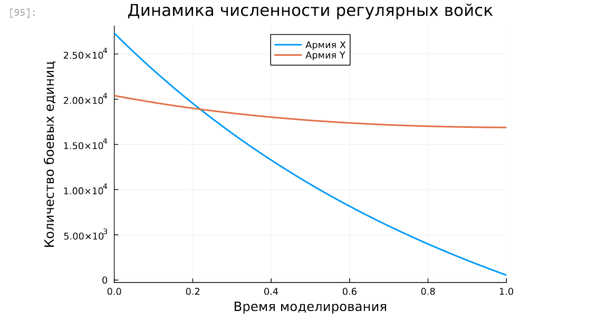

---
## Front matter
lang: ru-RU
title: "Лабораторная работа №3. Модель ведение боевых действий"
subtitle: "Дисциплина: Математическое моделирование"
author:
  - Ганина Т. С.
institute:
  - Группа НФИбд-01-22
  - Российский университет дружбы народов, Москва, Россия
date: 21 марта 2025

## i18n babel
babel-lang: russian
babel-otherlangs: english

## Formatting pdf
toc: false
toc-title: Содержание
slide_level: 2
aspectratio: 169
section-titles: true
theme: metropolis
header-includes:
 - \metroset{progressbar=frametitle,sectionpage=progressbar,numbering=fraction}
 - '\makeatletter'
 - '\beamer@ignorenonframefalse'
 - '\makeatother'
---

# Информация

## Докладчик

:::::::::::::: {.columns align=center}
::: {.column width="70%"}

  * Ганина Таисия Сергеевна
  * Студентка 3го курса, группа НФИбд-01-22
  * Фундаментальная информатика и информационные технологии
  * Российский университет дружбы народов
  * [Ссылка на репозиторий гитхаба tsganina](https://github.com/tsganina/study_2024-2025_mathmod)

:::
::: {.column width="30%"}

:::
::::::::::::::

# Вводная часть

## Цели и задачи

Построить модель боевых действий на языке прогаммирования Julia и посредством ПО OpenModelica.

## Задание

Между страной $Х$ и страной $У$ идет война. Численность состава войск
исчисляется от начала войны, и являются временными функциями $x(t)$ и $y(t)$. В начальный момент времени страна Х имеет армию численностью 27 300 человек, а
в распоряжении страны У армия численностью в 20 400 человек. Для упрощения
модели считаем, что коэффициенты a, b, c, h постоянны. Также считаем P(t) и Q(t) непрерывные функции.
Построить графики изменения численности войск армии $Х$ и армии $У$ для
следующих случаев:

1. Модель боевых действий между регулярными войсками:

$$\begin{cases}
    \dfrac{dx}{dt} = -0.405x(t) - 0.7y(t)+sin(t+8) + 1\\
    \dfrac{dy}{dt} = -0.68x(t) - 0.37y(t)+cos(t+6) + 1
\end{cases}$$

## Задание

2. Модель ведение боевых действий с участием регулярных войск и партизанских отрядов:

$$\begin{cases}
    \dfrac{dx}{dt} = -0.304x(t)-0.78y(t)+2*sin(2t)\\
    \dfrac{dy}{dt} = -0.68x(t)y(t)-0.2y(t)+2*cos(2t)
\end{cases}$$

# Модель боевых действий между регулярными войсками

## Модель боевых действий между регулярными войсками (Julia)

$$\begin{cases}
    \dfrac{dx}{dt} = -0.405x(t) - 0.7y(t)+sin(t+8) + 1\\
    \dfrac{dy}{dt} = -0.68x(t) - 0.37y(t)+cos(t+6) + 1
\end{cases}$$

- Потери, не связанные с боевыми действиями, описывают члены $-0.405x(t)$ и $-0.37y(t)$ (коэффиценты при $x$ и $y$ - это величины, характеризующие степень влияния различных факторов на потери)

- члены $-0.7y(t)$ и $-0.68x(t)$ отражают потери на поле боя (коэффиценты при  $x$ и $y$ указывают на эффективность боевых действий со стороны у и х соответственно).

- Функции $P(t) = sin(t+8) + 1$, $Q(t) = cos(t+6) + 1$ учитывают
возможность подхода подкрепления к войскам Х и У в течение одного дня.

## Модель боевых действий между регулярными войсками (Julia)

{#fig:001 width=70%}

## Модель боевых действий между регулярными войсками (Julia)

```Julia
using DifferentialEquations, Plots;
# Нелинейная неавтономная система с внешними возмущениями:
# dx/dt = -a*x - b*y + sin(3t)  (динамика армии X)
# dy/dt = -c*x - h*y + cos(4t) + 2  (динамика армии Y)
# где:
# a, b, c, h - коэффициенты боевой эффективности
# sin/cos-функции - моделируют внешние факторы (подкрепления/потери)
function reg(u, p, t)
    x, y = u
    a, b, c, h = p
    dx = -a*x - b*y + sin(t+8) + 1
    dy = -c*x - h*y + cos(t+6) + 1
    return [dx, dy]
end
```

## Модель боевых действий между регулярными войсками (Julia)

```Julia
# Параметры моделирования
# Начальные численности войск: [Армия X, Армия Y]
u0 = [27300, 20400]  
p = [0.405, 0.7, 0.68, 0.37]  
tspan = (0, 1)  

# Формулировка задачи Коши
# reg - функция системы
# u0 - начальные условия
# tspan - временной диапазон
# p - вектор параметров
prob = ODEProblem(reg, u0, tspan, p)
```

## Модель боевых действий между регулярными войсками (Julia)

```Julia
# Численное решение системы
# Используется адаптивный метод Tsitouras 5/4 Runge-Kutta
# с автоматическим выбором шага для обеспечения точности
sol = solve(prob, Tsit5())

# Визуализация результатов
plot(sol, 
    title = "Динамика численности регулярных войск", 
    label = ["Армия X" "Армия Y"], 
    xaxis = "Время моделирования", 
    yaxis = "Количество боевых единиц",
    linewidth = 2,
    legend = :top)
```

## Модель боевых действий между регулярными войсками (OpenModelica)

{#fig:002 width=70%}

## Модель боевых действий между регулярными войсками (OpenModelica)

```
model model_war1
  parameter Real a = 0.405;
  parameter Real b = 0.7;
  parameter Real c = 0.68;
  parameter Real h = 0.37;
  parameter Real x0 = 27300;
  parameter Real y0 = 20400;
  Real x(start=x0);
  Real y(start=y0);
equation
  der(x) = -a*x - b*y + sin(time+8) + 1;
  der(y) = -c*x - h*y + cos(time+6) + 1;
end model_war1;
```

# Модель ведение боевых действий с участием регулярных войск и партизанских отрядов

## Модель ведение боевых действий с участием регулярных войск и партизанских отрядов (Julia)

$$\begin{cases}
    \dfrac{dx}{dt} = -0.304x(t)-0.78y(t)+2*sin(2t)\\
    \dfrac{dy}{dt} = -0.68x(t)y(t)-0.2y(t)+2*cos(2t)
\end{cases}$$

В этой системе все величины имею тот же смысл, что и в системе до этого.

## Модель ведение боевых действий с участием регулярных войск и партизанских отрядов (Julia)

{#fig:003 width=70%}

## Модель ведение боевых действий с участием регулярных войск и партизанских отрядов (Julia)

```Julia
function reg_part(u, p, t)
    x, y = u
    a, b, c, h = p
    dx = -a*x - b*y + 2*sin(2*t)  # Потери от боев + циклические подкрепления
    dy = -c*x*y - h*y + 2*cos(2*t)  # Партизанские потери от взаимодействия
    return [dx, dy]
end
```

## Модель ведение боевых действий с участием регулярных войск и партизанских отрядов (Julia)

```Julia
# Исходные параметры конфликта
# Начальная численность: [Регулярные войска, Партизанские отряды]
u0 = [27300, 20400]  
# Коэффициенты: 
# [a - эффективность Y против X, 
#  b - потери X от партизан, 
#  c - интенсивность партизанской войны,
#  h - собственные потери Y]
p = [0.304, 0.78, 0.68, 0.2]  
# Масштаб времени: краткосрочный конфликт (1 условная единица)
tspan = (0, 0.0005)
```

## Модель ведение боевых действий с участием регулярных войск и партизанских отрядов (Julia)

```Julia
prob2 = ODEProblem(reg_part, u0, tspan, p)
# Используется адаптивный метод Tsitouras 5/4 Runge-Kutta
# с автоматическим выбором шага для обеспечения точности
sol2 = solve(prob2, Tsit5())
plot(sol2, 
    title = "Гибридный конфликт: регулярная армия vs партизаны", 
    label = ["Регулярные войска" "Партизаны"], 
    xaxis = "Тактические циклы", 
    yaxis = "Боеспособность",
    linewidth = 2,
    legend = :top)
```

## Модель ведение боевых действий с участием регулярных войск и партизанских отрядов (OpenModelica)

{#fig:004 width=70%}

## Модель ведение боевых действий с участием регулярных войск и партизанских отрядов (OpenModelica)

{#fig:005 width=70%}

## Модель ведение боевых действий с участием регулярных войск и партизанских отрядов (OpenModelica)

```
model model_war2
  parameter Real a = 0.304;
  parameter Real b = 0.78;
  parameter Real c = 0.68;
  parameter Real h = 0.2;
  parameter Real x0 = 27300;
  parameter Real y0 = 20400;
  Real x(start=x0);
  Real y(start=y0);
equation
  der(x) = -a*x - b*y + 2*sin(2*time);
  der(y) = -c*x*y - h*y + 2*cos(2*time);
end model_war2;
```

## Меняем коэффициенты

{#fig:006 width=70%}

## Меняем коэффициенты

{#fig:007 width=70%}

## Сравнение в таблице

: Сравнение коэффициентов

| Параметр | Первый случай (победа X) | Второй случай (победа Y) |
| --- | --- | --- |
| Эффективность Y (b) | 0.7 | **0.9** |
| Эффективность X (c) | **0.68** | 0.3 |
| Небоевые потери X (a) | 0.405 | **0.905** |
| Небоевые потери Y (h) | 0.37 | **0.001** |

# Результаты

В процессе выполнения данной лабораторной работы я построила модель боевых действий на языке прогаммирования Julia и посредством ПО OpenModelica, а также провела сравнительный анализ.
