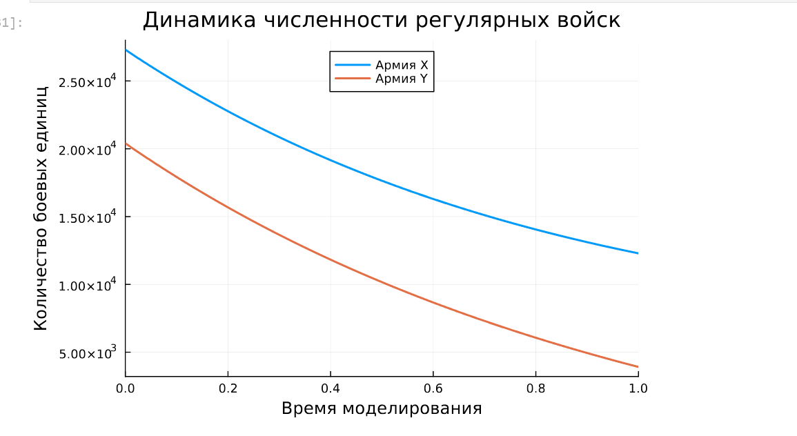
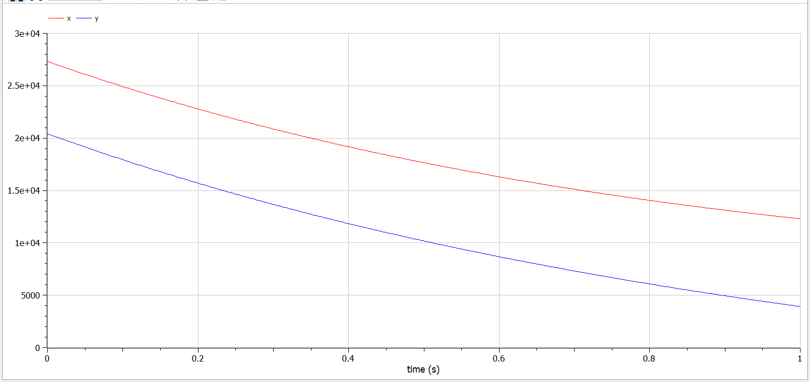
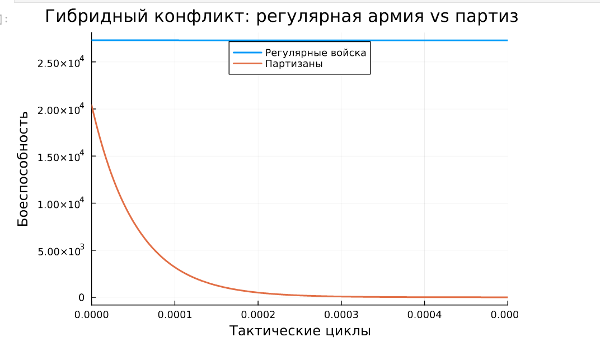
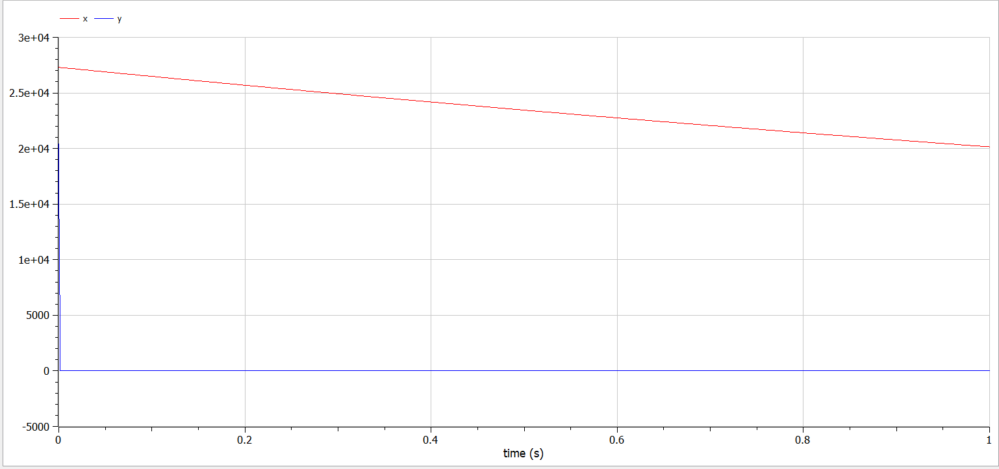
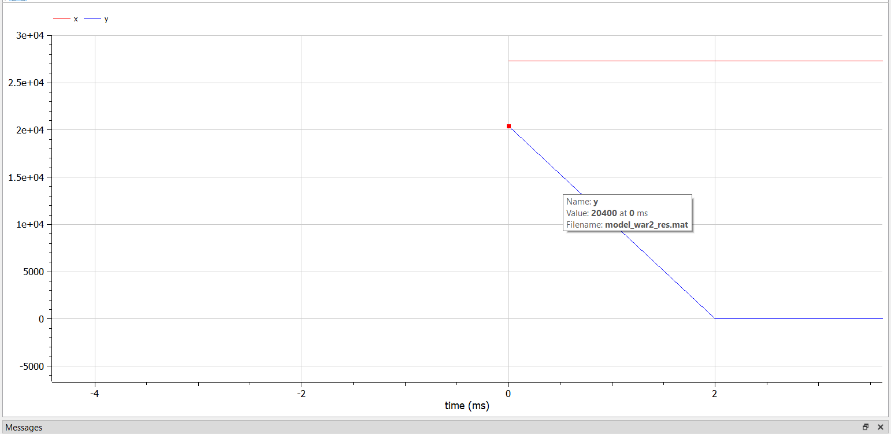
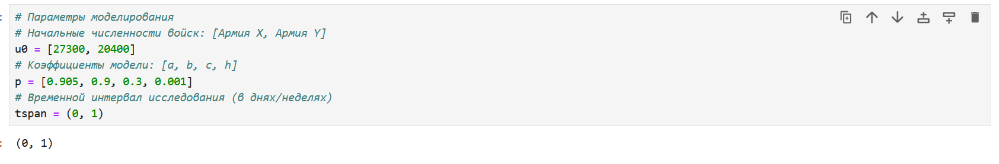
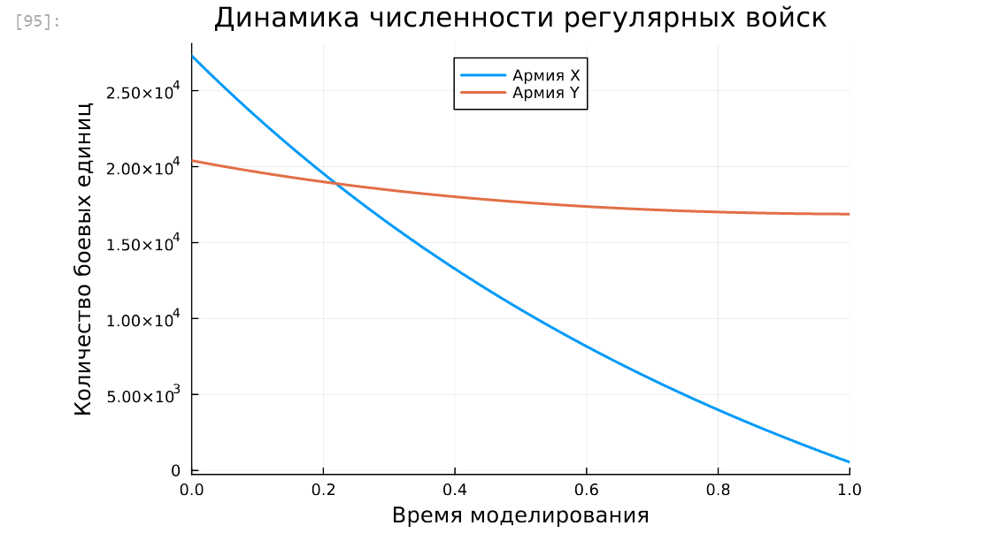

---
## Front matter
title: "Отчёт по лабораторной работе №3"
subtitle: "Дисциплина: Математическое моделирование"
author: "Ганина Таисия Сергеевна, НФИбд-01-22"

## Generic otions
lang: ru-RU
toc-title: "Содержание"

## Bibliography
bibliography: bib/cite.bib
csl: pandoc/csl/gost-r-7-0-5-2008-numeric.csl

## Pdf output format
toc: true # Table of contents
toc-depth: 2
lof: true # List of figures
lot: true # List of tables
fontsize: 12pt
linestretch: 1.5
papersize: a4
documentclass: scrreprt
## I18n polyglossia
polyglossia-lang:
  name: russian
  options:
	- spelling=modern
	- babelshorthands=true
polyglossia-otherlangs:
  name: english
## I18n babel
babel-lang: russian
babel-otherlangs: english
## Fonts
mainfont: PT Serif
romanfont: PT Serif
sansfont: PT Sans
monofont: PT Mono
mainfontoptions: Ligatures=TeX
romanfontoptions: Ligatures=TeX
sansfontoptions: Ligatures=TeX,Scale=MatchLowercase
monofontoptions: Scale=MatchLowercase,Scale=0.9
## Biblatex
biblatex: true
biblio-style: "gost-numeric"
biblatexoptions:
  - parentracker=true
  - backend=biber
  - hyperref=auto
  - language=auto
  - autolang=other*
  - citestyle=gost-numeric
## Pandoc-crossref LaTeX customization
figureTitle: "Рис."
tableTitle: "Таблица"
listingTitle: "Листинг"
lofTitle: "Список иллюстраций"
lotTitle: "Список таблиц"
lolTitle: "Листинги"
## Misc options
indent: true
header-includes:
  - \usepackage{indentfirst}
  - \usepackage{float} # keep figures where there are in the text
  - \floatplacement{figure}{H} # keep figures where there are in the text
---

# Цель работы

Построить модель боевых действий на языке прогаммирования Julia и посредством ПО OpenModelica.

# Задание

Между страной $Х$ и страной $У$ идет война. Численность состава войск
исчисляется от начала войны, и являются временными функциями $x(t)$ и $y(t)$. В начальный момент времени страна Х имеет армию численностью 27 300 человек, а
в распоряжении страны У армия численностью в 20 400 человек. Для упрощения
модели считаем, что коэффициенты a, b, c, h постоянны. Также считаем P(t) и Q(t) непрерывные функции.
Построить графики изменения численности войск армии $Х$ и армии $У$ для
следующих случаев:

1. Модель боевых действий между регулярными войсками:

$$\begin{cases}
    \dfrac{dx}{dt} = -0.405x(t) - 0.7y(t)+sin(t+8) + 1\\
    \dfrac{dy}{dt} = -0.68x(t) - 0.37y(t)+cos(t+6) + 1
\end{cases}$$

2. Модель ведение боевых действий с участием регулярных войск и партизанских отрядов:

$$\begin{cases}
    \dfrac{dx}{dt} = -0.304x(t)-0.78y(t)+2*sin(2t)\\
    \dfrac{dy}{dt} = -0.68x(t)y(t)-0.2y(t)+2*cos(2t)
\end{cases}$$

# Теоретическое введение

Законы Ланчестера (законы Осипова — Ланчестера) — математическая формула для расчета относительных сил пары сражающихся сторон — подразделений вооруженных сил. В статье «Влияние численности сражающихся сторон на их потери», опубликованной журналом «Военный сборник» в 1915 году, генерал-майор Корпуса военных топографов М. П. Осипов описал математическую модель глобального вооружённого противостояния, практически применяемую в военном деле при описании убыли сражающихся сторон с течением времени и, входящую в математическую теорию исследования операций, на год опередив английского математика Ф. У. Ланчестера. Мировая война, две революции в России не позволили новой власти заявить в установленном в научной среде порядке об открытии царского офицера.

В 1916 году, в разгар первой мировой войны, Фредерик Ланчестер разработал систему дифференциальных уравнений для демонстрации соотношения между противостоящими силами. Среди них есть так называемые Линейные законы Ланчестера (первого рода или честного боя, для рукопашного боя или неприцельного огня) и Квадратичные законы Ланчестера (для войн начиная с XX века с применением прицельного огня, дальнобойных орудий, огнестрельного оружия). В связи с установленным приоритетом в англоязычной литературе наметилась тенденция перехода от фразы «модель Ланчестера» к «модели Осипова — Ланчестера» [@wiki_online; @The_General_Lanchester_Model].

# Выполнение лабораторной работы

## Модель боевых действий между регулярными войсками (Julia)

Численность регулярных войск определяется тремя факторами:
- скорость уменьшения численности войск из-за причин, не связанных с
боевыми действиями (болезни, травмы, дезертирство);
- скорость потерь, обусловленных боевыми действиями
противоборствующих сторон (что связанно с качеством стратегии,
уровнем вооружения, профессионализмом солдат и т.п.);
- скорость поступления подкрепления (задаётся некоторой функцией от
времени).

В этом случае модель боевых действий между регулярными войсками
описывается следующим образом

$$\begin{cases}
    \dfrac{dx}{dt} = -0.405x(t) - 0.7y(t)+sin(t+8) + 1\\
    \dfrac{dy}{dt} = -0.68x(t) - 0.37y(t)+cos(t+6) + 1
\end{cases}$$

- Потери, не связанные с боевыми действиями, описывают члены $-0.405x(t)$ и $-0.37y(t)$ (коэффиценты при $x$ и $y$ - это величины, характеризующие степень влияния различных факторов на потери)

- члены $-0.7y(t)$ и $-0.68x(t)$ отражают потери на поле боя (коэффиценты при  $x$ и $y$ указывают на эффективность боевых действий со стороны у и х соответственно).

- Функции $P(t) = sin(t+8) + 1$, $Q(t) = cos(t+6) + 1$ учитывают
возможность подхода подкрепления к войскам Х и У в течение одного дня.

Результаты моделирования в Julia представлены ниже (рис. @fig:001):

{#fig:001 width=70%}

А теперь приведём код:

```Julia
# Импорт необходимых пакетов
# DifferentialEquations - решение дифференциальных уравнений
# Plots - визуализация результатов
using DifferentialEquations, Plots;

# Система дифференциальных уравнений боевой модели
# Нелинейная неавтономная система с внешними возмущениями:
# dx/dt = -a*x - b*y + sin(3t)  (динамика армии X)
# dy/dt = -c*x - h*y + cos(4t) + 2  (динамика армии Y)
# где:
# a, b, c, h - коэффициенты боевой эффективности
# sin/cos-функции - моделируют внешние факторы (подкрепления/потери)
function reg(u, p, t)
    x, y = u
    a, b, c, h = p
    dx = -a*x - b*y + sin(t+8) + 1
    dy = -c*x - h*y + cos(t+6) + 1
    return [dx, dy]
end

# Параметры моделирования
# Начальные численности войск: [Армия X, Армия Y]
u0 = [27300, 20400]  
# Коэффициенты модели: [a, b, c, h]
p = [0.405, 0.7, 0.68, 0.37]  
# Временной интервал исследования (в днях/неделях)
tspan = (0, 1)  

# Формулировка задачи Коши
# Создание объекта задачи для численного решения:
# - reg - функция системы
# - u0 - начальные условия
# - tspan - временной диапазон
# - p - вектор параметров
prob = ODEProblem(reg, u0, tspan, p)

# Численное решение системы
# Используется адаптивный метод Tsitouras 5/4 Runge-Kutta
# с автоматическим выбором шага для обеспечения точности
sol = solve(prob, Tsit5())

# Визуализация результатов
plot(sol, 
    title = "Динамика численности регулярных войск", 
    label = ["Армия X" "Армия Y"], 
    xaxis = "Время моделирования", 
    yaxis = "Количество боевых единиц",
    linewidth = 2,
    legend = :top)
```

## Модель боевых действий между регулярными войсками (OpenModelica)

Далее было необходимо повторить расчёты, но уже при помощи OpenModelica. Результат идентичен тому, что был получен при помощи Julia (рис. @fig:002):

{#fig:002 width=70%}

Код приведён ниже:

```
model model_war1
  parameter Real a = 0.405;
  parameter Real b = 0.7;
  parameter Real c = 0.68;
  parameter Real h = 0.37;
  parameter Real x0 = 27300;
  parameter Real y0 = 20400;
  Real x(start=x0);
  Real y(start=y0);
equation
  der(x) = -a*x - b*y + sin(time+8) + 1;
  der(y) = -c*x - h*y + cos(time+6) + 1;
end model_war1;
```

## Модель ведение боевых действий с участием регулярных войск и партизанских отрядов (Julia)

Во втором случае в борьбу добавляются партизанские отряды. Нерегулярные
войска в отличии от постоянной армии менее уязвимы, так как действуют скрытно,
в этом случае сопернику приходится действовать неизбирательно, по площадям,
занимаемым партизанами. Поэтому считается, что тем потерь партизан,
проводящих свои операции в разных местах на некоторой известной территории,
пропорционален не только численности армейских соединений, но и численности
самих партизан. В результате модель принимает вид:

$$\begin{cases}
    \dfrac{dx}{dt} = -0.304x(t)-0.78y(t)+2*sin(2t)\\
    \dfrac{dy}{dt} = -0.68x(t)y(t)-0.2y(t)+2*cos(2t)
\end{cases}$$

В этой системе все величины имею тот же смысл, что и в системе до этого.

- Потери, не связанные с боевыми действиями, описывают члены $-0.304x(t)$ и $-0.2y(t)$ (коэффиценты при $x$ и $y$ - это величины, характеризующие степень влияния различных факторов на потери)

- члены $-0.78y(t)$ и $-0.68x(t)y(t)$ отражают потери на поле боя (коэффиценты при  $x$ и $y$ указывают на эффективность боевых действий со стороны у и х соответственно). Функции $P(t) = 2*sin(2t)$, $Q(t) = 2*cos(2t)$ учитывают
возможность подхода подкрепления к войскам Х и У в течение одного дня.

Результаты моделирования в Julia представлены ниже (рис. @fig:003):

{#fig:003 width=70%}

А теперь приведём код:

```Julia
# Модель ведение боевых действий с участием регулярных войск и партизанских отрядов

# Модель гибридного конфликта 
# Совместная система для регулярных войск (X) и партизанских формирований (Y)
# Нелинейное взаимодействие сил (член c*x*y)
# Асимметричные уравнения потерь
function reg_part(u, p, t)
    x, y = u
    a, b, c, h = p
    dx = -a*x - b*y + 2*sin(2*t)  # Потери от боев + циклические подкрепления
    dy = -c*x*y - h*y + 2*cos(2*t)  # Партизанские потери от взаимодействия
    return [dx, dy]
end

# Исходные параметры конфликта
# Начальная численность: [Регулярные войска, Партизанские отряды]
u0 = [27300, 20400]  
# Коэффициенты: 
# [a - эффективность Y против X, 
#  b - потери X от партизан, 
#  c - интенсивность партизанской войны,
#  h - собственные потери Y]
p = [0.304, 0.78, 0.68, 0.2]  
# Масштаб времени: краткосрочный конфликт (1 условная единица)
tspan = (0, 0.0005)

prob2 = ODEProblem(reg_part, u0, tspan, p)

# Численное решение системы
# Используется адаптивный метод Tsitouras 5/4 Runge-Kutta
# с автоматическим выбором шага для обеспечения точности
sol2 = solve(prob2, Tsit5())

plot(sol2, 
    title = "Гибридный конфликт: регулярная армия vs партизаны", 
    label = ["Регулярные войска" "Партизаны"], 
    xaxis = "Тактические циклы", 
    yaxis = "Боеспособность",
    linewidth = 2,
    legend = :top)
```

## Модель ведение боевых действий с участием регулярных войск и партизанских отрядов (OpenModelica)

Далее было необходимо повторить расчёты, но уже при помощи OpenModelica. Результат идентичен тому, что был получен при помощи Julia (рис. @fig:004):

{#fig:004 width=70%}

Более "мелкий" промежуток времени, который позволяет подробно рассмотреть начало графика (рис. @fig:005):

{#fig:005 width=70%}

Код приведён ниже:

```
model model_war2
  parameter Real a = 0.304;
  parameter Real b = 0.78;
  parameter Real c = 0.68;
  parameter Real h = 0.2;
  parameter Real x0 = 27300;
  parameter Real y0 = 20400;
  Real x(start=x0);
  Real y(start=y0);
equation
  der(x) = -a*x - b*y + 2*sin(2*time);
  der(y) = -c*x*y - h*y + 2*cos(2*time);
end model_war2;
```

Далее я пробовала менять коэффициенты для модели боевых действий с участием регулярных войск (рис. @fig:006, @fig:007)

{#fig:006 width=70%}

{#fig:007 width=70%}

Победа в модели боевых действий определяется балансом между боевой эффективностью сторон, небоевых потерь и динамикой подкреплений.

**1. Анализ первого случая (победа армии X)**

`a = 0.405` (небоевые потери X), `b = 0.7` (эффективность Y),`c = 0.68` (эффективность X), `h = 0.37` (небоевые потери Y).

Разница между коэффициентами c и b небольшая (0.68 против 0.7), что указывает на примерное равенство сил в прямом противостоянии. Однако армия X имеет преимущество за счёт более низких небоевых потерь (a=0.405 против h=0.37).

Несмотря на близкие значения a и h, армия Y теряет больше сил вне боя, что снижает её общий ресурс. Если подкрепление P(t) для X превышает суммарные потери (`a*x` + `b*y`), а Q(t) для Y недостаточно для компенсации (`h*y` + `c*x`), армия X сохраняет численное превосходство.

**2. Анализ второго случая (победа армии Y)**

`a = 0.905` (небоевые потери X), `b = 0.9` (эффективность Y),`c = 0.3` (эффективность X), `h = 0.001` (небоевые потери Y).

Коэффициент b у Y вырос до 0.9, а c у X снизился до 0.3. Это означает, что армия Y теперь в 3 раза эффективнее в уничтожении войск X, чем X в борьбе с Y.
  
Параметр a=0.905 (против исходных 0.405) приводит к быстрому истощению армии X даже без боевых действий.
Коэффициент h=0.001 практически устраняет небоевые потери Y, сохраняя её ресурсы.
  
Даже при равных P(t) и Q(t), армия X не успевает восполнять потери из-за высоких значений a и c. Армия Y, напротив, теряет мало сил и эффективно уничтожает X.

**3. Сравнение в таблице**

Рассмотрим следующую таблицу [-@tbl:std-dir]

: Сравнение коэффициентов {#tbl:std-dir}

| Параметр | Первый случай (победа X) | Второй случай (победа Y) |
| --- | --- | --- |
| Эффективность Y (b) | 0.7 | **0.9** |
| Эффективность X (c) | **0.68** | 0.3 |
| Небоевые потери X (a) | 0.405 | **0.905** |
| Небоевые потери Y (h) | 0.37 | **0.001** |

# Выводы

В процессе выполнения данной лабораторной работы я построила модель боевых действий на языке прогаммирования Julia и посредством ПО OpenModelica, а также провела сравнительный анализ.

# Список литературы{.unnumbered}

::: {#refs}
:::
