---
## Front matter
lang: ru-RU
title: "Лабораторная работа №4. Модель гармонических колебаний"
subtitle: "Дисциплина: Математическое моделирование"
author:
  - Ганина Т. С.
institute:
  - Группа НФИбд-01-22
  - Российский университет дружбы народов, Москва, Россия
date: 28 марта 2025

## i18n babel
babel-lang: russian
babel-otherlangs: english

## Formatting pdf
toc: false
toc-title: Содержание
slide_level: 2
aspectratio: 169
section-titles: true
theme: metropolis
header-includes:
 - \metroset{progressbar=frametitle,sectionpage=progressbar,numbering=fraction}
 - '\makeatletter'
 - '\beamer@ignorenonframefalse'
 - '\makeatother'
---

# Информация

## Докладчик

:::::::::::::: {.columns align=center}
::: {.column width="70%"}

  * Ганина Таисия Сергеевна
  * Студентка 3го курса, группа НФИбд-01-22
  * Фундаментальная информатика и информационные технологии
  * Российский университет дружбы народов
  * [Ссылка на репозиторий гитхаба tsganina](https://github.com/tsganina/study_2024-2025_mathmod)

:::
::: {.column width="30%"}

:::
::::::::::::::

# Вводная часть

## Цели и задачи

Построить математическую модель гармонического осциллятора.

## Задание

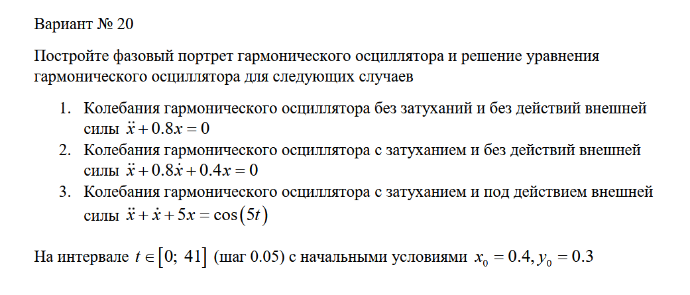{#fig:001 width=70%}

# Выполнение работы

## Модель колебаний гармонического осциллятора без затуханий и без действий внешней силы

```Julia
using DifferentialEquations, Plots
function f1(u, p, t)
    x, y = u
    g, w = p
    dx = y
    dy = -g .*y - w^2 .*x
    return [dx, dy]
end
p1 = [0, 0.8]
tspan = (0, 41)
u1 = [0.4, 0.3]
problem1 = ODEProblem(f1, u1, tspan, p1)
sol1 = solve(problem1, Tsit5(), saveat = 0.05)
```

## Модель колебаний гармонического осциллятора без затуханий и без действий внешней силы

```Julia
# Визуализация результатов
plot(sol1, 
    title = "Колебания гармонического осциллятора 
    \n без затуханий и без действий 
    \n внешней силы", label = ["x" "y"], 
    xaxis = "Время моделирования", 
    linewidth = 2, legend = :right)
plot(sol1, idxs = (1,2),
    title = "Фазовый портрет",
    xaxis = "x", yaxis = "y",
    label = "зависимость x от y")
```

## Модель колебаний гармонического осциллятора без затуханий и без действий внешней силы

:::::::::::::: {.columns align=center}
::: {.column width="50%"}

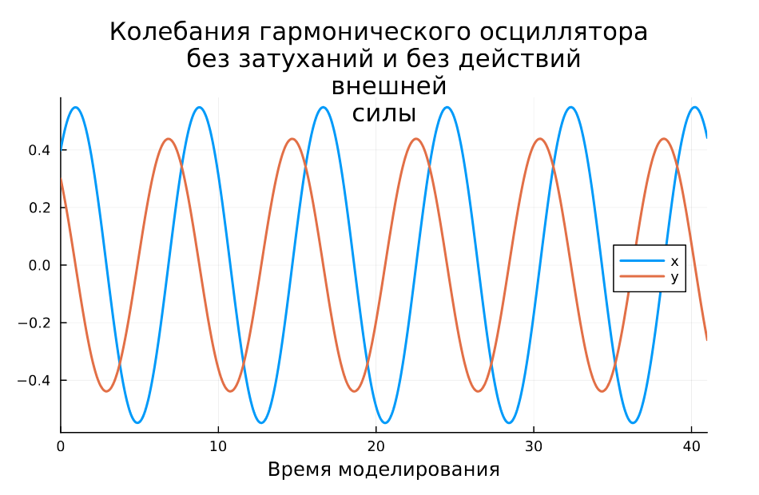{#fig:002 width=90%}

:::
::: {.column width="50%"}

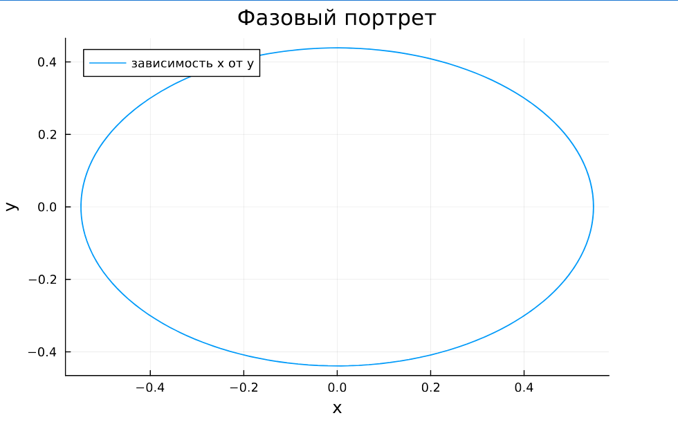{#fig:003 width=90%}

:::
::::::::::::::

## Модель колебаний гармонического осциллятора без затуханий и без действий внешней силы

```
model mathmod4_1
  parameter Real g = 0;
  parameter Real w = 0.8;
  parameter Real x0 = 0.4;
  parameter Real y0 = 0.3;
  Real x(start=x0);
  Real y(start=y0);
equation
    der(x) = y;
    der(y) = -g .*y - w^2 .*x;
end mathmod4_1;
```

## Модель колебаний гармонического осциллятора без затуханий и без действий внешней силы

:::::::::::::: {.columns align=center}
::: {.column width="50%"}

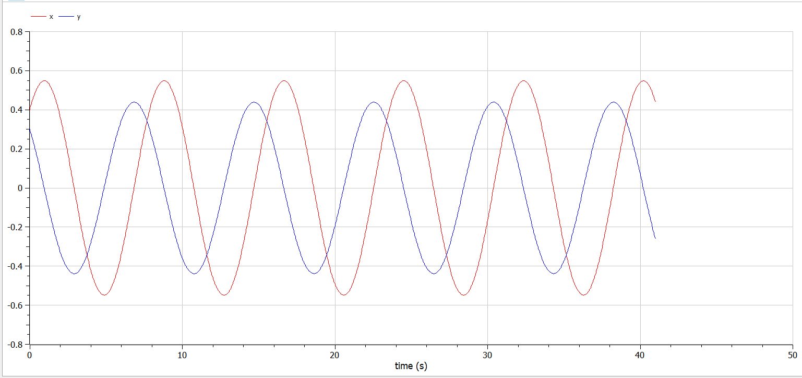{#fig:004 width=90%}

:::
::: {.column width="50%"}

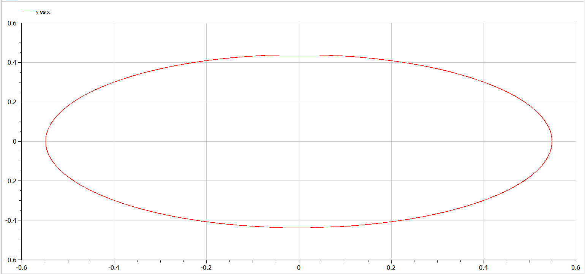{#fig:005 width=90%}

:::
::::::::::::::

## Модель колебаний гармонического осциллятора c затуханием и без действий внешней силы

```Julia
function f2(u, p, t)
    x, y = u
    g, w = p
    dx = y
    dy = -g .*y - w^2 .*x
    return [dx, dy]
end
p2 = [0.8, 0.4]
tspan = (0, 41)
u2 = [0.4, 0.3]
problem2 = ODEProblem(f2, u2, tspan, p2)
sol2 = solve(problem2, Tsit5(), saveat = 0.05)
```

## Модель колебаний гармонического осциллятора c затуханием и без действий внешней силы 

```Julia
# Визуализация результатов
plot(sol2, 
    title = "Колебания гармонического осциллятора 
    \n c затуханием и без действий 
    \n внешней силы", label = ["x" "y"],
    xaxis = "Время моделирования", 
    linewidth = 2, legend = :right)
plot(sol2, idxs = (1,2),
    title = "Фазовый портрет",
    xaxis = "x", yaxis = "y",
    label = "зависимость x от y")
```

## Модель колебаний гармонического осциллятора c затуханием и без действий внешней силы

:::::::::::::: {.columns align=center}
::: {.column width="50%"}

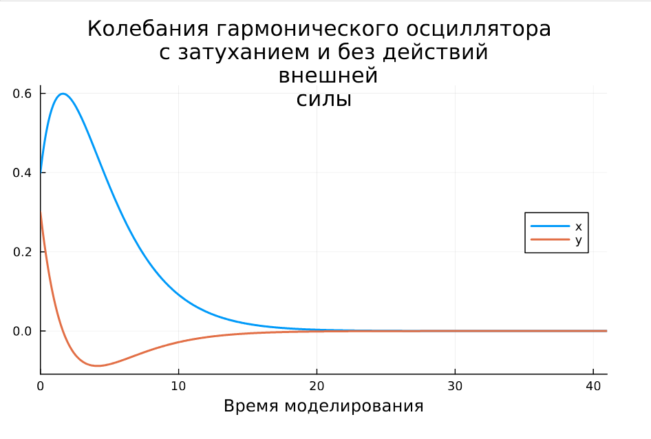{#fig:006 width=90%}

:::
::: {.column width="50%"}

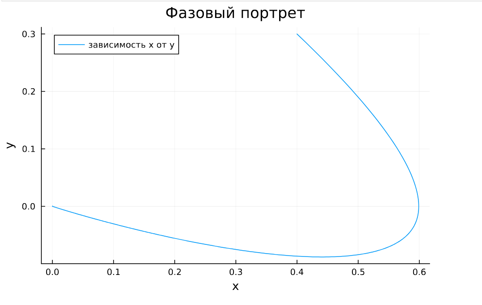{#fig:007 width=90%}

:::
::::::::::::::


## Модель колебаний гармонического осциллятора c затуханием и без действий внешней силы

```
model mathmod4_2
  parameter Real g = 0.8;
  parameter Real w = 0.4;
  parameter Real x0 = 0.4;
  parameter Real y0 = 0.3;
  Real x(start=x0);
  Real y(start=y0);
equation
    der(x) = y;
    der(y) = -g .*y - w^2 .*x;
end mathmod4_2;
```

## Модель колебаний гармонического осциллятора c затуханием и без действий внешней силы

:::::::::::::: {.columns align=center}
::: {.column width="50%"}

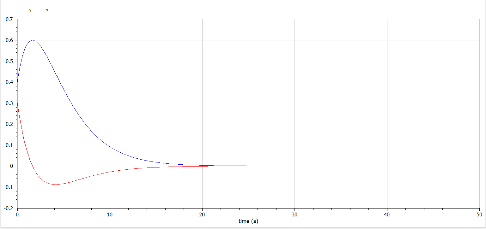{#fig:008 width=90%}

:::
::: {.column width="50%"}

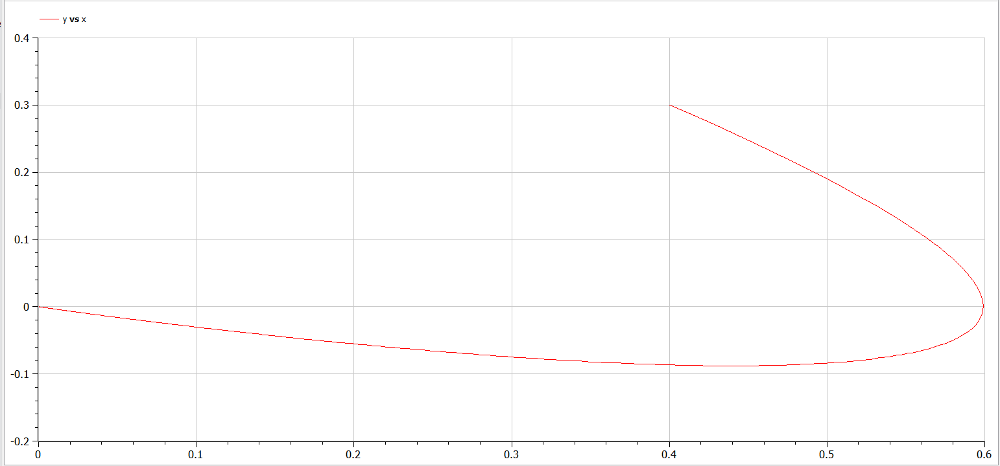{#fig:009 width=90%}

:::
::::::::::::::

## Модель колебаний гармонического осциллятора c затуханием и под действием внешней силы

```Julia
f(t) = cos(5*t)

function f3(u, p, t)
    x, y = u
    g, w = p
    dx = y
    dy = -g .*y - w^2 .*x + f(t)
    return [dx, dy]
end
p3 = [1, 5]
tspan = (0, 41)
u3 = [0.4, 0.3]
problem3 = ODEProblem(f3, u3, tspan, p3)
sol3 = solve(problem3, Tsit5(), saveat = 0.05)
```

```Julia
# Визуализация результатов
plot(sol3, 
    title = "Колебания гармонического осциллятора 
    \n c затуханием и под действием 
    \n внешней силы", label = ["x" "y"], 
    xaxis = "Время моделирования", 
    linewidth = 2, legend = :right)
plot(sol3, idxs = (1,2),
    title = "Фазовый портрет",
    xaxis = "x", yaxis = "y",
    label = "зависимость x от y")
```

## Модель колебаний гармонического осциллятора c затуханием и под действием внешней силы

:::::::::::::: {.columns align=center}
::: {.column width="50%"}

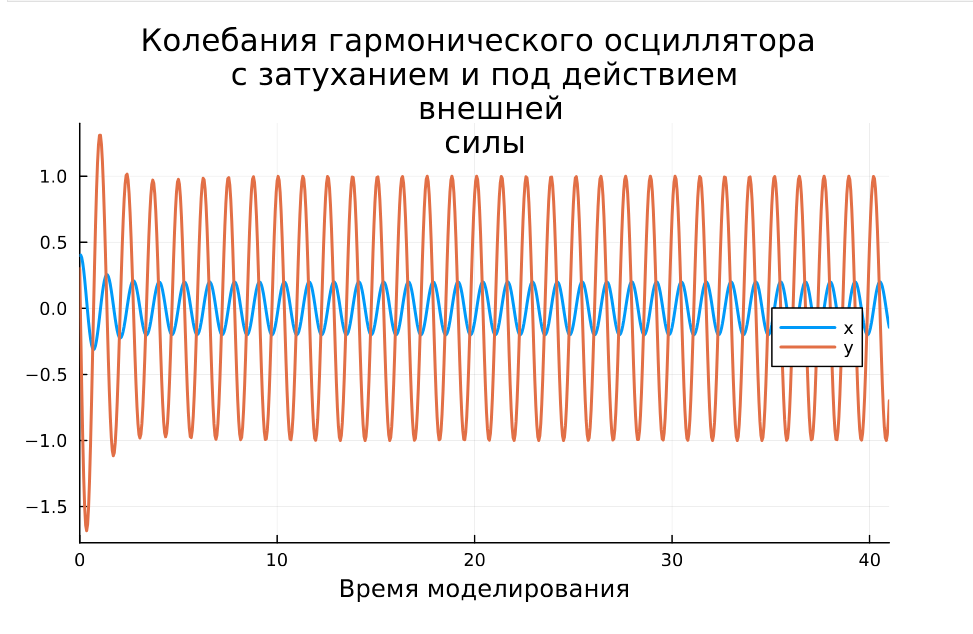{#fig:010 width=90%}

:::
::: {.column width="50%"}

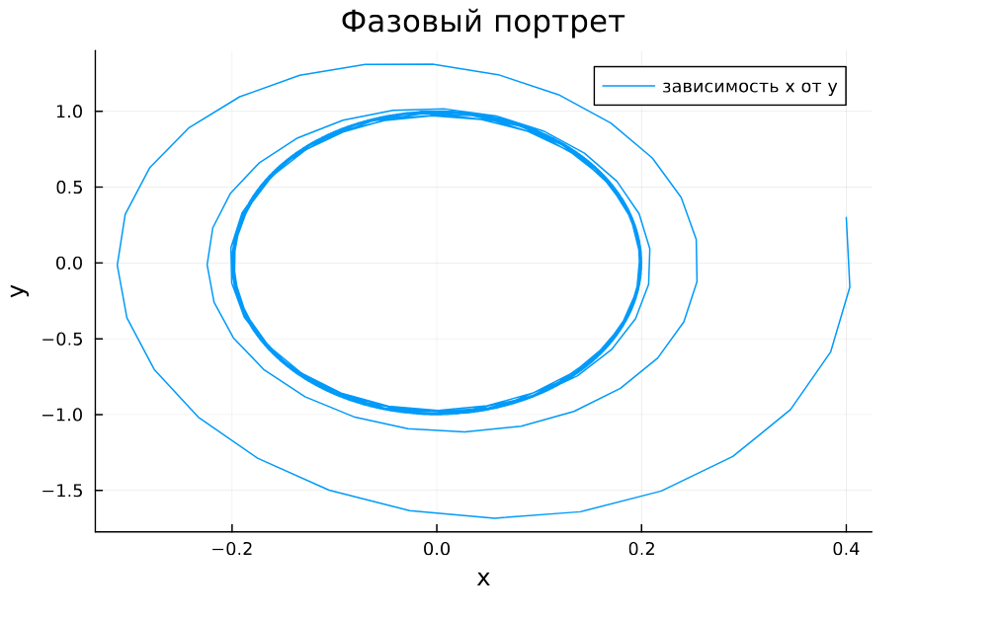{#fig:011 width=90%}

:::
::::::::::::::

## Модель колебаний гармонического осциллятора c затуханием и под действием внешней силы

```
model mathmod4_3
  parameter Real g = 1;
  parameter Real w = 5;
  parameter Real x0 = 0.4;
  parameter Real y0 = 0.3;
  Real x(start=x0);
  Real y(start=y0);
equation
  der(x) = y;
  der(y) = -g .*y - w^2 .*x + cos(5*time);
end mathmod4_3;
```

## Модель колебаний гармонического осциллятора c затуханием и под действием внешней силы

:::::::::::::: {.columns align=center}
::: {.column width="50%"}

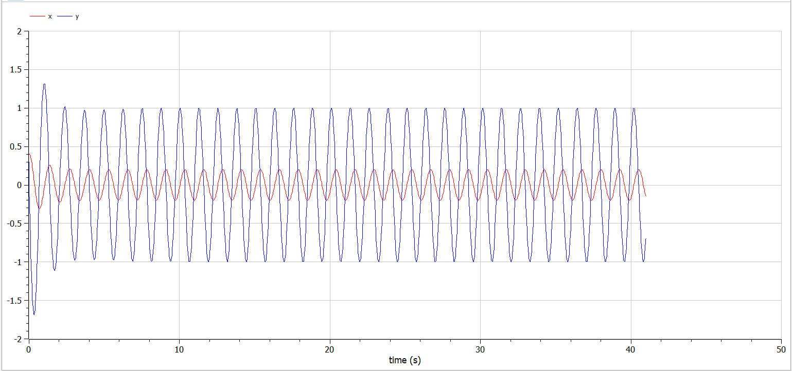{#fig:012 width=90%}

:::
::: {.column width="50%"}

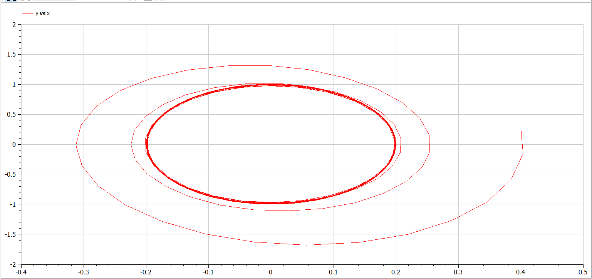{#fig:013 width=90%}

:::
::::::::::::::

# Результаты

В процессе выполнения данной лабораторной работы я построила математическую модель гармонического осциллятора.
