---
## Front matter
title: "Отчёт по лабораторной работе №4"
subtitle: "Дисциплина: Математическое моделирование"
author: "Ганина Таисия Сергеевна, НФИбд-01-22"

## Generic otions
lang: ru-RU
toc-title: "Содержание"

## Bibliography
bibliography: bib/cite.bib
csl: pandoc/csl/gost-r-7-0-5-2008-numeric.csl

## Pdf output format
toc: true # Table of contents
toc-depth: 2
lof: true # List of figures
lot: true # List of tables
fontsize: 12pt
linestretch: 1.5
papersize: a4
documentclass: scrreprt
## I18n polyglossia
polyglossia-lang:
  name: russian
  options:
	- spelling=modern
	- babelshorthands=true
polyglossia-otherlangs:
  name: english
## I18n babel
babel-lang: russian
babel-otherlangs: english
## Fonts
mainfont: PT Serif
romanfont: PT Serif
sansfont: PT Sans
monofont: PT Mono
mainfontoptions: Ligatures=TeX
romanfontoptions: Ligatures=TeX
sansfontoptions: Ligatures=TeX,Scale=MatchLowercase
monofontoptions: Scale=MatchLowercase,Scale=0.9
## Biblatex
biblatex: true
biblio-style: "gost-numeric"
biblatexoptions:
  - parentracker=true
  - backend=biber
  - hyperref=auto
  - language=auto
  - autolang=other*
  - citestyle=gost-numeric
## Pandoc-crossref LaTeX customization
figureTitle: "Рис."
tableTitle: "Таблица"
listingTitle: "Листинг"
lofTitle: "Список иллюстраций"
lotTitle: "Список таблиц"
lolTitle: "Листинги"
## Misc options
indent: true
header-includes:
  - \usepackage{indentfirst}
  - \usepackage{float} # keep figures where there are in the text
  - \floatplacement{figure}{H} # keep figures where there are in the text
---

# Цель работы

Построить математическую модель гармонического осциллятора.

# Задание

Построить фазовый портрет гармонического осциллятора и решение уравнения
гармонического осциллятора для следующих случаев:

1. Колебания гармонического осциллятора без затуханий и без действий внешней
силы 

$$\ddot{x} + 0.8x = 0$$

На интервале $t \in [0; 41]$ (шаг 0.05) с начальными условиями $x_0 = 0.4, y_0=0.3$

2. Колебания гармонического осциллятора c затуханием и без действий внешней силы 
  
$$\ddot{x} + 0.8x + 0.4x = 0$$

На интервале $t \in [0; 41]$ (шаг 0.05) с начальными условиями $x_0 = 0.4, y_0=0.3$

3. Колебания гармонического осциллятора c затуханием и под действием внешней силы 
   
$$\ddot x + \dot x + 5x = cos(5t).$$

На интервале $t \in [0; 41]$ (шаг 0.05) с начальными условиями $x_0 = 0.4, y_0=0.3$

# Теоретическое введение

Решение дифференциального уравнения, описывающего гармонические колебания имеет вид:

$x(t) = A \sin (\omega t + \varphi_0)$

или

$x(t) = A \cos (\omega t + \varphi_0)$,

где
* $x$ — отклонение колеблющейся величины в текущий момент Время (физика)|времени $t$ от среднего за период значения (например, в кинематике — смещение, отклонение колеблющейся точки от положения равновесия);
* $A$ — амплитуда колебания, то есть максимальное за период отклонение колеблющейся величины от среднего за период значения, размерность $A$ совпадает с размерностью $x$;
* $\omega$ (радиан/секунда|с, Градус (геометрия)|градус/с) — циклическая частота, показывающая, на сколько радиан (градусов) изменяется фаза колебания за 1 с;
* $(\omega t + \varphi_0) = \varphi$ (радиан, градус) — полная Фаза колебаний|фаза колебания (сокращённо  — фаза, не путать с начальной фазой);
* $\varphi_0$ (радиан, градус) — начальная фаза колебаний, которая определяет значение полной фазы колебания (и самой величины $x$) в момент времени $t = 0$.

Дифференциальное уравнение, описывающее гармонические колебания, имеет вид
: $\frac{d^2 x}{d t^2} + \omega^2 x = 0.$
Любое нетривиальное решение этого дифференциального уравнения — гармоническое колебание с циклической частотой $\omega$. [@wiki_online].

# Выполнение лабораторной работы

## Модель колебаний гармонического осциллятора без затуханий и без действий внешней силы

Колебания гармонического осциллятора без затуханий и без действий внешней
силы 

$$\ddot{x} + 0.8x = 0$$

На интервале $t \in [0; 41]$ (шаг 0.05) с начальными условиями $x_0 = 0.4, y_0=0.3$

Приведу код на Julia и результаты моделирования (рис. @fig:001, @fig:002)

```Julia
using DifferentialEquations, Plots
function f1(u, p, t)
    x, y = u
    g, w = p
    dx = y
    dy = -g .*y - w^2 .*x
    return [dx, dy]
end
p1 = [0, 0.8]
tspan = (0, 41)
u1 = [0.4, 0.3]
problem1 = ODEProblem(f1, u1, tspan, p1)
sol1 = solve(problem1, Tsit5(), saveat = 0.05)

# Визуализация результатов
plot(sol1, 
    title = "Колебания гармонического осциллятора 
    \n без затуханий и без действий 
    \n внешней силы", 
    label = ["x" "y"], 
    xaxis = "Время моделирования", 
    linewidth = 2,
    legend = :right)
    
plot(sol1, idxs = (1,2),
    title = "Фазовый портрет",
    xaxis = "x",
    yaxis = "y",
    label = "зависимость x от y")
```

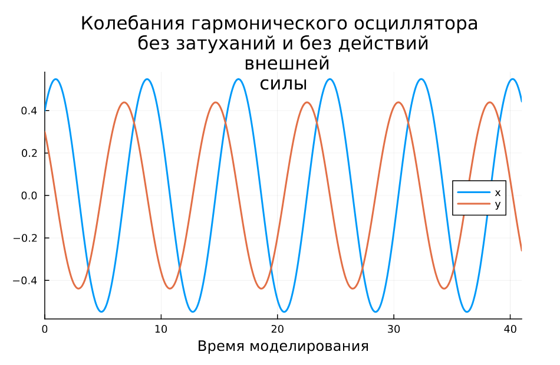{#fig:001 width=70%}

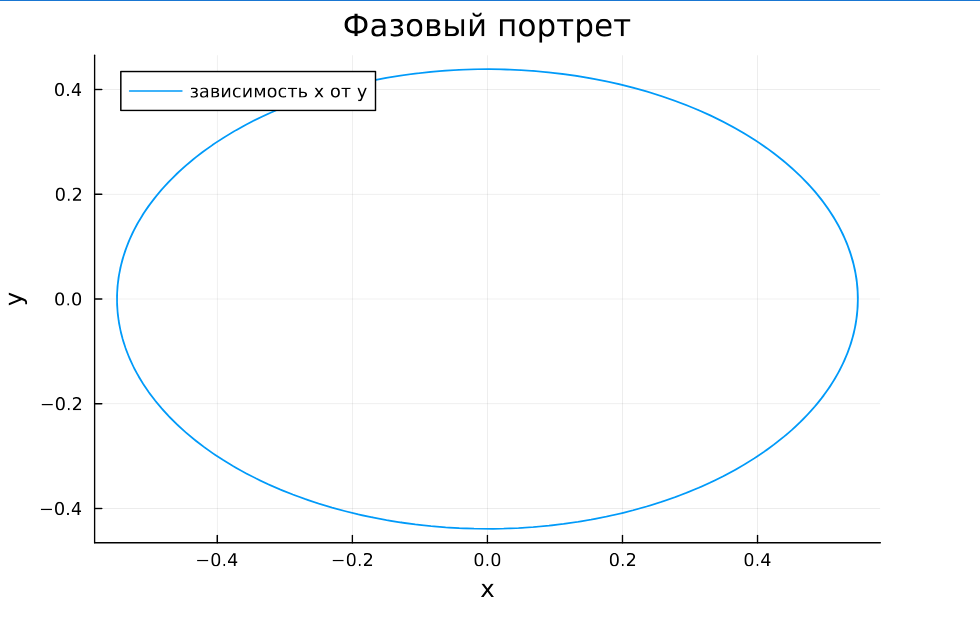{#fig:002 width=70%}

А теперь то же самое представим на OpenModelica (рис. @fig:003, @fig:004): 

```
model mathmod4_1
  parameter Real g = 0;
  parameter Real w = 0.8;
  parameter Real x0 = 0.4;
  parameter Real y0 = 0.3;
  Real x(start=x0);
  Real y(start=y0);
equation
    der(x) = y;
    der(y) = -g .*y - w^2 .*x;
end mathmod4_1;
```

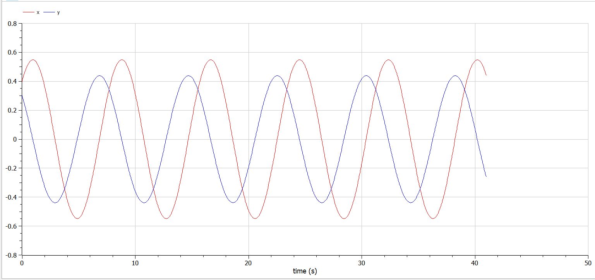{#fig:003 width=70%}

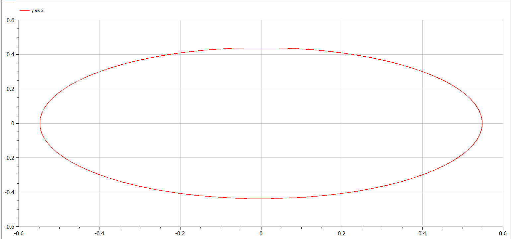{#fig:004 width=70%}

## Модель колебаний гармонического осциллятора c затуханием и без действий внешней силы 

Колебания гармонического осциллятора c затуханием и без действий внешней силы 
  
$$\ddot{x} + 0.8x + 0.4x = 0$$

На интервале $t \in [0; 41]$ (шаг 0.05) с начальными условиями $x_0 = 0.4, y_0=0.3$

Приведу код на Julia и результаты моделирования (рис. @fig:005, @fig:006)

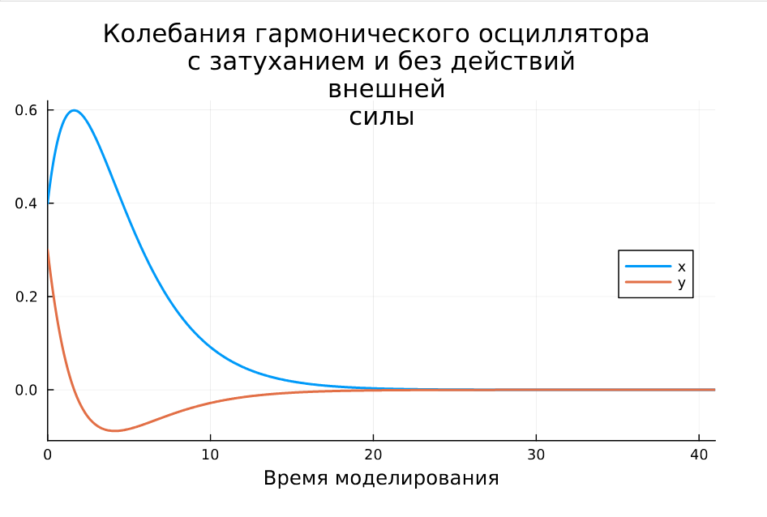{#fig:005 width=70%}

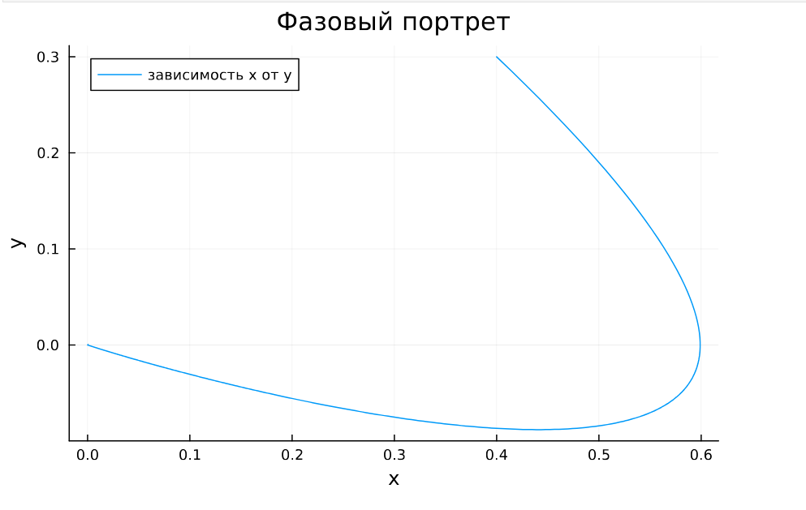{#fig:006 width=70%}

```Julia
function f2(u, p, t)
    x, y = u
    g, w = p
    dx = y
    dy = -g .*y - w^2 .*x
    return [dx, dy]
end
p2 = [0.8, 0.4]
tspan = (0, 41)
u2 = [0.4, 0.3]
problem2 = ODEProblem(f2, u2, tspan, p2)
sol2 = solve(problem2, Tsit5(), saveat = 0.05)

# Визуализация результатов
plot(sol2, 
    title = "Колебания гармонического осциллятора 
    \n c затуханием и без действий 
    \n внешней силы", 
    label = ["x" "y"], 
    xaxis = "Время моделирования", 
    linewidth = 2,
    legend = :right)
    
plot(sol2, idxs = (1,2),
    title = "Фазовый портрет",
    xaxis = "x",
    yaxis = "y",
    label = "зависимость x от y")
```

А теперь то же самое представим на OpenModelica (рис. @fig:007, @fig:008): 

```
model mathmod4_2
  parameter Real g = 0.8;
  parameter Real w = 0.4;
  parameter Real x0 = 0.4;
  parameter Real y0 = 0.3;
  Real x(start=x0);
  Real y(start=y0);
equation
    der(x) = y;
    der(y) = -g .*y - w^2 .*x;
end mathmod4_2;
```

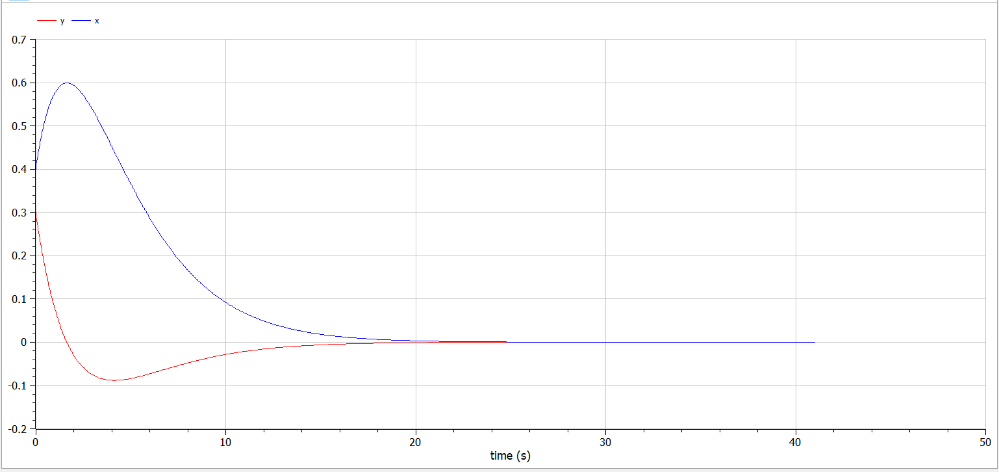{#fig:007 width=70%}

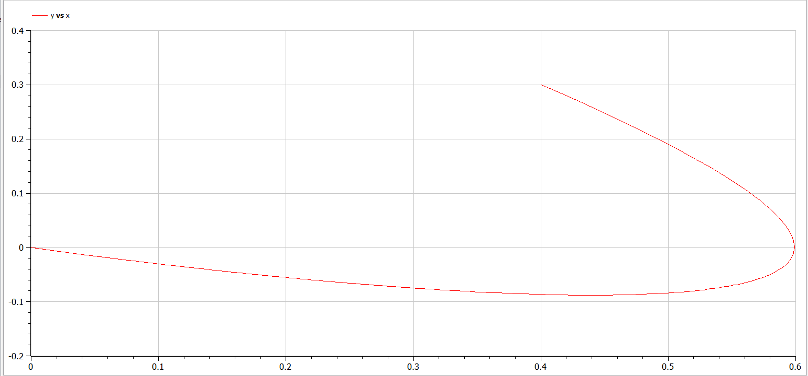{#fig:008 width=70%}

## Модель колебаний гармонического осциллятора c затуханием и под действием внешней силы

Колебания гармонического осциллятора c затуханием и под действием внешней силы 
   
$$\ddot x + \dot x + 5x = cos(5t).$$

На интервале $t \in [0; 41]$ (шаг 0.05) с начальными условиями $x_0 = 0.4, y_0=0.3$

Приведу код на Julia и результаты моделирования (рис. @fig:009, @fig:010)

```Julia
f(t) = cos(5*t)

function f3(u, p, t)
    x, y = u
    g, w = p
    dx = y
    dy = -g .*y - w^2 .*x + f(t)
    return [dx, dy]
end
p3 = [1, 5]
tspan = (0, 41)
u3 = [0.4, 0.3]
problem3 = ODEProblem(f3, u3, tspan, p3)
sol3 = solve(problem3, Tsit5(), saveat = 0.05)

# Визуализация результатов
plot(sol3, 
    title = "Колебания гармонического осциллятора 
    \n c затуханием и под действием 
    \n внешней силы", 
    label = ["x" "y"], 
    xaxis = "Время моделирования", 
    linewidth = 2,
    legend = :right)
plot(sol3, idxs = (1,2),
    title = "Фазовый портрет",
    xaxis = "x",
    yaxis = "y",
    label = "зависимость x от y")
```

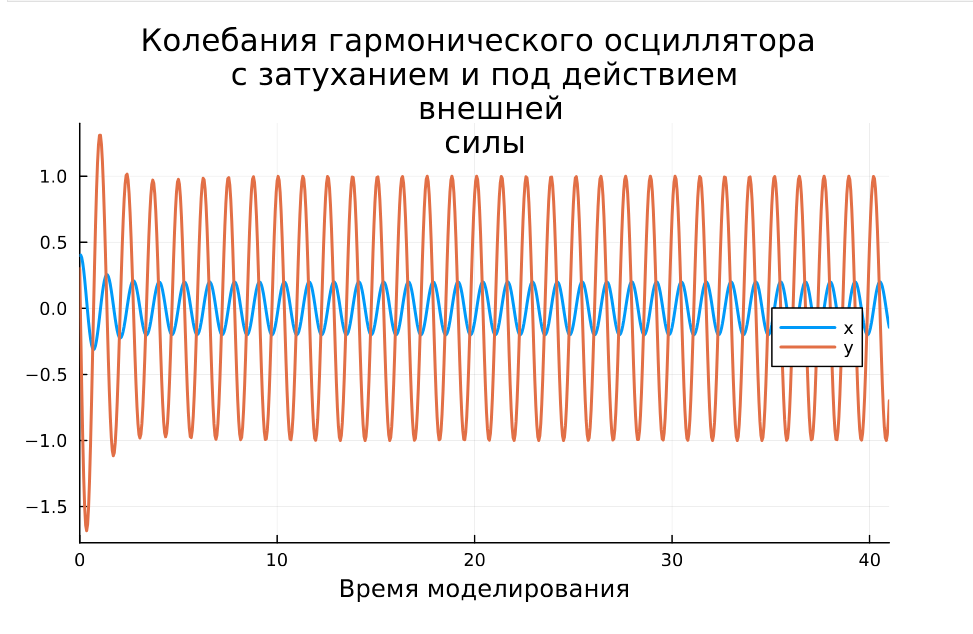{#fig:009 width=70%}

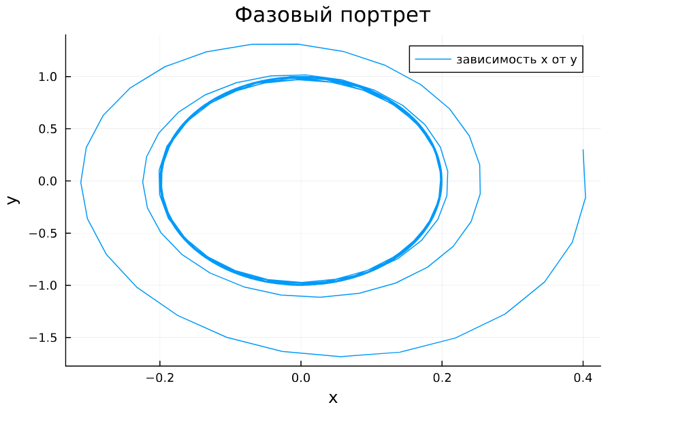{#fig:010 width=70%}

А теперь то же самое представим на OpenModelica (рис. @fig:011, @fig:012): 

```
model mathmod4_3
  parameter Real g = 1;
  parameter Real w = 5;
  parameter Real x0 = 0.4;
  parameter Real y0 = 0.3;
  Real x(start=x0);
  Real y(start=y0);
equation
  der(x) = y;
  der(y) = -g .*y - w^2 .*x + cos(5*time);
end mathmod4_3;
```

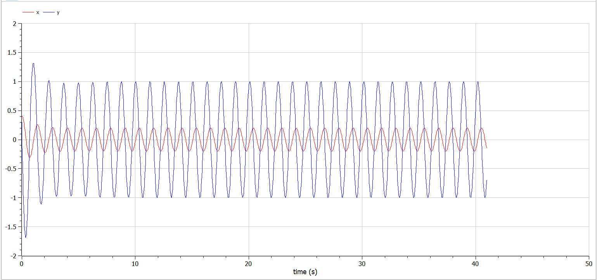{#fig:011 width=70%}

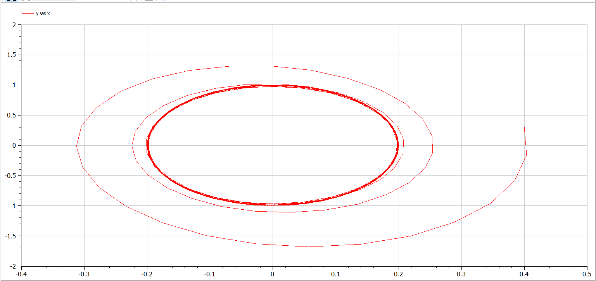{#fig:012 width=70%}

# Выводы

В процессе выполнения данной лабораторной работы я построила математическую модель гармонического осциллятора.

# Список литературы{.unnumbered}

::: {#refs}
:::
