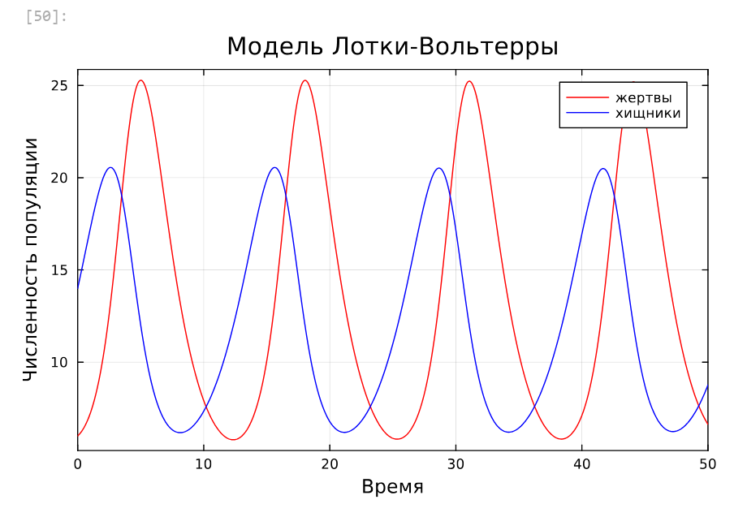
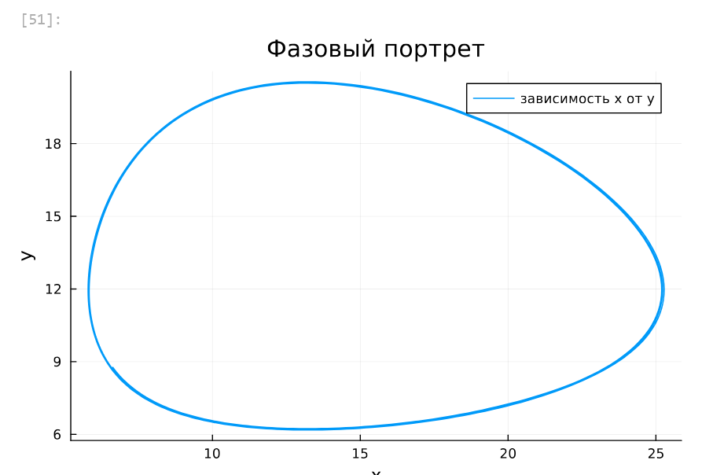
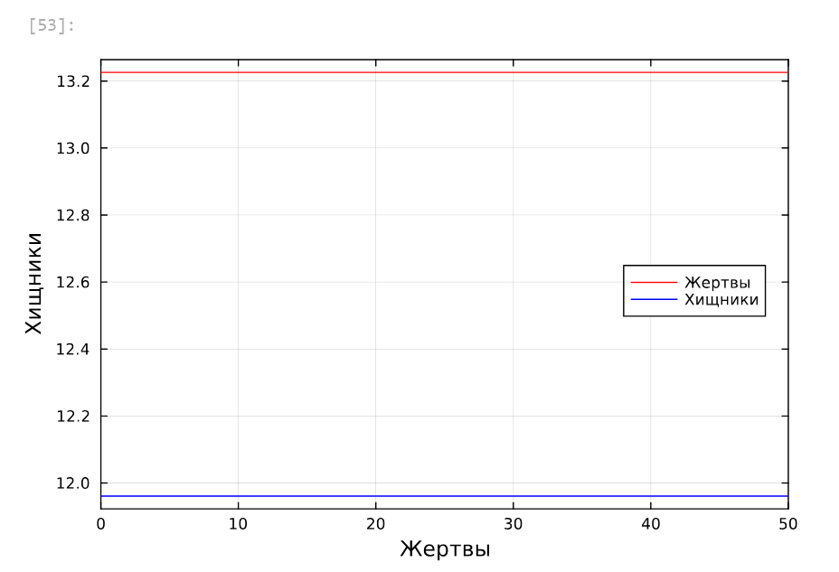
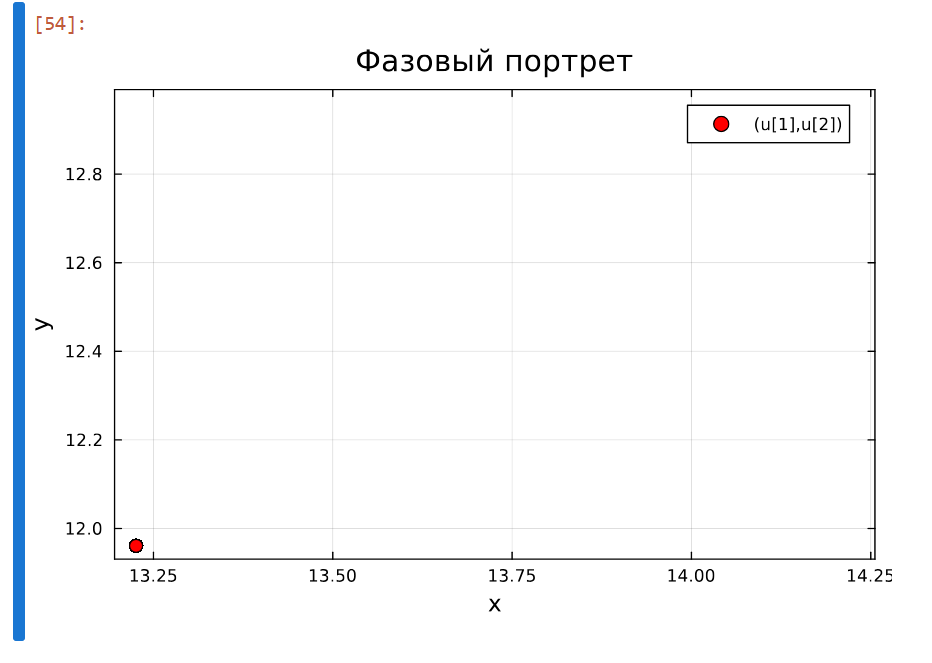
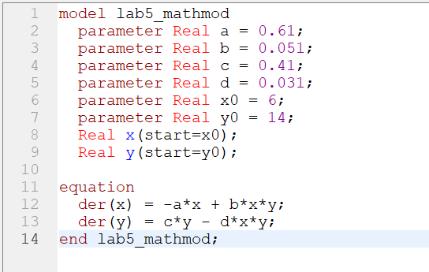
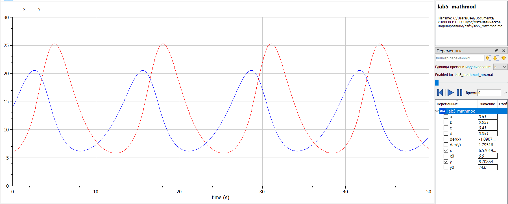
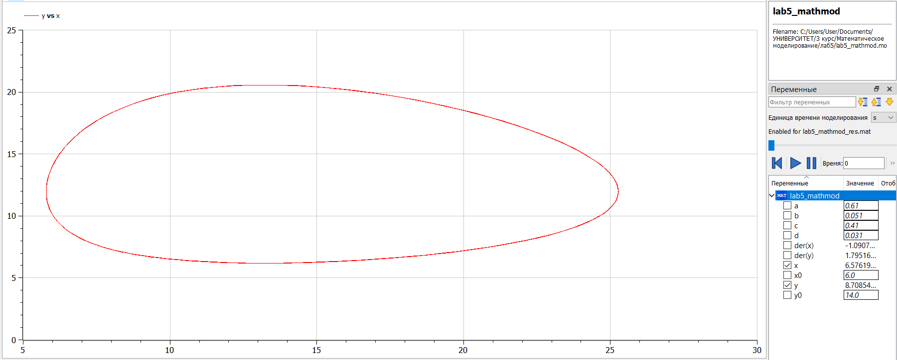
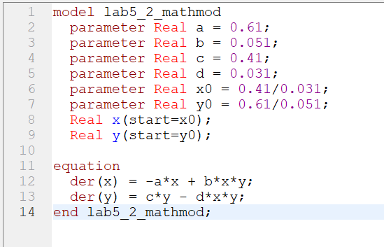
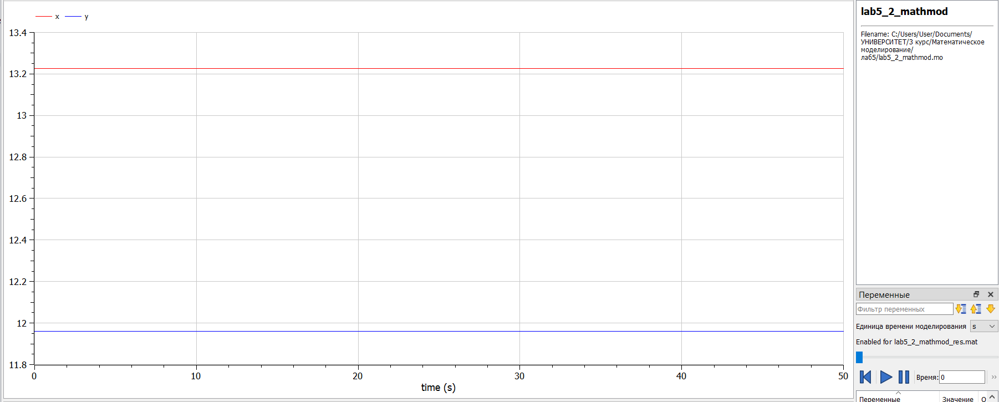
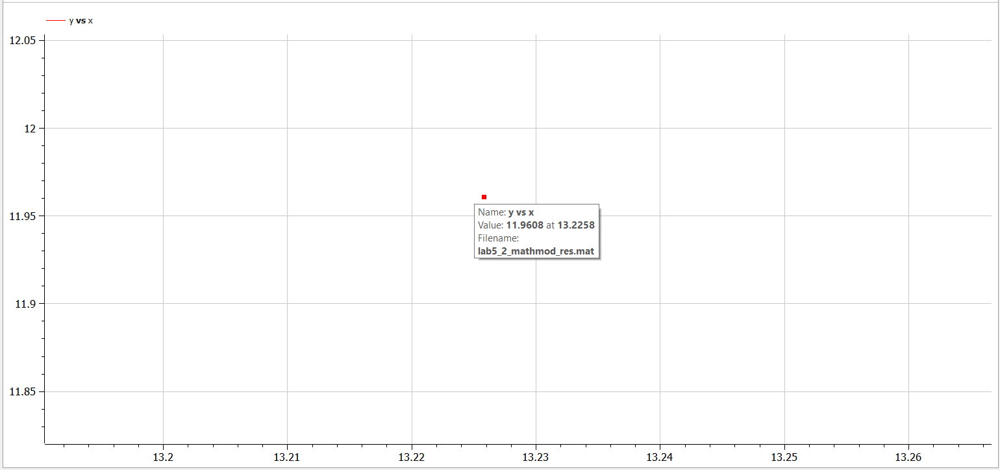

---
## Front matter
lang: ru-RU
title: "Лабораторная работа №5. Модель хищник-жертва"
subtitle: "Дисциплина: Математическое моделирование"
author:
  - Ганина Т. С.
institute:
  - Группа НФИбд-01-22
  - Российский университет дружбы народов, Москва, Россия
date: 29 марта 2025

## i18n babel
babel-lang: russian
babel-otherlangs: english

## Formatting pdf
toc: false
toc-title: Содержание
slide_level: 2
aspectratio: 169
section-titles: true
theme: metropolis
header-includes:
 - \metroset{progressbar=frametitle,sectionpage=progressbar,numbering=fraction}
 - '\makeatletter'
 - '\beamer@ignorenonframefalse'
 - '\makeatother'
---

# Информация

## Докладчик

:::::::::::::: {.columns align=center}
::: {.column width="70%"}

  * Ганина Таисия Сергеевна
  * Студентка 3го курса, группа НФИбд-01-22
  * Фундаментальная информатика и информационные технологии
  * Российский университет дружбы народов
  * [Ссылка на репозиторий гитхаба tsganina](https://github.com/tsganina/study_2024-2025_mathmod)

:::
::: {.column width="30%"}

:::
::::::::::::::

# Вводная часть

## Цели и задачи

Исследовать математическую модель Лотки-Вольерры.

## Задание

Для модели «хищник-жертва»:

$$\begin{cases}
    &\dfrac{dx}{dt} = - 0.61 x(t) + 0.051 x(t)y(t) \\
    \\
    &\dfrac{dy}{dt} = 0.41 y(t) - 0.031 x(t)y(t)
\end{cases}$$

Построить график зависимости численности хищников от численности жертв,
а также графики изменения численности хищников и численности жертв при
следующих начальных условиях: $x_0 = 6, y_0 = 14$.
Найти стационарное состояние системы.

# Выполнение работы

## Выполнение лабораторной работы. Julia

```Julia
using DifferentialEquations, Plots;
function Lotki_Volterra(u, p, t)
    x, y = u
    a, b, c, d = p
    dx = -a*x + b*x*y
    dy = c*y - d*x*y
    return [dx, dy]
end
u0 = [6,14]
p = [0.61, 0.051, 0.41, 0.031]
tspan = (0.0, 50.0)
prob = ODEProblem(Lotki_Volterra, u0, tspan, p)
sol = solve(prob, Tsit5())
```

## Выполнение лабораторной работы. Julia

```Julia
plot(sol, title = "Модель Лотки-Вольтерры", xaxis = "Время", 
    yaxis = "Численность популяции", 
    label = ["жертвы" "хищники"], 
    c = ["red" "blue"], box =:on)
plot(sol, idxs = (1,2),
    title = "Фазовый портрет",
    xaxis = "x",
    yaxis = "y",
    label = "зависимость x от y")
```

## Выполнение лабораторной работы. Julia

{#fig:001 width=50%}

## Выполнение лабораторной работы. Julia

{#fig:002 width=50%}

## Выполнение лабораторной работы. Julia

Далее найдём стационарное состояние системы по формулам:

$$\begin{cases}
  &x_0 = \dfrac{c}{d}\\
  \\
  &y_0 = \dfrac{a}{b}
\end{cases}
$$

## Выполнение лабораторной работы. Julia

```Julia
function find_stat(p)
    a,b,c,d = p
    x0 = c/d
    y0 = a/b
    return x0,y0
end
x0, y0 = find_stat(p)
u2 = [x0, y0]
print("x0 = ", x0, "y0 = ", y0)
prob2 = ODEProblem(Lotki_Volterra, u2, tspan, p)
sol2 = solve(prob2, Tsit5())
```

## Выполнение лабораторной работы. Julia

```Julia
plot(sol2, xaxis = "Жертвы", yaxis = "Хищники",
    label = ["Жертвы" "Хищники"],
    c = ["red" "blue"], box =:on,
    legend = :right)
scatter(sol2, idxs = (1,2),
    title = "Фазовый портрет",
    xaxis = "x",
    yaxis = "y",
    color = "red", markersize = 5, box=:on)
```

## Выполнение лабораторной работы. Julia

{#fig:003 width=50%}

## Выполнение лабораторной работы. Julia

{#fig:004 width=50%}

## Выполнение лабораторной работы. OpenModelica

{#fig:005 width=70%}

## Выполнение лабораторной работы. OpenModelica

{#fig:006 width=70%}

## Выполнение лабораторной работы. OpenModelica

{#fig:007 width=70%}

## Выполнение лабораторной работы. OpenModelica

{#fig:008 width=70%}

## Выполнение лабораторной работы. OpenModelica

{#fig:009 width=70%}

## Выполнение лабораторной работы. OpenModelica

{#fig:010 width=70%}

# Результаты

В результате выполнения лабораторной работы я построила математическую модель Лотки-Вольтерры на Julia и в OpenModelica.
