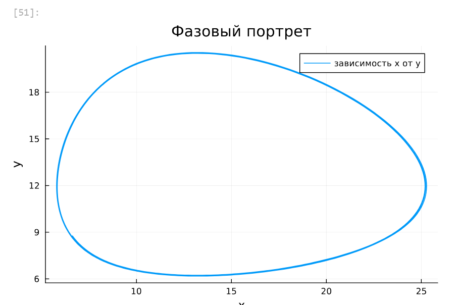
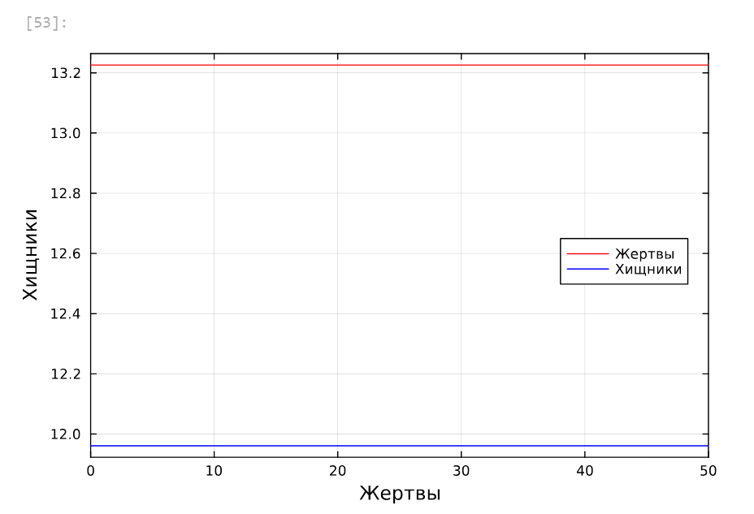
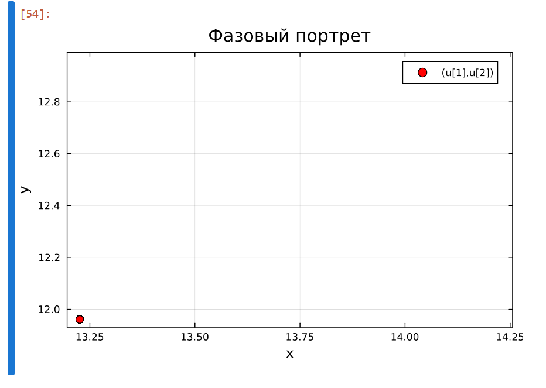
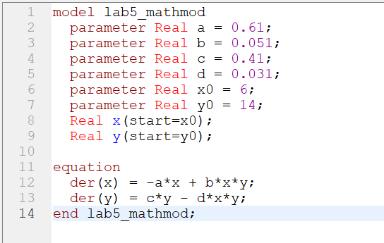
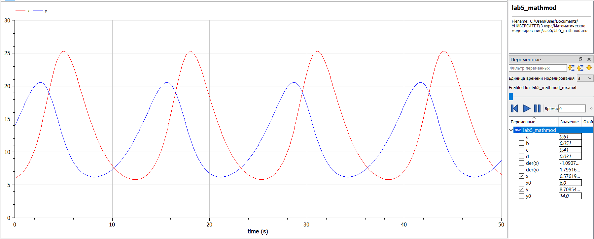
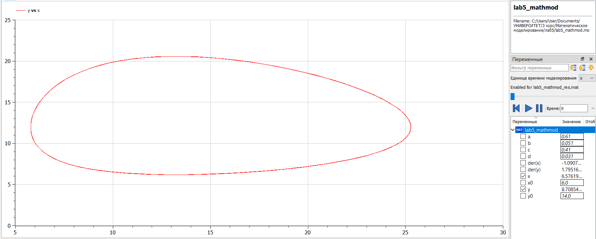
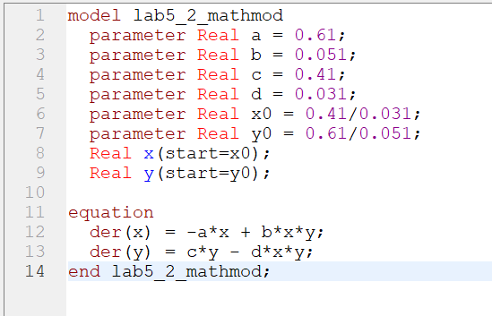
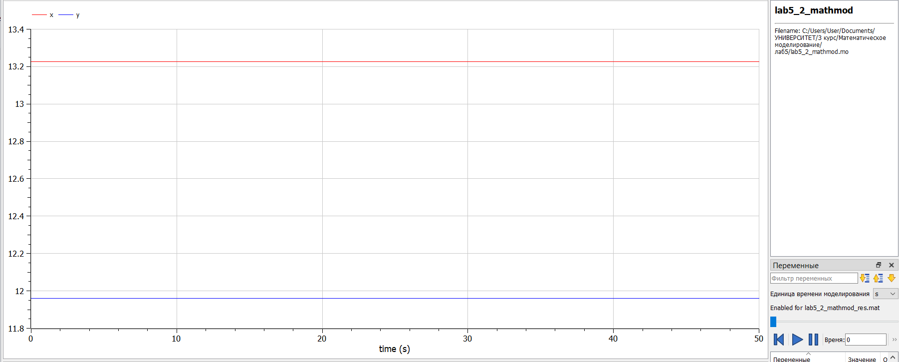
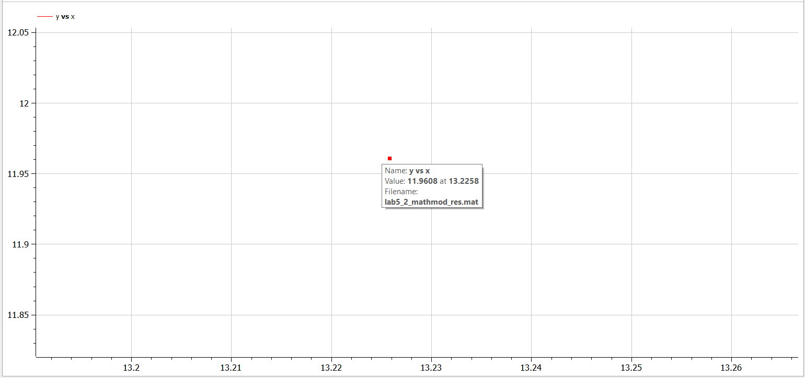

---
## Front matter
title: "Отчёт по лабораторной работе №5"
subtitle: "Дисциплина: Математическое моделирование"
author: "Ганина Таисия Сергеевна, НФИбд-01-22"

## Generic otions
lang: ru-RU
toc-title: "Содержание"

## Bibliography
bibliography: bib/cite.bib
csl: pandoc/csl/gost-r-7-0-5-2008-numeric.csl

## Pdf output format
toc: true # Table of contents
toc-depth: 2
lof: true # List of figures
lot: true # List of tables
fontsize: 12pt
linestretch: 1.5
papersize: a4
documentclass: scrreprt
## I18n polyglossia
polyglossia-lang:
  name: russian
  options:
	- spelling=modern
	- babelshorthands=true
polyglossia-otherlangs:
  name: english
## I18n babel
babel-lang: russian
babel-otherlangs: english
## Fonts
mainfont: PT Serif
romanfont: PT Serif
sansfont: PT Sans
monofont: PT Mono
mainfontoptions: Ligatures=TeX
romanfontoptions: Ligatures=TeX
sansfontoptions: Ligatures=TeX,Scale=MatchLowercase
monofontoptions: Scale=MatchLowercase,Scale=0.9
## Biblatex
biblatex: true
biblio-style: "gost-numeric"
biblatexoptions:
  - parentracker=true
  - backend=biber
  - hyperref=auto
  - language=auto
  - autolang=other*
  - citestyle=gost-numeric
## Pandoc-crossref LaTeX customization
figureTitle: "Рис."
tableTitle: "Таблица"
listingTitle: "Листинг"
lofTitle: "Список иллюстраций"
lotTitle: "Список таблиц"
lolTitle: "Листинги"
## Misc options
indent: true
header-includes:
  - \usepackage{indentfirst}
  - \usepackage{float} # keep figures where there are in the text
  - \floatplacement{figure}{H} # keep figures where there are in the text
---

# Цель работы

Исследовать математическую модель Лотки-Вольерры.

# Задание

Для модели «хищник-жертва»:

$$\begin{cases}
    &\dfrac{dx}{dt} = - 0.61 x(t) + 0.051 x(t)y(t) \\
    \\
    &\dfrac{dy}{dt} = 0.41 y(t) - 0.031 x(t)y(t)
\end{cases}$$

Построить график зависимости численности хищников от численности жертв,
а также графики изменения численности хищников и численности жертв при
следующих начальных условиях: $x_0 = 6, y_0 = 14$.
Найти стационарное состояние системы.

# Теоретическое введение

Модель Лотки — Вольтерры (модель Лотки — Вольтеррa) — модель взаимодействия двух видов типа «хищник — жертва», названная в честь своих авторов (Лотка, 1925; Вольтерра 1926), которые предложили модельные уравнения независимо друг от друга.

Такие уравнения можно использовать для моделирования систем «хищник — жертва», «паразит — хозяин», конкуренции и других видов взаимодействия между двумя видами.

В математической форме предложенная система имеет следующий вид:

$$\begin{cases}
    &\dfrac{dx}{dt} = \alpha x(t) - \beta x(t)y(t) \\
    &\dfrac{dy}{dt} = -\gamma y(t) + \delta x(t)y(t)
\end{cases}$$

где 
$\displaystyle x$ — количество жертв, 

$\displaystyle y$ — количество хищников, 

${\displaystyle t}$ — время, 

${\displaystyle \alpha ,\beta ,\gamma ,\delta }$ — коэффициенты, отражающие взаимодействия между видами [@wiki].

# Выполнение лабораторной работы

## Выполнение лабораторной работы. Julia

В начале напишем код на Julia, а после продемонстрируем полученный график зависимости численности хищников от численности жертв, а также графики изменения численности хищников и численности жертв(рис. @fig:001, @fig:002).

```Julia
# Используемые библиотеки
using DifferentialEquations, Plots;

# задания системы ДУ, описывающей модель Лотки-Вольтерры
function Lotki_Volterra(u, p, t)
    x, y = u
    a, b, c, d = p
    dx = -a*x + b*x*y
    dy = c*y - d*x*y
    return [dx, dy]
end

# Начальные условия
u0 = [6,14]
p = [0.61, 0.051, 0.41, 0.031]
tspan = (0.0, 50.0)
prob = ODEProblem(Lotki_Volterra, u0, tspan, p)
sol = solve(prob, Tsit5())

# Постановка проблемы и ее решение
plot(sol, title = "Модель Лотки-Вольтерры", xaxis = "Время", 
    yaxis = "Численность популяции", 
    label = ["жертвы" "хищники"], 
    c = ["red" "blue"], box =:on)
plot(sol, idxs = (1,2),
    title = "Фазовый портрет",
    xaxis = "x",
    yaxis = "y",
    label = "зависимость x от y")
```

{#fig:001 width=70%}

{#fig:002 width=70%}

Далее найдём стационарное состояние системы по формулам:

$$\begin{cases}
  &x_0 = \dfrac{c}{d}\\
  \\
  &y_0 = \dfrac{a}{b}
\end{cases}
$$

Ответ: $x_0 = 13.225806451612902, y_0 = 11.96078431372549$

Код на Julia и графики (рис. @fig:003, @fig:004):

```Julia
function find_stat(p)
    a,b,c,d = p
    x0 = c/d
    y0 = a/b
    return x0,y0
end

x0, y0 = find_stat(p)
u2 = [x0, y0]
print("x0 = ", x0, "y0 = ", y0)
prob2 = ODEProblem(Lotki_Volterra, u2, tspan, p)
sol2 = solve(prob2, Tsit5())

plot(sol2, xaxis = "Жертвы", yaxis = "Хищники",
    label = ["Жертвы" "Хищники"],
    c = ["red" "blue"], box =:on,
    legend = :right)
    
scatter(sol2, idxs = (1,2),
    title = "Фазовый портрет",
    xaxis = "x",
    yaxis = "y",
    color = "red", markersize = 5, box=:on)
```

{#fig:003 width=70%}

{#fig:004 width=70%}

## Выполнение лабораторной работы. OpenModelica

А теперь выполним построение графиков при помощи OpenModelica (рис. @fig:005, @fig:006, @fig:007):

{#fig:005 width=70%}

{#fig:006 width=70%}

{#fig:007 width=70%}

Далее найдём стационарное состояние системы (рис. @fig:008, @fig:009, @fig:010)

{#fig:008 width=70%}

{#fig:009 width=70%}

{#fig:010 width=70%}

# Выводы

В результате выполнения лабораторной работы я построила математическую модель Лотки-Вольтерры на Julia и в OpenModelica.

# Список литературы{.unnumbered}

::: {#refs}
:::
