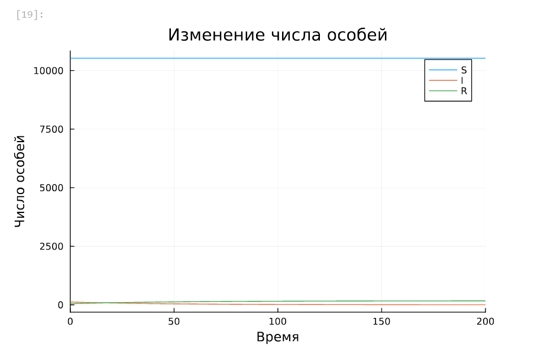
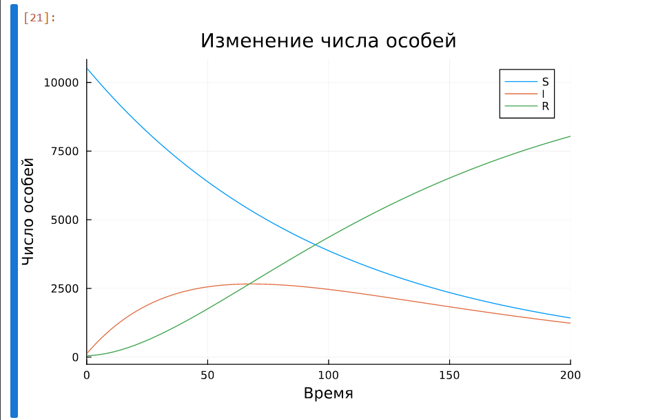
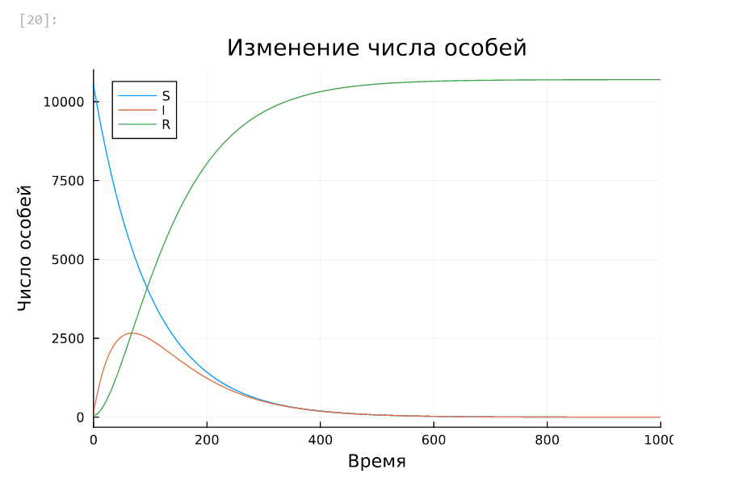
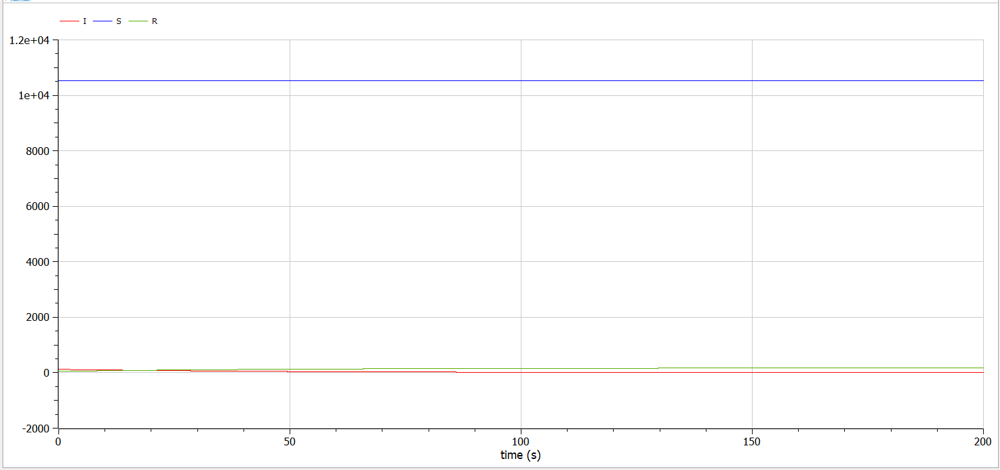
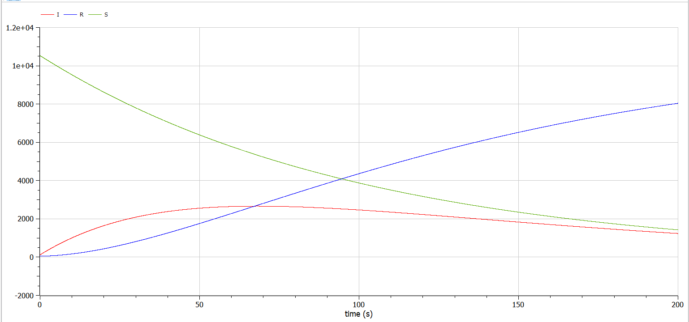

---
## Front matter
lang: ru-RU
title: "Лабораторная работа №6. Модель эпидемии SIR"
subtitle: "Дисциплина: Математическое моделирование"
author:
  - Ганина Т. С.
institute:
  - Группа НФИбд-01-22
  - Российский университет дружбы народов, Москва, Россия
date: 05 апреля 2025

## i18n babel
babel-lang: russian
babel-otherlangs: english

## Formatting pdf
toc: false
toc-title: Содержание
slide_level: 2
aspectratio: 169
section-titles: true
theme: metropolis
header-includes:
 - \metroset{progressbar=frametitle,sectionpage=progressbar,numbering=fraction}
 - '\makeatletter'
 - '\beamer@ignorenonframefalse'
 - '\makeatother'
---

# Информация

## Докладчик

:::::::::::::: {.columns align=center}
::: {.column width="70%"}

  * Ганина Таисия Сергеевна
  * Студентка 3го курса, группа НФИбд-01-22
  * Фундаментальная информатика и информационные технологии
  * Российский университет дружбы народов
  * [Ссылка на репозиторий гитхаба tsganina](https://github.com/tsganina/study_2024-2025_mathmod)

:::
::: {.column width="30%"}

:::
::::::::::::::

# Вводная часть

## Цели и задачи

Исследовать модель SIR (задача об эпидемии)

## Задание

На одном острове вспыхнула эпидемия. Известно, что из всех проживающих на острове ($N=10 700$) в момент начала эпидемии ($t=0$) число заболевших людей
(являющихся распространителями инфекции) $I(0)=121$, А число здоровых людей с иммунитетом к болезни $R(0)=50$. Таким образом, число людей восприимчивых к болезни, но пока здоровых, в начальный момент времени $S(0)=N-I(0)- R(0) = 10 529$.

Постройте графики изменения числа особей в каждой из трех групп.

Рассмотрите, как будет протекать эпидемия в случае:
1) если $I(0)\leq I^*$;
2) если $I(0) > I^*$.

# Выполнение работы

## Выполнение лабораторной работы. Случай $I(0)\leq I^*$, Julia

```Julia
# I0 <= I*
function sir(u,p,t)
    (S,I,R) = u
    (alpha, beta) = p
    N = S+I+R
    dS = 0
    dI = -beta*I
    dR = beta*I
    return [dS, dI, dR]
end
```

## Выполнение лабораторной работы. Случай $I(0)\leq I^*$, Julia

```Julia
N = 10700
I_0 = 121
R_0 = 50
S_0 = N - I_0 - R_0
u0 = [S_0, I_0, R_0]
p = [0.01, 0.02]
tspan = (0.0, 200.0)
prob = ODEProblem(sir, u0, tspan, p)
sol = solve(prob, Tsit5(), saveat = 0.01)
plot(sol, label = ["S" "I" "R"], 
    xlabel = "Время", 
    ylabel = "Число особей", 
    title = "Изменение числа особей")
```

## Выполнение лабораторной работы. Случай $I(0)\leq I^*$, Julia

{#fig:001 width=70%}

## Выполнение лабораторной работы. $I(0) > I^*$, Julia

```Julia
function sir_2(u,p,t)
    (S,I,R) = u
    (alpha, beta) = p
    N = S+I+R
    dS = -alpha*S
    dI = alpha*S - beta*I
    dR = beta*I
    return [dS, dI, dR]
end
```

## Выполнение лабораторной работы. $I(0) > I^*$, Julia

```Julia
N = 10700
I_0 = 121
R_0 = 50
S_0 = N - I_0 - R_0
u0 = [S_0, I_0, R_0]
p = [0.01, 0.02]
tspan = (0.0, 1000.0)
tspan2 = (0.0, 200.0)
```

## Выполнение лабораторной работы. $I(0) > I^*$, Julia

```Julia
prob2 = ODEProblem(sir_2, u0, tspan, p)
sol2 = solve(prob2, Tsit5(), saveat = 0.01)

prob22 = ODEProblem(sir_2, u0, tspan2, p)
sol22 = solve(prob22, Tsit5(), saveat = 0.01)

plot(sol2, label = ["S" "I" "R"], 
    xlabel = "Время", 
    ylabel = "Число особей", 
    title = "Изменение числа особей")
```

## Выполнение лабораторной работы. $I(0) > I^*$, Julia

{#fig:003 width=70%}

## Выполнение лабораторной работы. $I(0) > I^*$, Julia

{#fig:004 width=70%}

## Выполнение лабораторной работы. Случай $I(0)\leq I^*$, OpenModelica

```
  parameter Real N = 10700;
  parameter Real alpha = 0.01;
  parameter Real beta = 0.02;
  parameter Real I0 = 121;
  parameter Real R0 = 50;
  parameter Real S0 = N-I0-R0;
  Real S(start=S0);
  Real I(start=I0);
  Real R(start=R0);

equation
    der(S) = 0;
    der(I) = -beta*I;
    der(R) = beta*I;
```

## Выполнение лабораторной работы. Случай $I(0)\leq I^*$, OpenModelica

{#fig:002 width=70%}

## Выполнение лабораторной работы. $I(0) > I^*$, OpenModelica

```
  parameter Real N = 10700;
  parameter Real alpha = 0.01;
  parameter Real beta = 0.02;
  parameter Real I0 = 121;
  parameter Real R0 = 50;
  parameter Real S0 = N-I0-R0;
  Real S(start=S0);
  Real I(start=I0);
  Real R(start=R0);
equation
    der(S) = -alpha*S;
    der(I) = alpha*S - beta*I;
    der(R) = beta*I;
```


## Выполнение лабораторной работы. $I(0) > I^*$, OpenModelica

{#fig:005 width=70%}


# Результаты

В результате выполнения данной лабораторной работы я исследовала модель SIR.
