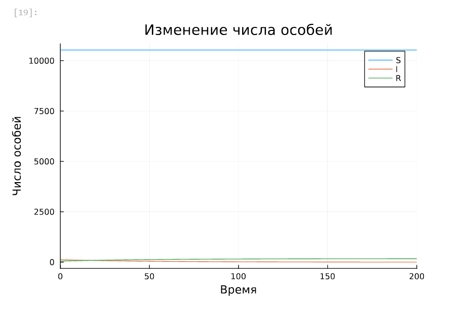
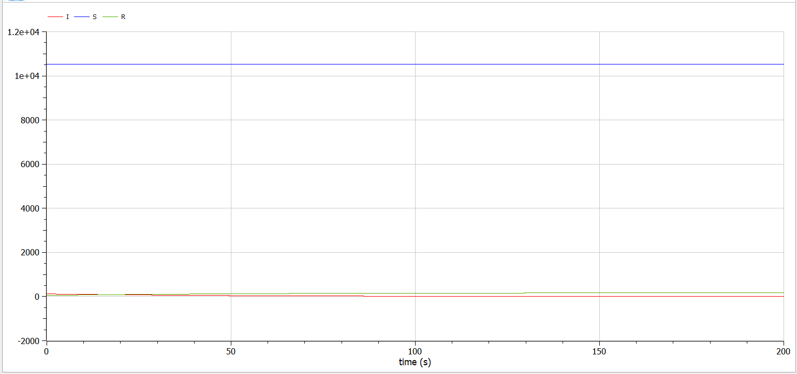
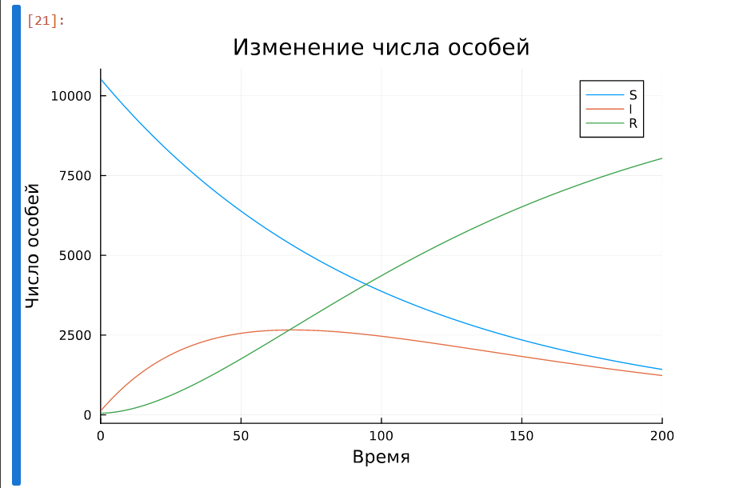
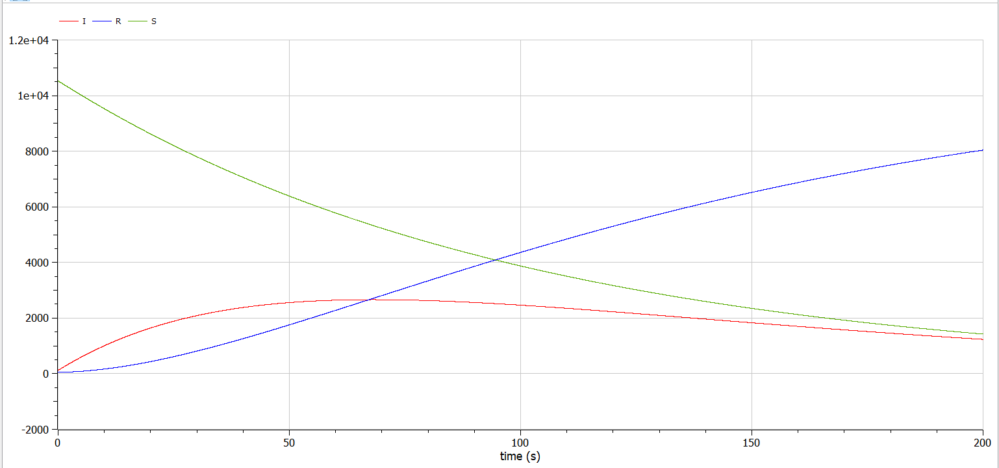

---
## Front matter
title: "Отчёт по лабораторной работе №6"
subtitle: "Дисциплина: Математическое моделирование"
author: "Ганина Таисия Сергеевна, НФИбд-01-22"

## Generic otions
lang: ru-RU
toc-title: "Содержание"

## Bibliography
bibliography: bib/cite.bib
csl: pandoc/csl/gost-r-7-0-5-2008-numeric.csl

## Pdf output format
toc: true # Table of contents
toc-depth: 2
lof: true # List of figures
lot: true # List of tables
fontsize: 12pt
linestretch: 1.5
papersize: a4
documentclass: scrreprt
## I18n polyglossia
polyglossia-lang:
  name: russian
  options:
	- spelling=modern
	- babelshorthands=true
polyglossia-otherlangs:
  name: english
## I18n babel
babel-lang: russian
babel-otherlangs: english
## Fonts
mainfont: PT Serif
romanfont: PT Serif
sansfont: PT Sans
monofont: PT Mono
mainfontoptions: Ligatures=TeX
romanfontoptions: Ligatures=TeX
sansfontoptions: Ligatures=TeX,Scale=MatchLowercase
monofontoptions: Scale=MatchLowercase,Scale=0.9
## Biblatex
biblatex: true
biblio-style: "gost-numeric"
biblatexoptions:
  - parentracker=true
  - backend=biber
  - hyperref=auto
  - language=auto
  - autolang=other*
  - citestyle=gost-numeric
## Pandoc-crossref LaTeX customization
figureTitle: "Рис."
tableTitle: "Таблица"
listingTitle: "Листинг"
lofTitle: "Список иллюстраций"
lotTitle: "Список таблиц"
lolTitle: "Листинги"
## Misc options
indent: true
header-includes:
  - \usepackage{indentfirst}
  - \usepackage{float} # keep figures where there are in the text
  - \floatplacement{figure}{H} # keep figures where there are in the text
---

# Цель работы

Исследовать модель SIR (задача об эпидемии)

# Задание

Вариант 20:

На одном острове вспыхнула эпидемия. Известно, что из всех проживающих на острове ($N=10 700$) в момент начала эпидемии ($t=0$) число заболевших людей
(являющихся распространителями инфекции) $I(0)=121$, А число здоровых людей с иммунитетом к болезни $R(0)=50$. Таким образом, число людей восприимчивых к болезни, но пока здоровых, в начальный момент времени $S(0)=N-I(0)- R(0) = 10 529$.

Постройте графики изменения числа особей в каждой из трех групп.

Рассмотрите, как будет протекать эпидемия в случае:
1) если $I(0)\leq I^*$;
2) если $I(0) > I^*$.

# Теоретическое введение

Компартментальные модели являются очень общим методом моделирования. Они часто применяются к математическому моделированию инфекционных заболеваний. Население распределяется по отделениям с помощью меток – например, S, I, или R, (Susceptible, Infectious, or Recovered). Люди могут прогресс между отсеками. Порядок расположения меток обычно показывает структуру потоков между компартментами; например, SEIS означает восприимчивый, подверженный воздействию, инфекционный, затем снова восприимчивый [@wiki_sir].

Зарождение таких моделей относится к началу 20 века, важными работами которого являются работы Росса в 1916 году Росс и Хадсон в 1917 году, Кермак и Маккендрик в 1927 г., и Кендалл в 1956 году. Модель Рид–Мороз также был важным и широко упускаемым из виду предком современных подходов к эпидемиологическому моделированию.

Модели чаще всего управляются с помощью обыкновенных дифференциальных уравнений (которые являются детерминированными), но также могут использоваться со стохастической (случайной) структурой, которая более реалистична, но гораздо сложнее в анализе.

Модели пытаются предсказать такие вещи, как распространение болезни, или общее число инфицированных, или продолжительность эпидемии, а также оценить различные эпидемиологические параметры, такие как репродуктивное число. Такие модели могут показать, насколько различаются вмешательства общественного здравоохранения могут повлиять на исход эпидемии, например, на то, какой метод является наиболее эффективным для выпуска ограниченного количества вакцин в данной популяции.

# Выполнение лабораторной работы

## Случай $I(0)\leq I^*$

Рассмотрим случай, когда число заболевших не превышает критического значения $I^*$, то есть считаем, что все больные изолированы и не заражают здоровых.

### Реализация на Julia

Зададим систему дифференциальных уравнений, описывающих нашу модель, а также начальные условия данные в задаче. Используя библиотеки `DifferentialEquations.jl` и `Plots.jl` решим систему дифференциальных уравнений и построим соответствующий график.

```Julia
using Plots
using DifferentialEquations

# I0 <= I*
function sir(u,p,t)
    (S,I,R) = u
    (alpha, beta) = p
    N = S+I+R
    dS = 0
    dI = -beta*I
    dR = beta*I
    return [dS, dI, dR]
end

N = 10700
I_0 = 121
R_0 = 50
S_0 = N - I_0 - R_0
u0 = [S_0, I_0, R_0]
p = [0.01, 0.02]
tspan = (0.0, 200.0)

prob = ODEProblem(sir, u0, tspan, p)
sol = solve(prob, Tsit5(), saveat = 0.01)
plot(sol, label = ["S" "I" "R"], 
    xlabel = "Время", 
    ylabel = "Число особей", 
    title = "Изменение числа особей")
```

В результате получаем следующий график динамики изменения числа людей в каждой из трех групп (рис. @fig:001). Видно, что численность здоровых людей (S) не меняется, поскольку мы рассматриваем случай, когда все больные изолированы, то есть здоровые не заражаются. Число больных уменьшается, а число людей с иммунитетом увеличивается.

{#fig:001 width=70%}

### Реализация на OpenModelica

Здесь мы задаем параметры, начальные условия, систему ДУ и выполняем симуляцию на том же интервале и с тем же шагом, что и в Julia.

```
model lab6_mathmod_1
  parameter Real N = 10700;
  parameter Real alpha = 0.01;
  parameter Real beta = 0.02;
  parameter Real I0 = 121;
  parameter Real R0 = 50;
  parameter Real S0 = N-I0-R0;
  Real S(start=S0);
  Real I(start=I0);
  Real R(start=R0);

equation
    der(S) = 0;
    der(I) = -beta*I;
    der(R) = beta*I;
end lab6_mathmod_1;
```

В результате получаем следующий график динамики изменения числа людей в каждой из трех групп (рис. @fig:002). Видно, что численность здоровых людей (S) не меняется, поскольку мы рассматриваем случай, когда все больные изолированы, то есть здоровые не заражаются. Число больных уменьшается, а число людей с иммунитетом увеличивается.

{#fig:002 width=70%}

График, построенный посредством OpenModelica, идентичен графику, выполненном на Julia.

## Случай $I(0) > I^*$

Рассмотрим случай, когда число заболевших превышает критическое значения $I^*$, то есть считаем, что инфицирование способны заражать восприимчивых к болезни особей. 

### Реализация на Julia

Зададим систему дифференциальных уравнений, описывающих нашу модель, а также начальные условия данные в задаче. Используя библиотеки `DifferentialEquations.jl` и `Plots.jl` решим систему дифференциальных уравнений и построим соответствующий график.

```Julia
function sir_2(u,p,t)
    (S,I,R) = u
    (alpha, beta) = p
    N = S+I+R
    dS = -alpha*S
    dI = alpha*S - beta*I
    dR = beta*I
    return [dS, dI, dR]
end

N = 10700
I_0 = 121
R_0 = 50
S_0 = N - I_0 - R_0
u0 = [S_0, I_0, R_0]
p = [0.01, 0.02]
tspan = (0.0, 1000.0)
tspan2 = (0.0, 200.0)

prob2 = ODEProblem(sir_2, u0, tspan, p)
sol2 = solve(prob2, Tsit5(), saveat = 0.01)

prob22 = ODEProblem(sir_2, u0, tspan2, p)
sol22 = solve(prob22, Tsit5(), saveat = 0.01)

plot(sol2, label = ["S" "I" "R"], 
    xlabel = "Время", 
    ylabel = "Число особей", 
    title = "Изменение числа особей")
```

В результате получаем следующий график динамики изменения числа людей в каждой из трех групп (рис. @fig:003). Видно, что численность здоровых людей (S) уменьшается, поскольку мы рассматриваем случай, когда больные заражают здоровых. Число больных людей сначала увеличивается, а затем уменьшается, поскольку люди успевают выздоравливать и приобретать иммунитет (это зависит от заданных коэффициентов заболеваемости и выздоровления).

{#fig:003 width=70%}

После я решила поменять время моделирования, задав `tspan = (0.0, 1000.0)`, чтобы посмотреть, как система приходит в состояние равновесия. Результат можно увидеть на графике (рис. @fig:004):

{#fig:004 width=70%}

### Реализация на OpenModelica

Здесь мы задаем параметры, начальные условия, систему ДУ и выполняем симуляцию на том же интервале и с тем же шагом, что и в Julia.

```
model lab6_mathmod_2
  parameter Real N = 10700;
  parameter Real alpha = 0.01;
  parameter Real beta = 0.02;
  parameter Real I0 = 121;
  parameter Real R0 = 50;
  parameter Real S0 = N-I0-R0;
  Real S(start=S0);
  Real I(start=I0);
  Real R(start=R0);

equation
    der(S) = -alpha*S;
    der(I) = alpha*S - beta*I;
    der(R) = beta*I;
end lab6_mathmod_2;
```

В результате получаем следующий график динамики изменения числа людей в каждой из трех групп (рис. @fig:005).Видно, что численность здоровых людей (S) уменьшается, поскольку мы рассматриваем случай, когда больные заражают здоровых. Число больных людей сначала увеличивается, а затем уменьшается, поскольку люди успевают выздоравливать и приобретать иммунитет (это зависит от заданных коэффициентов заболеваемости и выздоровления).

{#fig:005 width=70%}

График, построенный посредством OpenModelica, идентичен графику, выполненном на Julia.

# Выводы

В результате выполнения данной лабораторной работы я исследовала модель SIR.

# Список литературы{.unnumbered}

::: {#refs}
:::
