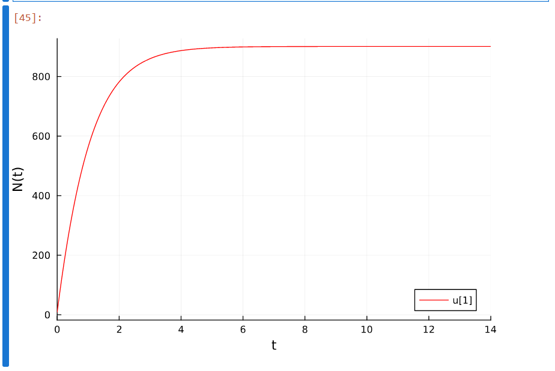
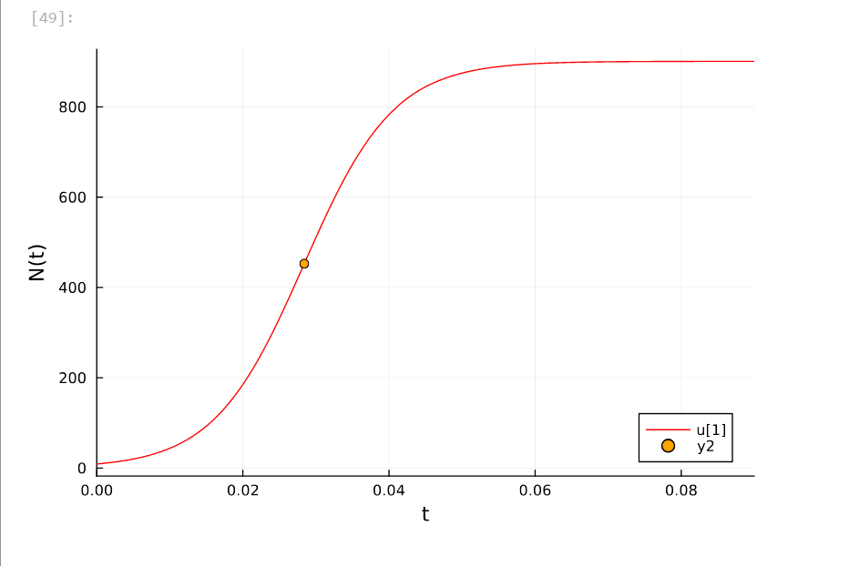
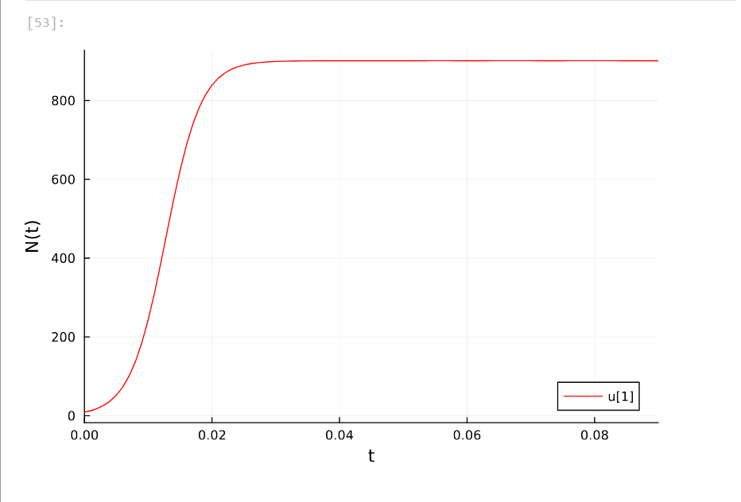
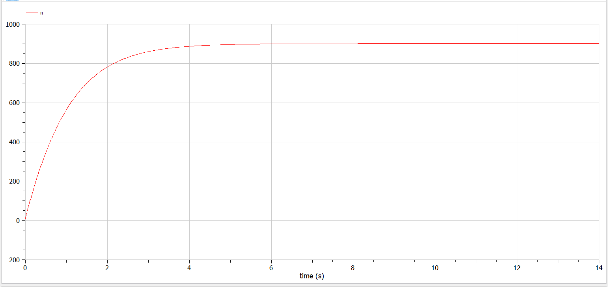
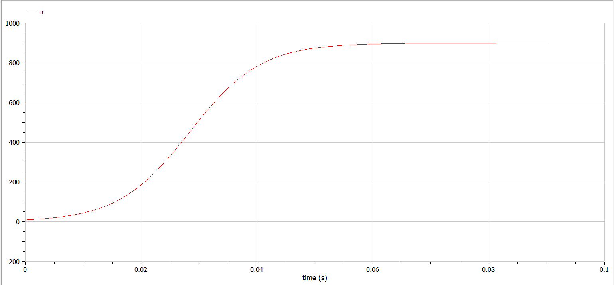
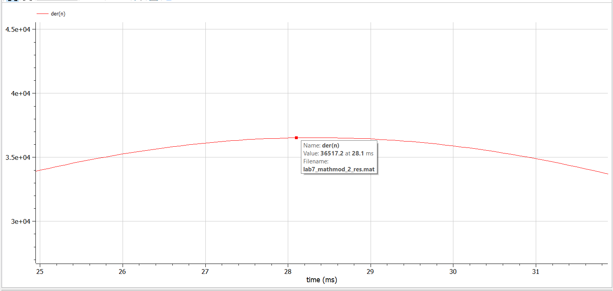
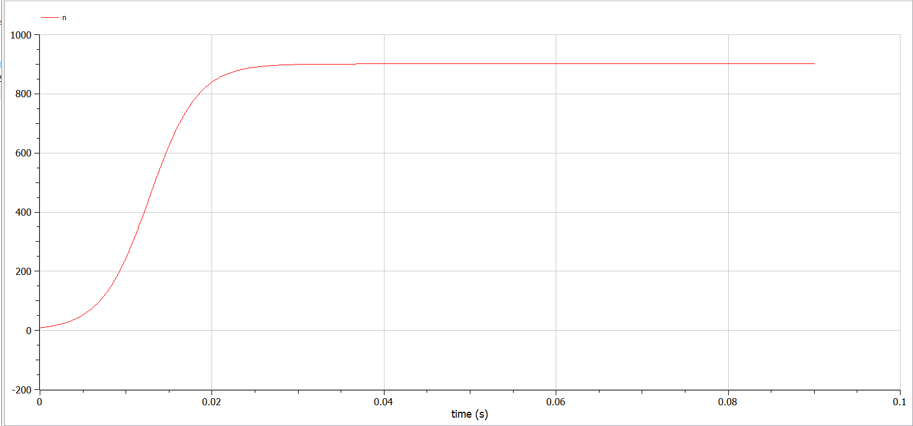

---
## Front matter
lang: ru-RU
title: "Лабораторная работа №7. Модель эффективности рекламы"
subtitle: "Дисциплина: Математическое моделирование"
author:
  - Ганина Т. С.
institute:
  - Группа НФИбд-01-22
  - Российский университет дружбы народов, Москва, Россия
date: 06 апреля 2025

## i18n babel
babel-lang: russian
babel-otherlangs: english

## Formatting pdf
toc: false
toc-title: Содержание
slide_level: 2
aspectratio: 169
section-titles: true
theme: metropolis
header-includes:
 - \metroset{progressbar=frametitle,sectionpage=progressbar,numbering=fraction}
 - '\makeatletter'
 - '\beamer@ignorenonframefalse'
 - '\makeatother'
---

# Информация

## Докладчик

:::::::::::::: {.columns align=center}
::: {.column width="70%"}

  * Ганина Таисия Сергеевна
  * Студентка 3го курса, группа НФИбд-01-22
  * Фундаментальная информатика и информационные технологии
  * Российский университет дружбы народов
  * [Ссылка на репозиторий гитхаба tsganina](https://github.com/tsganina/study_2024-2025_mathmod)

:::
::: {.column width="30%"}

:::
::::::::::::::

# Вводная часть

## Цели и задачи

Исследовать модель эффективности рекламы. 

## Задание

Построить график распространения рекламы, математическая модель которой описывается
следующим уравнением:

1. $\dfrac{dn}{dt} = (0.91+0.00019n(t))(N-n(t))$

2. $\dfrac{dn}{dt} = (0.000081+0.18n(t))(N-n(t))$

3. $\dfrac{dn}{dt} = (0.2\sin(2t)+0.4\cos(4t)n(t))(N-n(t))$

При этом объем аудитории $N = 901$, в начальный момент о товаре знает 9 человек. Для случая 2 определить в какой момент времени скорость распространения рекламы будет
иметь максимальное значение.

# Выполнение работы

## Выполнение лабораторной работы. Julia

```Julia
using DifferentialEquations, Plots;
f(n, p, t) = (p[1] + p[2]*n)*(p[3] - n)
p1 = [0.91, 0.00019, 901]
p2 = [0.000081, 0.18, 901]
n_0 = 9
tspan1 = (0.0, 14.0)
tspan2 = (0.0, 0.09)
prob1 = ODEProblem(f, n_0, tspan1, p1)
prob2 = ODEProblem(f, n_0, tspan2, p2)
```

## Выполнение лабораторной работы. Julia

```Julia
sol1 = solve(prob1, Tsit5(), saveat = 0.01)
plot(sol1, markersize =:15, c =:red, yaxis = "N(t)")

sol2 = solve(prob2, Tsit5(), saveat = 0.0001)
plot(sol2, markersize =:15, c=:red, yaxis="N(t)")
```

## Выполнение лабораторной работы. Julia

{#fig:001 width=70%}

## Выполнение лабораторной работы. Julia

```Julia
dev = [sol2(i, Val{1}) for i in 0:0.0001:0.09]
maximum(dev)
```

Получим значение `36516.426718136565`.

Далее найдем индекс этого элемента в векторе `dev`.

```Julia
findall(x -> x == 36516.426718136565, dev)

1-element Vector{Int64}:
 285
```


## Выполнение лабораторной работы. Julia

```Julia
x = sol2.t[285]
y = sol2.u[285]
scatter!((x,y), c=:orange, leg=:bottomright)
```

## Выполнение лабораторной работы. Julia

{#fig:002 width=70%}

## Выполнение лабораторной работы. Julia

```Julia
function f3(u,p,t)
    n = u
    dn = (0.2*sin(2*t) + 0.4*cos(4*t)*n)*(901 - n)
end
u_0 = 9
tspan = (0.0, 0.09)
prob3 = ODEProblem(f3, u_0, tspan)
sol3 = DifferentialEquations.solve(prob3, Tsit5(), saveat = 0.001)
plot(sol3, markersize =:15, c=:red, yaxis="N(t)")
```

## Выполнение лабораторной работы. Julia

{#fig:003 width=70%}

## Выполнение лабораторной работы. OpenModelica

```
model lab7_mathmod_1
  parameter Real N = 901;
  parameter Real alpha1 = 0.91;
  parameter Real alpha2 = 0.00019;
  parameter Real n_0 = 9;
  
  Real n(start=n_0);

equation
    der(n) = (alpha1+alpha2*n)*(N-n);
end lab7_mathmod_1;
```

## Выполнение лабораторной работы. OpenModelica

{#fig:004 width=70%}

## Выполнение лабораторной работы. OpenModelica

```
model lab7_mathmod_2
  parameter Real N = 901;
  parameter Real alpha1 = 0.000081;
  parameter Real alpha2 = 0.18;
  parameter Real n_0 = 9;
  Real n(start=n_0);
equation
    der(n) = (alpha1+alpha2*n)*(N-n);
end lab7_mathmod_2;
```


## Выполнение лабораторной работы. OpenModelica

{#fig:005 width=70%}

## Выполнение лабораторной работы. OpenModelica

{#fig:006 width=70%}

## Выполнение лабораторной работы. OpenModelica

```
model lab7_mathmod_3
  parameter Real N = 901;
  parameter Real n_0 = 9;
  
  Real n(start=n_0);

equation
    der(n) = (0.2*sin(2*time) + 0.4*cos(4*time)*n)*(N - n);
end lab7_mathmod_3;
```

## Выполнение лабораторной работы. OpenModelica

{#fig:007 width=70%}

# Результаты

В результате выполнения данной лабораторной работы была исследована модель эффективности рекламы.
