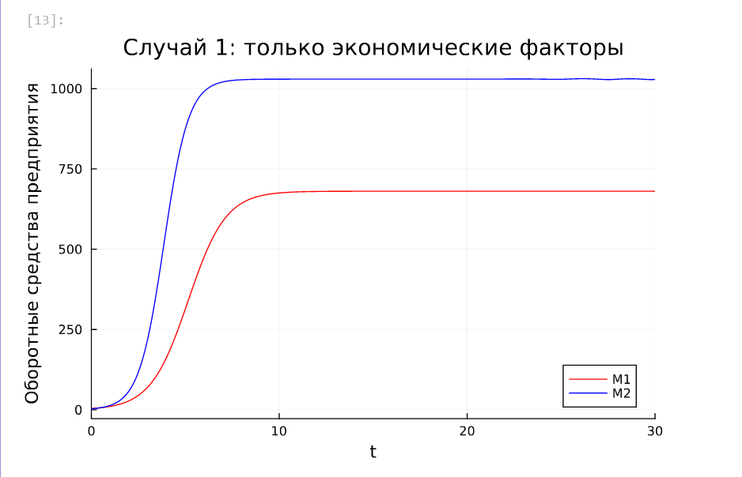
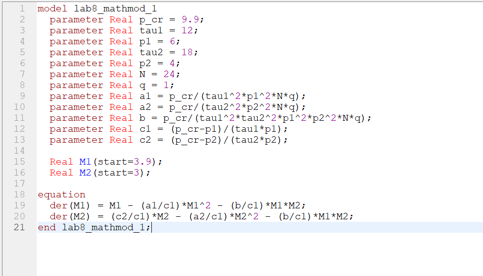
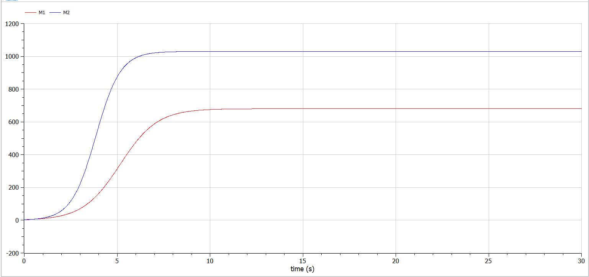
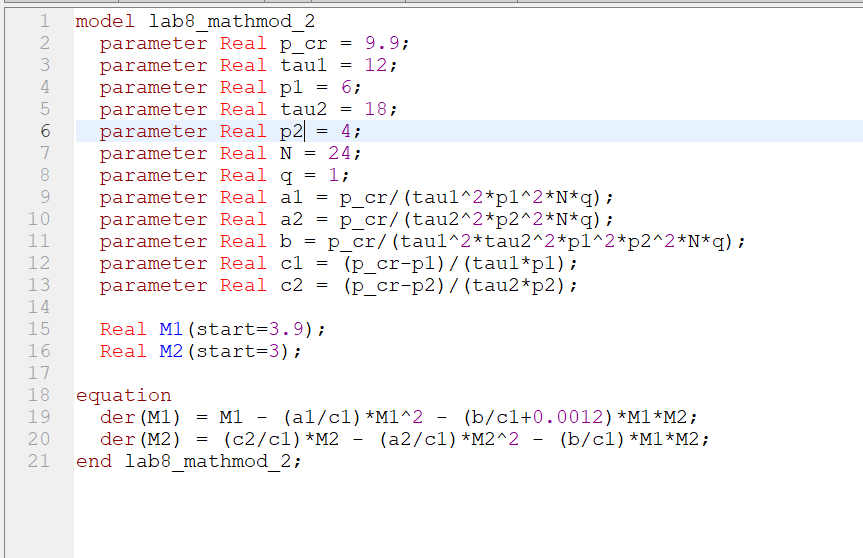
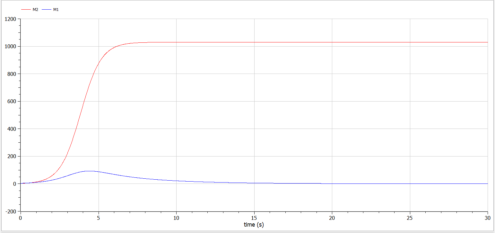

---
## Front matter
lang: ru-RU
title: "Лабораторная работа №8. Модель конкуренции двух фирм"
subtitle: "Дисциплина: Математическое моделирование"
author:
  - Ганина Т. С.
institute:
  - Группа НФИбд-01-22
  - Российский университет дружбы народов, Москва, Россия
date: 07 апреля 2025

## i18n babel
babel-lang: russian
babel-otherlangs: english

## Formatting pdf
toc: false
toc-title: Содержание
slide_level: 2
aspectratio: 169
section-titles: true
theme: metropolis
header-includes:
 - \metroset{progressbar=frametitle,sectionpage=progressbar,numbering=fraction}
 - '\makeatletter'
 - '\beamer@ignorenonframefalse'
 - '\makeatother'
---

# Информация

## Докладчик

:::::::::::::: {.columns align=center}
::: {.column width="70%"}

  * Ганина Таисия Сергеевна
  * Студентка 3го курса, группа НФИбд-01-22
  * Фундаментальная информатика и информационные технологии
  * Российский университет дружбы народов
  * [Ссылка на репозиторий гитхаба tsganina](https://github.com/tsganina/study_2024-2025_mathmod)

:::
::: {.column width="30%"}

:::
::::::::::::::

# Вводная часть

## Цели и задачи

Исследовать математическую модель конкуренции двух фирм.

## Задание. Случай 1

Рассмотрим две фирмы, производящие взаимозаменяемые товары одинакового качества и находящиеся в одной рыночной нише. Считаем, что в рамках нашей модели конкурентная борьба ведётся только рыночными методами. То есть, конкуренты могут влиять на противника путем изменения параметров своего производства: себестоимость, время цикла, но не могут прямо вмешиваться в ситуацию на рынке. Будем считать, что постоянные издержки пренебрежимо малы, и в модели учитывать не будем. В этом случае динамика изменения объемов продаж фирмы 1 и фирмы 2 описывается следующей системой уравнений:

$$\begin{cases}                                 
  &\dfrac{dM_1}{d\theta} = M_1-\dfrac{b}{c_1}M_1M_2-\dfrac{a_1}{c_1}M_1^2,\\
  \\
  &\dfrac{dM_2}{d\theta} = \dfrac{c_2}{c_1}M2-\dfrac{b}{c_1}M_1M_2-\dfrac{a_1}{c_1}M_2^2,
\end{cases}$$

где $a_1=\dfrac{p_{cr}}{\tau_{1}^2\tilde p_1^2Nq}, a_2=\dfrac{p_{cr}}{\tau_{2}^2\tilde p_2^2Nq}, b=\dfrac{p_{cr}}{\tau_{1}^2\tilde p_1^2\tau_{2}^2\tilde p_2^2Nq}, \, \, c_1=\dfrac{p_{cr} - \tilde{p_1}}{\tau_{1}\tilde p_1}, c_2=\dfrac{p_{cr} - \tilde{p_1}}{\tau_{2}\tilde p_2}$

Также введена нормировка $t=c_1\theta$.

## Задание. Случай 2.

Рассмотрим модель, когда, помимо экономического фактора
влияния (изменение себестоимости, производственного цикла, использование
кредита и т.п.), используются еще и социально-психологические факторы –
формирование общественного предпочтения одного товара другому, не зависимо от
их качества и цены. В этом случае взаимодействие двух фирм будет зависеть друг
от друга, соответственно коэффициент перед $M_1M_2$
будет отличаться. Пусть в рамках рассматриваемой модели динамика изменения объемов продаж фирмы 1 и
фирмы 2 описывается следующей системой уравнений:

$$\begin{cases}                                 
  &\dfrac{dM_1}{d\theta} = M_1-(\dfrac{b}{c_1}+0.0012)M_1M_2-\dfrac{a_1}{c_1}M_1^2,\\
  \\
  &\dfrac{dM_2}{d\theta} = \dfrac{c_2}{c_1}M2-\dfrac{b}{c_1}M_1M_2-\dfrac{a_1}{c_1}M_2^2,
\end{cases}$$

## Задание

Для обоих случаев рассмотрим задачу со следующими начальными условиями и параметрами:
$$M_0^1=3.9, M_0^2=3, p_{cr}=9.9, \,N=24, q=1, \tau_1=12, \tau_2=18, \tilde{p_1}=6, \tilde{p_2}=4$$

1. Построить графики изменения оборотных средств фирмы 1 и фирмы 2 без
учета постоянных издержек и с веденной нормировкой для случая 1.
2. Построить графики изменения оборотных средств фирмы 1 и фирмы 2 без
учета постоянных издержек и с веденной нормировкой для случая 2.


# Выполнение работы

## Выполнение лабораторной работы. Julia

```Julia
using DifferentialEquations, Plots;
# задаем параметры модели согласно условию задачи
p_cr = 9.9          # критическая стоимость продукта
tau1 = 12           # длительность производственного цикла фирмы 1
p1 = 6              # себестоимость продукта у фирмы 1
tau2 = 18           # длительность производственного цикла фирмы 2
p2 = 4              # себестоимость продукта у фирмы 2
N = 24              # число потребителей
q = 1;              # максимальная потребность одного человека
# вычисляем коэффициенты системы уравнений для случая 1
a1 = p_cr/(tau1^2*p1^2*N*q)    # коэффициент a₁ по формуле из условия
a2 = p_cr/(tau2^2*p2^2*N*q)    # коэффициент a₂
# Характеризуют влияние внутренних факторов фирм на объём продаж
```

## Выполнение лабораторной работы. Julia

```Julia
b = p_cr/(tau1^2*tau2^2*p1^2*p2^2*N*q)  # коэффициент b, 
# Отражает внешнее конкурентное взаимодействие между фирмами
c1 = (p_cr-p1)/(tau1*p1)       # коэффициент c₁
c2 = (p_cr-p2)/(tau2*p2);      # коэффициент c₂
# Характеризуют эффективность использования ресурсов
# начальные условия: M₁(0) = 3.9, M₂(0) = 3
u0 = [3.9, 3]       
# вектор параметров для передачи в функцию
p = [a1, a2, b, c1, c2]  
# временной интервал (нормированное время)
tspan = (0.0, 30.0);
```

## Выполнение лабораторной работы. Julia

```Julia
function f(u, p, t)
    M1, M2 = u
    a1, a2, b, c1, c2 = p
    dM1 = M1 - (a1/c1)*M1^2 - (b/c1)*M1*M2
    dM2 = (c2/c1)*M2 - (a2/c1)*M2^2 - (b/c1)*M1*M2
    return [dM1, dM2]
end
# создаем и решаем задачу Коши для случая 1
prob = ODEProblem(f, u0, tspan, p)
# используем алгоритм с сохранением решения каждые 0.01 единицы времени
sol = solve(prob, Tsit5(), saveat = 0.01)
plot(sol, yaxis = "Оборотные средства предприятия", 
    label = ["M1" "M2"], c = ["red" "blue"],
    title = "Случай 1: только экономические факторы")
```

## Выполнение лабораторной работы. Julia

{#fig:001 width=70%}

## Выполнение лабораторной работы. Julia

```Julia
function f2(u, p, t)
    M1, M2 = u
    a1, a2, b, c1, c2 = p
    dM1 = M1 - (a1/c1)*M1^2 - (b/c1 + 0.0012)*M1*M2
    dM2 = (c2/c1)*M2 - (a2/c1)*M2^2 - (b/c1)*M1*M2
    return [dM1, dM2]
end
prob2 = ODEProblem(f2, u0, tspan, p)
sol2 = solve(prob2, Tsit5(), saveat = 0.01)
plot(sol2, yaxis = "Оборотные средства предприятия", 
    label = ["M1" "M2"], c = ["red" "blue"],
    title = "Случай 2: с социально-психологическими факторами")
```

## Выполнение лабораторной работы. Julia

{#fig:002 width=70%}

## Выполнение лабораторной работы. OpenModelica

{#fig:003 width=70%}

## Выполнение лабораторной работы. OpenModelica

{#fig:004 width=70%}

## Выполнение лабораторной работы. OpenModelica

{#fig:005 width=70%}

## Выполнение лабораторной работы. OpenModelica

{#fig:006 width=70%}

# Результаты

В результате выполнения лабораторной работы была исследована модель конкуренции двух фирм.
