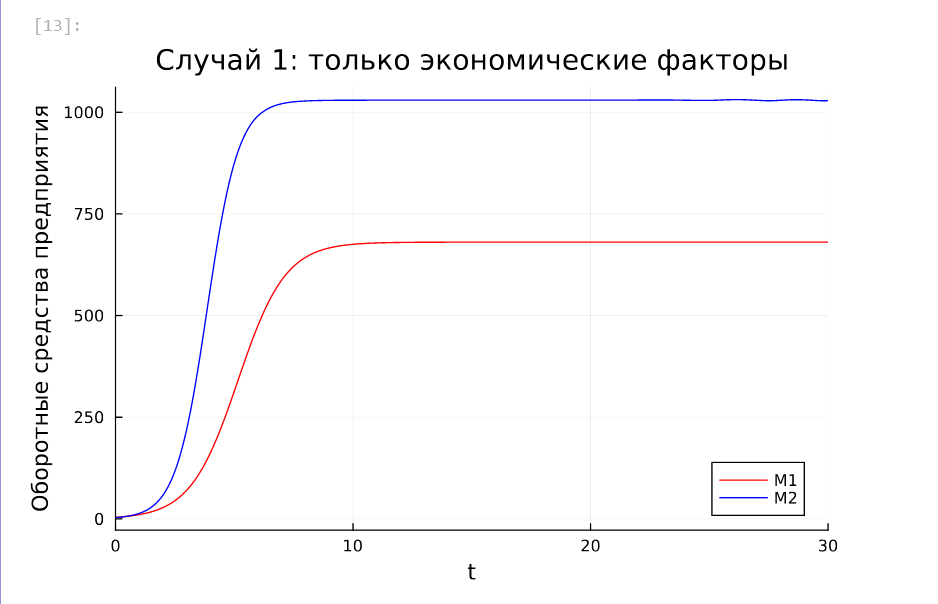
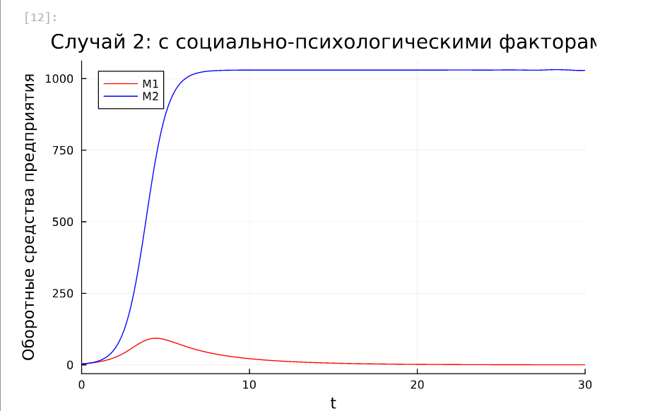
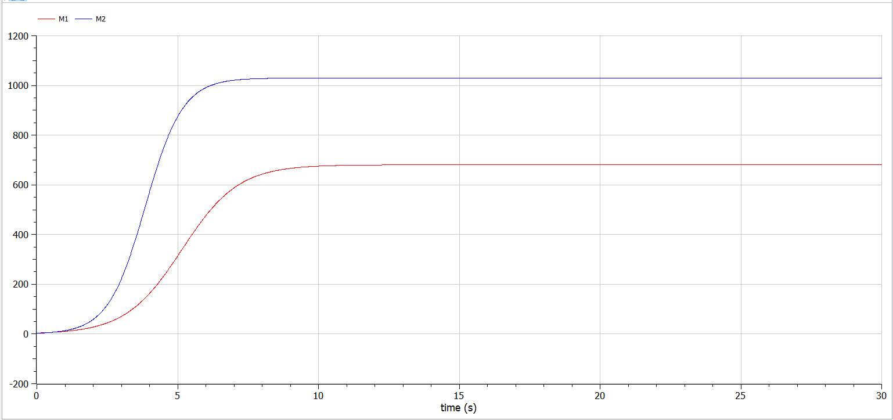
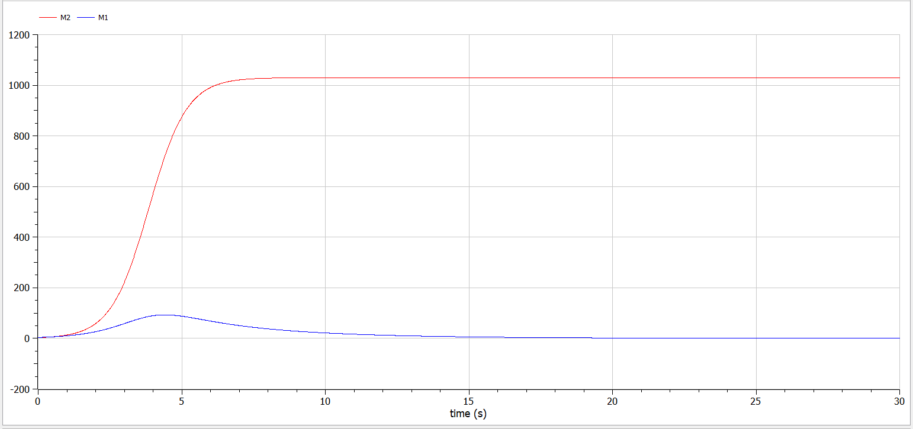

---
## Front matter
title: "Отчёт по лабораторной работе №8"
subtitle: "Дисциплина: Математическое моделирование"
author: "Ганина Таисия Сергеевна, НФИбд-01-22"

## Generic otions
lang: ru-RU
toc-title: "Содержание"

## Bibliography
bibliography: bib/cite.bib
csl: pandoc/csl/gost-r-7-0-5-2008-numeric.csl

## Pdf output format
toc: true # Table of contents
toc-depth: 2
lof: true # List of figures
lot: true # List of tables
fontsize: 12pt
linestretch: 1.5
papersize: a4
documentclass: scrreprt
## I18n polyglossia
polyglossia-lang:
  name: russian
  options:
	- spelling=modern
	- babelshorthands=true
polyglossia-otherlangs:
  name: english
## I18n babel
babel-lang: russian
babel-otherlangs: english
## Fonts
mainfont: PT Serif
romanfont: PT Serif
sansfont: PT Sans
monofont: PT Mono
mainfontoptions: Ligatures=TeX
romanfontoptions: Ligatures=TeX
sansfontoptions: Ligatures=TeX,Scale=MatchLowercase
monofontoptions: Scale=MatchLowercase,Scale=0.9
## Biblatex
biblatex: true
biblio-style: "gost-numeric"
biblatexoptions:
  - parentracker=true
  - backend=biber
  - hyperref=auto
  - language=auto
  - autolang=other*
  - citestyle=gost-numeric
## Pandoc-crossref LaTeX customization
figureTitle: "Рис."
tableTitle: "Таблица"
listingTitle: "Листинг"
lofTitle: "Список иллюстраций"
lotTitle: "Список таблиц"
lolTitle: "Листинги"
## Misc options
indent: true
header-includes:
  - \usepackage{indentfirst}
  - \usepackage{float} # keep figures where there are in the text
  - \floatplacement{figure}{H} # keep figures where there are in the text
---

# Цель работы

Исследовать математическую модель конкуренции двух фирм.

# Задание

## Случай 1

Рассмотрим две фирмы, производящие взаимозаменяемые товары
одинакового качества и находящиеся в одной рыночной нише. Считаем, что в рамках
нашей модели конкурентная борьба ведётся только рыночными методами. То есть, конкуренты могут влиять на противника путем изменения параметров своего
производства: себестоимость, время цикла, но не могут прямо вмешиваться в
ситуацию на рынке («назначать» цену или влиять на потребителей каким-либо иным способом.) Будем считать, что постоянные издержки пренебрежимо малы, и в
модели учитывать не будем. В этом случае динамика изменения объемов продаж
фирмы 1 и фирмы 2 описывается следующей системой уравнений:

$$\begin{cases}                                 
  \dfrac{dM_1}{d\theta} = M_1-\dfrac{b}{c_1}M_1M_2-\dfrac{a_1}{c_1}M_1^2,\\\\
  \dfrac{dM_2}{d\theta} = \dfrac{c_2}{c_1}M2-\dfrac{b}{c_1}M_1M_2-\dfrac{a_1}{c_1}M_2^2,
\end{cases}
$$

где $a_1=\dfrac{p_{cr}}{\tau_{1}^2\tilde p_1^2Nq}, \, \, a_2=\dfrac{p_{cr}}{\tau_{2}^2\tilde p_2^2Nq}, \, \, b=\dfrac{p_{cr}}{\tau_{1}^2\tilde p_1^2\tau_{2}^2\tilde p_2^2Nq}, \, \, c_1=\dfrac{p_{cr} - \tilde{p_1}}{\tau_{1}\tilde p_1}, \, \, c_2=\dfrac{p_{cr} - \tilde{p_1}}{\tau_{2}\tilde p_2}$

Также введена нормировка $t=c_1\theta$.

## Случай 2.

Рассмотрим модель, когда, помимо экономического фактора
влияния (изменение себестоимости, производственного цикла, использование
кредита и т.п.), используются еще и социально-психологические факторы –
формирование общественного предпочтения одного товара другому, не зависимо от
их качества и цены. В этом случае взаимодействие двух фирм будет зависеть друг
от друга, соответственно коэффициент перед $M_1M_2$
будет отличаться. Пусть в
рамках рассматриваемой модели динамика изменения объемов продаж фирмы 1 и
фирмы 2 описывается следующей системой уравнений:

$$\begin{cases}                                 
  \dfrac{dM_1}{d\theta} = M_1-(\dfrac{b}{c_1}+0.0012)M_1M_2-\dfrac{a_1}{c_1}M_1^2,\\\\
  \dfrac{dM_2}{d\theta} = \dfrac{c_2}{c_1}M2-\dfrac{b}{c_1}M_1M_2-\dfrac{a_1}{c_1}M_2^2,
\end{cases}
$$

Для обоих случаев рассмотрим задачу со следующими начальными условиями и параметрами:
$$M_0^1=3.9, \, M_0^2=3,\\ p_{cr}=9.9, \,N=24, q=1, \tau_1=12, \, \tau_2=18,\\ \tilde{p_1}=6, \, \tilde{p_2}=4$$

## Обозначения:

* $N$ – число потребителей производимого продукта.
* $\tau$ – длительность производственного цикла
* $p$ – рыночная цена товара
* $\tilde{p}$– себестоимость продукта, то есть переменные издержки на производство единицы
продукции.
* $q$ – максимальная потребность одного человека в продукте в единицу времени
* $\theta = \dfrac{t}{c_1}$- безразмерное время


1. Построить графики изменения оборотных средств фирмы 1 и фирмы 2 без
учета постоянных издержек и с веденной нормировкой для случая 1.
2. Построить графики изменения оборотных средств фирмы 1 и фирмы 2 без
учета постоянных издержек и с веденной нормировкой для случая 2.

# Теоретическое введение

Математическому моделированию процессов конкуренции и сотрудничества двух фирм на различных рынках посвящено довольно много научных работ, в основном использующих аппарат теории игр и статистических решений. В качестве примера можно привести работы таких исследователей, как Курно, Стакельберг, Бертран, Нэш, Парето [@wiki].

Следует отметить, что динамические дифференциальные модели уже давно и успешно используются для математического моделирования самых разнообразных по своей природе процессов. Достаточно упомянуть широко использующуюся в экологии модель «хищник-жертва» Вольтерра, математическую теорию развития эпидемий, модели боевых действий

Задача решалась в следующей постановке.

На рынке однородного товара присутствуют две основные фирмы, разделяющие его между собой, т.е. имеет место классическая дуополия.

Безусловно, это является весьма сильным предположением, однако оно вполне оправдано в тех случаях, когда доля продаж остальных конкурентов на рассматриваемом сегменте рынке пренебрежимо мала. Хорошим примером может служить отечественный рынок микропроцессоров, который по существу разделили между собой две фирмы: Intel и AMD. 

Изменение объемов продаж конкурирующих фирм с течением времени описывается следующей системой дифференциальных уравнений:

$$\begin{cases}
\frac{d M_1}{d \theta} = M_1 - \dfrac{b}{c_1} M_1 M_2 - \dfrac{a_1}{c_1} M_1^2,\\
\frac{d M_2}{d \theta} = \dfrac{c_2}{c_1} M_1 - \dfrac{b}{c_1} M_1 M_2 - \dfrac{a_2}{c_1} M_2^2,
\end{cases}$$

где $a_1 = \dfrac{p_{cr}}{(\tau _1^2 \tilde{p_1} N q)}$, $a_2 = \dfrac{p_{cr}}{(\tau _2 ^2*\tilde{p_2} N q)}$, $b = \dfrac{p_{cr}}{(\tau _1^2 \tau _2^2 \tilde{p_1}^2 \tilde{p_2}^2 N q)}$,
$c_1 = \dfrac{(p_{cr}-p_1)}{(\tau _1 \tilde{p_1})}$, $c_2 = \dfrac{(p_{cr}-p_2)}{(\tau _2 \tilde{p_2})}$.

- $N$ -- число потребителей производимого продукта.
- $\tau$ -- длительность производственного цикла
- $p$ -- рыночная цена товара
- $\tilde p$ -- себестоимость продукта, то есть переменные издержки на производство единицы продукции.
- $q$ -- максимальная потребность одного человека в продукте в единицу времени 
- $\theta = \dfrac{t}{c_1}$ -- безразмерное время

# Выполнение лабораторной работы

## Реализация на Julia

Для реализации на языке программирования Julia будем использовать библиотеки `DifferentialEquations.jl` для решения дифференциальных уравнений и `Plots.jl` для отрисовки графиков.

Параметры и начальные условия для обоих случаев нашей задачи одинаковы, так что зададим их:

```Julia
using DifferentialEquations, Plots;

# задаем параметры модели согласно условию задачи
p_cr = 9.9          # критическая стоимость продукта
tau1 = 12           # длительность производственного цикла фирмы 1
p1 = 6              # себестоимость продукта у фирмы 1
tau2 = 18           # длительность производственного цикла фирмы 2
p2 = 4              # себестоимость продукта у фирмы 2
N = 24              # число потребителей
q = 1;              # максимальная потребность одного человека

# вычисляем коэффициенты системы уравнений для случая 1
a1 = p_cr/(tau1^2*p1^2*N*q)    # коэффициент a₁ по формуле из условия
a2 = p_cr/(tau2^2*p2^2*N*q)    # коэффициент a₂
# Характеризуют влияние внутренних факторов фирм на объём продаж

b = p_cr/(tau1^2*tau2^2*p1^2*p2^2*N*q)  # коэффициент b, 
# Отражает внешнее конкурентное взаимодействие между фирмами

c1 = (p_cr-p1)/(tau1*p1)       # коэффициент c₁
c2 = (p_cr-p2)/(tau2*p2);      # коэффициент c₂
# Характеризуют эффективность использования ресурсов

# начальные условия: M₁(0) = 3.9, M₂(0) = 3
u0 = [3.9, 3]       
# вектор параметров для передачи в функцию
p = [a1, a2, b, c1, c2]  
# временной интервал (нормированное время)
tspan = (0.0, 30.0);
```

### Случай 1

Рассмотрим две фирмы, производящие взаимозаменяемые товары
одинакового качества и находящиеся в одной рыночной нише. Последнее означает,
что у потребителей в этой нише нет априорных предпочтений, и они приобретут
тот или иной товар, не обращая внимания на знак фирмы.
В этом случае, на рынке устанавливается единая цена, которая определяется
балансом суммарного предложения и спроса. Иными словами, в рамках нашей
модели конкурентная борьба ведётся только рыночными методами. То есть,
конкуренты могут влиять на противника путем изменения параметров своего
производства: себестоимость, время цикла, но не могут прямо вмешиваться в
ситуацию на рынке («назначать» цену или влиять на потребителей каким-либо иным способом.)
Зададим функцию, описывающую систему уравнений для этого случая.

Далее решаем систему ДУ, сначала определив проблему с помощью метода `ODEProblem()`, а затем решим с помощью `solve()` солвером `Tsit5()` с шагом 0.01. Нарисуем график с помощью `plot()`.

```Julia
# функция, описывающая систему уравнений для случая 1
function f(u, p, t)
    M1, M2 = u
    a1, a2, b, c1, c2 = p
    # первое уравнение системы: dM₁/dtheta
    dM1 = M1 - (a1/c1)*M1^2 - (b/c1)*M1*M2
    # второе уравнение системы: dM₂/dtheta
    dM2 = (c2/c1)*M2 - (a2/c1)*M2^2 - (b/c1)*M1*M2
    return [dM1, dM2]
end

# создаем и решаем задачу Коши для случая 1
prob = ODEProblem(f, u0, tspan, p)
# используем алгоритм Tsit5 с сохранением решения каждые 0.01 единицы времени
sol = solve(prob, Tsit5(), saveat = 0.01)

# строим график для случая 1
plot(sol, 
    yaxis = "Оборотные средства предприятия", 
    label = ["M1" "M2"], 
    c = ["red" "blue"],
    title = "Случай 1: только экономические факторы")
```

В результате получаем следующий график изменения оборотных средств фирмы 1 и фирмы 2 без учета постоянных издержек и с веденной нормировкой (рис. @fig:001). По графику видно, что рост оборотных средств предприятий идет
независимо друг от друга. В математической модели этот факт отражается в
коэффициенте, стоящим перед членом $M_1M_2$: в рассматриваемой задаче он
одинаковый в обоих уравнениях ($\dfrac{b}{c_1}$). Это было обозначено в условиях задачи.
Каждая фирма достигает свое максимальное значение объема продаж и остается на
рынке с этим значением, то есть каждая фирма захватывает свою часть рынка
потребителей, которая не изменяется. 

{#fig:001 width=70%}

### Случай 2

Рассмотрим модель, когда, помимо экономического фактора влияния
(изменение себестоимости, производственного цикла, использование кредита и
т.п.), используются еще и социально-психологические факторы – формирование
общественного предпочтения одного товара другому, не зависимо от их качества и
цены. В этом случае взаимодействие двух фирм будет зависеть друг от друга,
соответственно коэффициент перед $M_1M_2$ будет отличаться. 
Зададим функцию, описывающую систему уравнений для этого случая.

Далее решаем систему ДУ, сначала определив проблему с помощью метода `ODEProblem()`, а затем решим с помощью `solve()` солвером `Tsit5()` с шагом 0.01. Нарисуем график с помощью `plot()`.

```Julia
# функция для случая 2 с учетом социально-психологических факторов
function f2(u, p, t)
    M1, M2 = u
    a1, a2, b, c1, c2 = p
    # измененное первое уравнение с дополнительным коэффициентом 0.00015
    dM1 = M1 - (a1/c1)*M1^2 - (b/c1 + 0.0012)*M1*M2
    # второе уравнение остается без изменений
    dM2 = (c2/c1)*M2 - (a2/c1)*M2^2 - (b/c1)*M1*M2
    return [dM1, dM2]
end

# решаем задачу для случая 2
prob2 = ODEProblem(f2, u0, tspan, p)
sol2 = solve(prob2, Tsit5(), saveat = 0.01)

# строим график для случая 2
plot(sol2, 
    yaxis = "Оборотные средства предприятия", 
    label = ["M1" "M2"], 
    c = ["red" "blue"],
    title = "Случай 2: с социально-психологическими факторами")
```

В результате получаем следующий график изменения оборотных средств фирмы 1 и фирмы 2 без учета постоянных издержек и с веденной нормировкой (рис. @fig:002). По графику видно, что первая фирма, несмотря на начальный рост,
достигнув своего максимального объема продаж, начитает нести убытки и, в итоге,
терпит банкротство. Динамика роста объемов оборотных средств второй фирмы
остается без изменения: достигнув максимального значения, остается на этом
уровне.

{#fig:002 width=70%}

## Реализация на OpenModelica

### Случай 1

Зададим параметры, начальные условия и систему уравнений.
Далее выполним симуляцию на временном интервале и с шагом дифференцирования, как при реализации на Julia. 

```
model lab8_mathmod_1
  parameter Real p_cr = 9.9;
  parameter Real tau1 = 12;  
  parameter Real p1 = 6;
  parameter Real tau2 = 18;
  parameter Real p2 = 4;  
  parameter Real N = 24;
  parameter Real q = 1;
  parameter Real a1 = p_cr/(tau1^2*p1^2*N*q);
  parameter Real a2 = p_cr/(tau2^2*p2^2*N*q);
  parameter Real b = p_cr/(tau1^2*tau2^2*p1^2*p2^2*N*q);  
  parameter Real c1 = (p_cr-p1)/(tau1*p1);
  parameter Real c2 = (p_cr-p2)/(tau2*p2);
  
  Real M1(start=3.9);
  Real M2(start=3);
  
equation
  der(M1) = M1 - (a1/c1)*M1^2 - (b/c1)*M1*M2;
  der(M2) = (c2/c1)*M2 - (a2/c1)*M2^2 - (b/c1)*M1*M2;
end lab8_mathmod_1;
```

Получим следующий график изменения оборотных средств фирмы 1 и фирмы 2 без учета постоянных издержек и с веденной нормировкой (рис. @fig:003). По графику видно, что рост оборотных средств предприятий идет независимо друг от друга. Каждая фирма достигает свое максимальное значение объема продаж и остается на рынке с этим значением, то есть каждая фирма захватывает свою часть рынка
потребителей, которая не изменяется. 

{#fig:003 width=70%}

### Случай 2

Зададим параметры, начальные условия и систему уравнений. Далее выполним симуляцию на временном интервале и с шагом дифференцирования, как при реализации на Julia. 

```
model lab8_mathmod_2
  parameter Real p_cr = 9.9;
  parameter Real tau1 = 12;  
  parameter Real p1 = 6;
  parameter Real tau2 = 18;
  parameter Real p2 = 4;  
  parameter Real N = 24;
  parameter Real q = 1;
  parameter Real a1 = p_cr/(tau1^2*p1^2*N*q);
  parameter Real a2 = p_cr/(tau2^2*p2^2*N*q);
  parameter Real b = p_cr/(tau1^2*tau2^2*p1^2*p2^2*N*q);  
  parameter Real c1 = (p_cr-p1)/(tau1*p1);
  parameter Real c2 = (p_cr-p2)/(tau2*p2);
  
  Real M1(start=3.9);
  Real M2(start=3);
  
equation
  der(M1) = M1 - (a1/c1)*M1^2 - (b/c1+0.0012)*M1*M2;
  der(M2) = (c2/c1)*M2 - (a2/c1)*M2^2 - (b/c1)*M1*M2;
end lab8_mathmod_2;
```

Получим следующий график изменения оборотных средств фирмы 1 и фирмы 2 без учета постоянных издержек и с веденной нормировкой (рис. @fig:004).  По графику видно, что первая фирма, несмотря на начальный рост,
достигнув своего максимального объема продаж, начитает нести убытки и, в итоге,
терпит банкротство. Динамика роста объемов оборотных средств второй фирмы
остается без изменения: достигнув максимального значения, остается на этом
уровне.

{#fig:004 width=70%}


# Выводы

В результате выполнения лабораторной работы была исследована модель конкуренции двух фирм.


# Список литературы{.unnumbered}

::: {#refs}
:::
