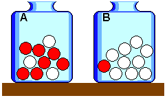

---
## Front matter
lang: ru-RU
title: "Модели с урнами"
subtitle: "Дисциплина: Математическое моделирование"
author:
  - Ганина Т. С.
institute:
  - Группа НФИбд-01-22
  - Российский университет дружбы народов, Москва, Россия
date: 13 апреля 2025

## i18n babel
babel-lang: russian
babel-otherlangs: english

## Formatting pdf
toc: false
toc-title: Содержание
slide_level: 2
aspectratio: 169
section-titles: true
theme: metropolis
header-includes:
 - \metroset{progressbar=frametitle,sectionpage=progressbar,numbering=fraction}
 - '\makeatletter'
 - '\beamer@ignorenonframefalse'
 - '\makeatother'
---

# Информация

## Докладчик

:::::::::::::: {.columns align=center}
::: {.column width="70%"}

  * Ганина Таисия Сергеевна
  * Студентка 3го курса, группа НФИбд-01-22
  * Фундаментальная информатика и информационные технологии
  * Российский университет дружбы народов
  * [Ссылка на репозиторий гитхаба tsganina](https://github.com/tsganina/study_2024-2025_mathmod)

:::
::: {.column width="30%"}

:::
::::::::::::::

# Вводная часть

## Актуальность

Актуальность темы обусловлена универсальностью урновых подходов. Во-первых, они служат мостиком между детерминированными и стохастическими системами.

Во вторых, эти модели помогают изучать динамику с памятью — явления, где текущее состояние системы зависит от её истории.

## Объект исследования

Объектом исследования выступают урновые модели как класс вероятностных систем.  

1. **Модель Бернулли** — базовый случай с независимыми испытаниями.  
2. **Модель Поля** — система с самоусиливающейся вероятностью.  
3. **Модель баланса** — механизм достижения равновесия через компенсацию.

## Научная новизна

Научная новизна работы заключается в комплексном подходе к изучению урновых моделей. Проведён сравнительный анализ систем с зависимыми и независимыми испытаниями, выявляющий роль начальных условий.

## Практическая значимость

Практическая значимость работы проявляется в следующих направлениях:  

1. Прогнозирование в условиях неопределённости
2. Биостатистика и экология
3. Социальные науки

## Общее описание моделей с урнами

**Урновая модель** в теории вероятностей и статистике — идеализированный мысленный эксперимент, в котором некоторые объекты реального интереса (атомы, люди, автомобили и т.п.) представлены как окрашенные шары в урне или другом контейнере. Урновые модели представляют собой абстрактные вероятностные системы, которые включают в себя несколько ключевых элементов: урну, шары и правила манипуляции.

## Общее описание моделей с урнами

{#fig:001 width=70%}

## Классификация моделей

Урновые модели можно разделить на три типа:

1. Модели с возвращением
2. Модели без возвращения
3. Модели с динамическим изменением состава

# Модель Бернулли

## Принцип: независимые испытания с постоянной вероятностью

Модель Бернулли — это простая и широко используемая урновая модель, основанная на принципе **независимых испытаний** с **постоянной вероятностью**. Это означает, что каждый раз, когда мы извлекаем шар из урны, вероятность его цвета не зависит от предыдущих извлечений.

## Формула

Если мы говорим о повторных испытаниях, таких как подбрасывание монеты, формула Бернулли для $n$ испытаний имеет вид:

$P(X = k) = \binom{n}{k} p^k (1-p)^{n-k}$

где:

- $n$ — количество испытаний,
- $k$ — количество успехов (например, выпадения орла),
- $p$ — вероятность успеха в одном испытании,
- $\binom{n}{k}$ — число сочетаний из $n$ по $k$.

## Свойства

Модель Бернулли обладает двумя ключевыми свойствами:

1. Отсутствие памяти (независимость испытаний)
2. Биномиальное распределение результатов

## Пример: подбрасывание монеты с заданной вероятностью

:::::::::::::: {.columns align=center}
::: {.column width="50%"}

Модель Бернулли часто используется для описания подбрасывания монеты.  Предположим, у нас есть монета, которая падает орлом с вероятностью $p = 0.5$ и решкой с вероятностью $q = 0.5$. Если мы подбрасываем эту монету $n = 10$ раз, мы можем использовать формулу Бернулли, чтобы вычислить вероятность получить, например, 7 орлов:

$P(X = 7) = \binom{10}{7} (0.5)^7 (0.5)^3 = \binom{10}{7} (0.5)^{10}$

:::
::: {.column width="50%"}

{#fig:003 width=90%}

:::
::::::::::::::

# Модель Поля (Pólya Urn)

## Принцип работы

Модель Поля описывает стохастический процесс с *самоусилением*. Изначально урна содержит $N_0$ шаров двух цветов (например, $a$ красных и  $b$ синих).

На каждом шаге:  

1. Случайно извлекается шар.  
2. Он возвращается в урну *вместе с  $c > 0$ шарами того же цвета*.  

Вероятность выбора цвета на шаге $n$ зависит от текущего состава урны:

$P(\text{красный}) = \frac{a + c \cdot k_n}{a + b + c \cdot n}$, где $k_n$ — число извлечённых красных шаров к шагу $n$.

## Свойства модели

- Зависимость от истории
- Сходимость к распределению

## Пример применения

Модель иллюстрирует процессы с **кумулятивным преимуществом** (постепенно накапливаемый или накапливающийся, суммирующийся со временем):  

- В эпидемиологии — распространение инфекции
- В социальных сетях — виральность контента

# Модель баланса

## Принцип

Модель баланса представляет собой стохастический процесс, который описывает динамику системы, стремящейся к равновесию. В рамках этой модели урна изначально содержит $a$ шаров одного цвета (например, красных) и $b$ шаров другого цвета (например, синих). На каждом шаге происходит следующее:

1. Из урны случайным образом извлекается один шар.
2. Вместо возвращения шара того же цвета в урну добавляется шар **противоположного цвета**.

## Формула

Вероятность выбора шара определенного цвета на шаге $n$ задается формулой:
$P(\text{красный}) = \frac{R_n}{R_n + B_n}, \quad P(\text{синий}) = \frac{B_n}{R_n + B_n}$,
где $R_n$ и $B_n$ — текущие количества красных и синих шаров соответственно.

После каждого шага количество шаров обновляется согласно правилу:
$R_{n+1} = R_n - 1 + \delta_B, \quad B_{n+1} = B_n - 1 + \delta_R$,

где $\delta_B = 1$, если был выбран красный шар, и $\delta_R = 1$, если был выбран синий шар.

## Свойства

1. Сходимость к равновесию
2. Устойчивость
3. Детерминированность в долгосрочной перспективе
4. Независимость от начальных условий

## Применение модели

Модель баланса может быть использована для описания различных явлений, где наблюдается стремление системы к равновесию:

- Экологические системы
- Химические реакции
- Социальные процессы
- Финансовые рынки

# Области применения урновых моделей  

## Математическая статистика: оценка неизвестного

Урновые модели используются, когда нужно сделать выводы о целом на основе частичных данных.  

- **Оценка доли дефектов в партии товара**  
    - Допустим, в партии из 1000 товаров 50 бракованных (это неизвестно). Вы проверяете 100 товаров **без возвращения** (гипергеометрическая модель). Если среди них 5 бракованных, можно оценить общее число дефектов в партии.  

- **Формула для расчёта вероятности**:  
  $$P(\text{брак}) = \frac{\text{число бракованных в выборке}}{\text{размер выборки}}$$  

# Практические задачи: от IT до экономики  

## A/B-тестирование

Представьте, что вы запускаете новую кнопку на сайте. Пользователей случайно делят на две группы:  
- Группа A видит старую кнопку.  
- Группа B — новую.  

## A/B-тестирование

1. Собирают данные: 1000 кликов в каждой группе.  
2. Сравнивают доли успехов с помощью формулы:  
   $$Z = \frac{p_A - p_B}{\sqrt{p(1-p)(\frac{1}{n_A} + \frac{1}{n_B})}},$$
   где $p = \frac{\text{общее число успехов}}{\text{общее число испытаний}}$

# Заключение

Мы рассмотрели основные урновые модели — инструменты теории вероятностей, которые позволяют анализировать и предсказывать поведение различных стохастических систем.

- Урновые модели демонстрируют широкий спектр поведения: от независимости до самоорганизации.
- Модель Поля и баланса отражают реальные процессы с обратной связью, что делает их особенно полезными для изучения сложных систем.

## Список литературы

1. Феллер В. Введение в теорию вероятностей и её приложения.
2. Urn problem, article [Электронный ресурс]. URL: https://en.wikipedia.org/wiki/Urn_problem.
3. Лекция, теория вероятностей [Электронный ресурс]. URL: https://science.fandom.com/ru/wiki/%D0%A2%D0%B5%D0%BE%D1%80%D0%B8%D1%8F_%D0%B2%D0%B5%D1%80%D0%BE%D1%8F%D1%82%D0%BD%D0%BE%D1%81%D1%82%D0%B5%D0%B9.
4. Ивченко Г. Анализ урновых моделей с изменяющимся составом шаров.
5. Теория вероятностей, Московский государственный институт электроники и математики (технический университет) [Электронный ресурс]. URL: https://studfile.net/preview/1640634/page:8/.
6. Формула Бернулли [Электронный ресурс]. URL: https://ru.wikipedia.org/wiki/%D0%A4%D0%BE%D1%80%D0%BC%D1%83%D0%BB%D0%B0_%D0%91%D0%B5%D1%80%D0%BD%D1%83%D0%BB%D0%BB%D0%B8.
7. Российская электронная школа, урок о формуле Бернулли [Электронный ресурс]. URL: https://resh.edu.ru/subject/lesson/4929/conspect/.
8. Mahmoud H. Pólya Urn Models. 
9. Эггертссон Г. Стохастические процессы в экономике.
