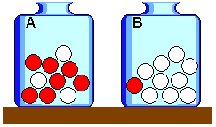
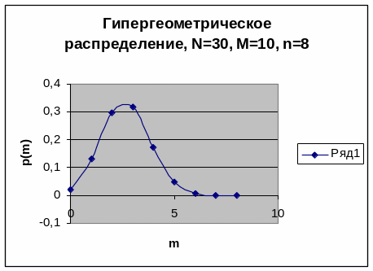
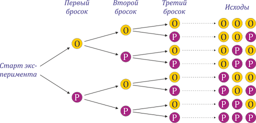

---
## Front matter
title: "Модели с урнами"
subtitle: "Математическое моделирование"
author: "Ганина Таисия Сергеевна, НФИбд-01-22"

## Generic otions
lang: ru-RU
toc-title: "Содержание"

## Bibliography
bibliography: bib/cite.bib
csl: pandoc/csl/gost-r-7-0-5-2008-numeric.csl

## Pdf output format
toc: true # Table of contents
toc-depth: 2
lof: true # List of figures
lot: true # List of tables
fontsize: 12pt
linestretch: 1.5
papersize: a4
documentclass: scrreprt
## I18n polyglossia
polyglossia-lang:
  name: russian
  options:
	- spelling=modern
	- babelshorthands=true
polyglossia-otherlangs:
  name: english
## I18n babel
babel-lang: russian
babel-otherlangs: english
## Fonts
mainfont: PT Serif
romanfont: PT Serif
sansfont: PT Sans
monofont: PT Mono
mainfontoptions: Ligatures=TeX
romanfontoptions: Ligatures=TeX
sansfontoptions: Ligatures=TeX,Scale=MatchLowercase
monofontoptions: Scale=MatchLowercase,Scale=0.9
## Biblatex
biblatex: true
biblio-style: "gost-numeric"
biblatexoptions:
  - parentracker=true
  - backend=biber
  - hyperref=auto
  - language=auto
  - autolang=other*
  - citestyle=gost-numeric
## Pandoc-crossref LaTeX customization
figureTitle: "Рис."
tableTitle: "Таблица"
listingTitle: "Листинг"
lofTitle: "Список иллюстраций"
lotTitle: "Список таблиц"
lolTitle: "Листинги"
## Misc options
indent: true
header-includes:
  - \usepackage{indentfirst}
  - \usepackage{float} # keep figures where there are in the text
  - \floatplacement{figure}{H} # keep figures where there are in the text
---

# Введение

Современная наука всё чаще обращается к математическим моделям для анализа сложных систем, где случайность и неопределённость играют ключевую роль. Известно, что урновые модели — наглядный аппарат теории вероятностей, позволяющий описывать многие реальные процесс и явления. Урновые модели — абстрактные вероятностные системы, имитирующие процесс извлечения шаров из урны. Их изучение позволяет не только исследовать фундаментальные законы теории вероятностей, но и решать практические задачи в областях, далёких от чистой математики: от прогнозирования экономических кризисов до моделирования экологических процессов. [@feller]

## Актуальность

Актуальность темы обусловлена универсальностью урновых подходов. Во-первых, они служат мостиком между детерминированными и стохастическими системами. С одной стороны, они могут включать правила, которые детерминированно определяют, как изменяется состав урны (например, если мы всегда добавляем шар того же цвета, который вытащили). С другой стороны, сам процесс выбора шаров из урны является случайным (стохастическим).

Во вторых, эти модели помогают изучать динамику с памятью — явления, где текущее состояние системы зависит от её истории, что характерно для биологических популяций (численность популяции сегодня зависит от её размера в прошлом, условий окружающей среды, миграции и т.д) или финансовых рынков (цена актива сегодня зависит от предыдущих колебаний цен, новостей, поведения инвесторов и других факторов).[lecture1]

## Объект исследования

Объектом исследования выступают урновые модели как класс вероятностных систем. Их структура включает три ключевых элемента: урну (контейнер), шары (объекты с определёнными свойствами) и правила манипуляции (извлечение, добавление). Предмет исследования — свойства, условия сходимости и прикладное значение трёх конкретных моделей:  

1. **Модель Бернулли** — базовый случай с независимыми испытаниями.  
2. **Модель Поля** — система с самоусиливающейся вероятностью.  
3. **Модель баланса** — механизм достижения равновесия через компенсацию.  

## Научная новизна

Научная новизна работы заключается в комплексном подходе к изучению урновых моделей. Проведён сравнительный анализ систем с зависимыми и независимыми испытаниями, выявляющий роль начальных условий.

## Практическая значимость

Практическая значимость работы проявляется в следующих направлениях:  

1. Прогнозирование в условиях неопределённости:  
   - Модель Поля применяется в алгоритмах обработки Big Data для анализа пользовательского поведения.  
   - Модель баланса используется в логистике для оптимизации соотношения спроса и предложения.  
2. Биостатистика и экология:  
   - Урновые схемы имитируют динамику популяций, где «шары» представляют особи разных видов, а правила их добавления/удаления соответствуют рождению и гибели.  
3. Социальные науки:  
   - Моделирование распространения информации в социальных сетях, где «цвет» шара ассоциируется с типом контента (например, "fake news" vs. "проверенные данные").

Таким образом, урновые модели выступают не только как теоретический конструкт, но и как рабочий инструмент для междисциплинарных исследований.

# Историческая справка

Одна из первых формулировок задачи, связанной с урновыми моделями, встречается в труде Якоба Бернулли Ars Conjectandi, опубликованном в 1713 году. В нём он анализировал проблему определения соотношения разноцветных шаров в урне на основе наблюдений за извлечёнными экземплярами. Эта задача, относящаяся к области обратных вероятностей, активно изучалась в XVIII веке и привлекала внимание таких математиков, как Абрахам де Муавр и Томас Байес.

Термин urna, использованный Бернулли, происходит из латинского языка и первоначально обозначал глиняный сосуд. В Древнем Риме это слово также применялось для описания сосудов, в которые бросали бюллетени или жребии. Современные итальянский и испанский языки сохранили это значение: слово urna до сих пор используется для обозначения избирательной урны. Возможно, идею для своей модели Бернулли почерпнул из практик, связанных с жеребьёвками, выборами и азартными играми, где исход решается путём случайного извлечения объектов из сосуда. Считается, что подобные методы активно применялись, например, при проведении выборов дожа в Венеции в Средние века и эпоху Ренессанса, когда выборщики определялись по жребию с помощью разноцветных шаров, извлекаемых из урны. [@wiki1]

# Общее описание моделей с урнами

**Урновая модель** в теории вероятностей и статистике — идеализированный мысленный эксперимент, в котором некоторые объекты реального интереса (атомы, люди, автомобили и т.п.) представлены как окрашенные шары в урне или другом контейнере. вынимают (удаляют) один или более шаров из урны; цель состоит в том, чтобы определить вероятность вынимания шаров одного цвета или другого, или некоторые другие свойства. [@lecture2]

Урновые модели представляют собой абстрактные вероятностные системы, которые включают в себя несколько ключевых элементов: урну, шары и правила манипуляции (рис. @fig:001).

{#fig:001 width=70%}

* **Урна**: представляет собой контейнер, содержащий шары. Урна может быть конечной или бесконечной по объёму, что влияет на тип моделируемых процессов. Например, в некоторых моделях урна может содержать шары нескольких цветов, что позволяет имитировать сложные системы с множеством исходов. [@mathnet]

* **Шары**: объекты внутри урны, которые могут иметь разные цвета или свойства. Каждый шар соответствует определённому событию или состоянию системы. Например, в модели Поля шары могут представлять собой элементы популяции, а их цвета — разные типы особей [@studfile].

* **Правила извлечения и добавления**: определяют, как шары удаляются из урны и добавляются обратно. Эти правила могут включать в себя возвращение шара в урну после извлечения (модель с возвращением), удаление без возвращения (модель без возвращения), или динамическое изменение состава урны (модель с динамическим изменением) [@mathnet, @studfile].
  
  
## Классификация моделей

Урновые модели можно разделить на три типа:

1. **Модели с возвращением**: шар возвращается в урну после извлечения. Пример — **модель Бернулли**, где каждый опыт независим и имеет фиксированную вероятность.

2. **Модели без возвращения**: шар не возвращается в урну. Пример — гипергеометрическая схема, где вероятность извлечения зависит от количества уже извлечённых шаров (рис. @fig:002).

{#fig:002 width=70%}

3. **Модели с динамическим изменением состава**: в урну добавляются новые шары после извлечения. Примеры — **модель Поля** и **модель баланса**. В модели Поля добавляется шар того же цвета, усиливая вероятность его извлечения. В модели баланса добавляется шар противоположного цвета, стремясь к равновесию.
   

# Модель Бернулли

## Принцип: независимые испытания с постоянной вероятностью

Модель Бернулли — это простая и широко используемая урновая модель, основанная на принципе **независимых испытаний** с **постоянной вероятностью**. Это означает, что каждый раз, когда мы извлекаем шар из урны, вероятность его цвета не зависит от предыдущих извлечений. [@wiki_bernulli]

Формула вероятности извлечения шара цвета $k$ выглядит следующим образом:

$P(A_k) = \frac{N_k}{N}$

где:

- $N_k$ — количество шаров цвета $k$,
- $N$ — общее количество шаров в урне.

Однако, если мы говорим о повторных испытаниях, таких как подбрасывание монеты, формула Бернулли для $n$ испытаний имеет вид:

$P(X = k) = \binom{n}{k} p^k (1-p)^{n-k}$

где:

- $n$ — количество испытаний,
- $k$ — количество успехов (например, выпадения орла),
- $p$ — вероятность успеха в одном испытании,
- $\binom{n}{k}$ — число сочетаний из $n$ по $k$.

## Свойства

Модель Бернулли обладает двумя ключевыми свойствами:

1. **Отсутствие памяти (независимость испытаний)**: каждый опыт является независимым от предыдущих. Это означает, что вероятность извлечения шара не меняется после каждого испытания [@wiki_bernulli].

2. **Биномиальное распределение результатов**: если мы повторяем испытания несколько раз, количество успехов (например, извлечений шаров определённого цвета) следует биномиальному распределению [@feller, @wiki_bernulli].

## Пример: подбрасывание монеты с заданной вероятностью

Модель Бернулли часто используется для описания подбрасывания монеты. Предположим, у нас есть монета, которая падает орлом с вероятностью $p = 0.5$ и решкой с вероятностью $q = 0.5$. Если мы подбрасываем эту монету $n = 10$ раз, мы можем использовать формулу Бернулли, чтобы вычислить вероятность получить, например, 7 орлов:

$P(X = 7) = \binom{10}{7} (0.5)^7 (0.5)^3 = \binom{10}{7} (0.5)^{10}$

Этот пример показывает, как модель Бернулли может быть применена для анализа реальных ситуаций с независимыми испытаниями [@resh] (рис. @fig:003).

{#fig:003 width=70%}

# Модель Поля (Pólya Urn)

## Принцип работы

Модель Поля описывает стохастический процесс с *самоусилением*. Изначально урна содержит $N_0$ шаров двух цветов (например, $a$ красных и  $b$ синих). [@Mahmoud]

На каждом шаге:  

1. Случайно извлекается шар.  
2. Он возвращается в урну *вместе с  $c > 0$ шарами того же цвета*.  

Вероятность выбора цвета на шаге $n$ зависит от текущего состава урны:

$P(\text{красный}) = \frac{a + c \cdot k_n}{a + b + c \cdot n}$, 

где $k_n$ — число извлечённых красных шаров к шагу $n$. Каждое извлечение увеличивает долю выбранного цвета, создавая **положительную обратную связь**. Вероятность выбора цвета зависит от текущего состава урны. Чем больше шаров определённого цвета уже в урне, тем выше вероятность выбора этого цвета на следующем шаге.

## Свойства модели

- **Зависимость от истории**: Результат каждого испытания влияет на все последующие («эффект снежного кома»). Ранние успехи усиливают доминирование одного цвета.
- **Сходимость к распределению**: Доля шаров сходится к случайной величине с бета-распределением $\text{Beta}(a/c, b/c)$. **Бета-распределение** — это вероятностное распределение, которое описывает случайные величины, которые находятся в диапазоне от 0 до 1. Оно часто используется для моделирования долей или пропорций. Однако предельное состояние **не предопределено** — малые начальные отклонения могут привести к разным исходам. Представьте себе урну с красными и синими шарами. На каждом шаге вы берёте шар, а затем добавляете несколько шаров того же цвета обратно в урну. Со временем доля красных или синих шаров будет меняться, но в конце концов она будет следовать бета-распределению. Однако то, какая доля будет доминировать (красная или синяя), зависит от случайных событий на ранних шагах и не предопределено заранее. [@feller]

## Пример применения

Модель иллюстрирует процессы с **кумулятивным преимуществом** (постепенно накапливаемый или накапливающийся, суммирующийся со временем):  

- В эпидемиологии — распространение инфекции, где каждый заражённый увеличивает вероятность новых случаев (аналог добавления шаров).  
- В социальных сетях — виральность контента: чем чаще мем репостят, тем выше его видимость и вероятность дальнейшего распространения («эффект победителя получает всё»). 

# Модель баланса

## Принцип

Модель баланса представляет собой стохастический процесс, который описывает динамику системы, стремящейся к равновесию. В рамках этой модели урна изначально содержит $a$ шаров одного цвета (например, красных) и $b$ шаров другого цвета (например, синих). На каждом шаге происходит следующее:

1. Из урны случайным образом извлекается один шар.
2. Вместо возвращения шара того же цвета в урну добавляется шар **противоположного цвета**. Например, если вынут белый шар, то в урну добавляется черный шар, и наоборот. Этот принцип позволяет моделировать процесс, который стремится к балансу между двумя состояниями.

Таким образом, вероятность извлечения шара каждого цвета на следующем шаге изменяется таким образом, чтобы система постепенно приближалась к состоянию равновесия, где количество шаров обоих цветов становится примерно одинаковым. Вероятность выбора шара определенного цвета на шаге $n$ задается формулой:
$P(\text{красный}) = \frac{R_n}{R_n + B_n}, \quad P(\text{синий}) = \frac{B_n}{R_n + B_n}$,
где $R_n$ и $B_n$ — текущие количества красных и синих шаров соответственно.

После каждого шага количество шаров обновляется согласно правилу:
$R_{n+1} = R_n - 1 + \delta_B, \quad B_{n+1} = B_n - 1 + \delta_R$,

где $\delta_B = 1$, если был выбран красный шар, и $\delta_R = 1$, если был выбран синий шар.

## Свойства

1. **Сходимость к равновесию**: Модель демонстрирует тенденцию к достижению состояния, в котором количество шаров обоих цветов выравнивается. Это связано с тем, что каждый раз, когда извлекается шар одного цвета, система "компенсирует" это добавлением шара противоположного цвета.

2. **Устойчивость**: Даже если начальное соотношение шаров существенно несбалансировано (например, значительно больше красных шаров, чем синих), модель постепенно приводит к равновесию благодаря механизму обратной связи.

3. **Детерминированность в долгосрочной перспективе**: Хотя процесс является стохастическим на каждом отдельном шаге, в пределе система демонстрирует детерминированное поведение: соотношение числа шаров сходится к $1:1$.

4. **Независимость от начальных условий**: Конечное состояние системы не зависит от начального распределения шаров, что делает модель универсальной для описания процессов самобалансировки.

## Пример

Рассмотрим простой пример. Пусть в урне изначально находятся 8 красных шаров и 2 синих шара ($R_0 = 8, B_0 = 2$). На каждом шаге мы случайным образом выбираем шар и добавляем шар противоположного цвета. 

- Если на первом шаге выбран красный шар, то его удаляют, но добавляют один синий шар. Теперь в урне станет $R_1 = 7$ красных шаров и $B_1 = 3$ синих шаров.
- Если на втором шаге снова выбран красный шар, то после этого шага в урне окажется $R_2 = 6$ красных шаров и $B_2 = 4$ синих шаров.

По мере продолжения процесса вероятность выбора красного шара уменьшается, а вероятность выбора синего шара увеличивается. В итоге система придет к состоянию, где количество красных и синих шаров будет примерно одинаковым.

## Применение модели

Модель баланса может быть использована для описания различных явлений, где наблюдается стремление системы к равновесию:

- **Экологические системы**: динамика популяций хищников и жертв.
- **Химические реакции**: установление равновесия между реагентами и продуктами.
- **Социальные процессы**: выравнивание мнений или распределения ресурсов в обществе.
- **Финансовые рынки**: стабилизация цен на активы. [@egertson]

# Области применения урновых моделей  

Урновые модели — это не просто абстрактные математические конструкции. Они активно применяются в науке и практике для решения реальных задач.

## Теория вероятностей: как предсказать будущее случайных процессов

Здесь урновые модели помогают понять, как ведут себя системы со случайными событиями в долгосрочной перспективе.  

- **Модель Поля и сходимость**  
    - Представьте, что вы добавляете в урну шары того же цвета, который только что вытащили. Со временем один цвет начнёт преобладать. Это называется **сходимостью** — система стабилизируется, но итог зависит от начальных условий. Например, если в урне сначала больше красных шаров, с большой вероятностью они «захватят» урну.  

- **Модель баланса и равновесие**  
    - Если после каждого извлечения шара вы добавляете противоположный цвет, система стремится к балансу. Это похоже на экосистему, где хищники и жертвы регулируют численность друг друга.  

## Математическая статистика: оценка неизвестного

Урновые модели используются, когда нужно сделать выводы о целом на основе частичных данных.  

- **Оценка доли дефектов в партии товара**  
    - Допустим, в партии из 1000 товаров 50 бракованных (это неизвестно). Вы проверяете 100 товаров **без возвращения** (гипергеометрическая модель). Если среди них 5 бракованных, можно оценить общее число дефектов в партии.  

- **Формула для расчёта вероятности**:  
  $$P(\text{брак}) = \frac{\text{число бракованных в выборке}}{\text{размер выборки}}$$  

## Практические задачи: от IT до экономики  

### A/B-тестирование

Представьте, что вы запускаете новую кнопку на сайте. Пользователей случайно делят на две группы:  
- Группа A видит старую кнопку.  
- Группа B — новую.  

Здесь работает **модель Бернулли**: каждый клик — независимое событие с вероятностью успеха (например, 5% для группы A и 7% для группы B). Чтобы понять, действительно ли новая кнопка лучше, используют статистические тесты.  

**Как это работает**:  
1. Собирают данные: 1000 кликов в каждой группе.  
2. Сравнивают доли успехов с помощью формулы:  
   $$Z = \frac{p_A - p_B}{\sqrt{p(1-p)(\frac{1}{n_A} + \frac{1}{n_B})}},$$
   где $p = \frac{\text{общее число успехов}}{\text{общее число испытаний}}$ 
3. Если $Z > 1.96$, различие считается значимым.  

### Прогнозирование рынков

Почему один продукт становится популярным, а другой нет? Тут полезна **модель Поля**.  

- **Пример**: Два новых мессенджера. У первого 100 пользователей, у второго — 150. Каждый новый пользователь привлекает своих друзей (аналог добавления шаров). Со временем мессенджер с большей начальной аудиторией может захватить рынок, даже если оба одинаково хороши.

# Заключение

Мы рассмотрели основные урновые модели — инструменты теории вероятностей, которые позволяют анализировать и предсказывать поведение различных стохастических систем. **Модель Бернулли** демонстрирует независимость испытаний, **модель Поля** — самоорганизацию с обратной связью, а **модель баланса** — стремление к равновесию.

- Урновые модели демонстрируют широкий спектр поведения: от независимости до самоорганизации.
- Модель Поля и баланса отражают реальные процессы с обратной связью, что делает их особенно полезными для изучения сложных систем. Расширение на **многомерные случаи** (более двух цветов), что позволит моделировать более сложные системы. А **интеграция с методами машинного обучения** может открыть новые возможности для прогнозирования и анализа данных.

Таким образом, урновые модели остаются важным инструментом для понимания и моделирования случайных процессов в различных областях науки и практики.

# Список литературы{.unnumbered}

::: {#refs}
:::
